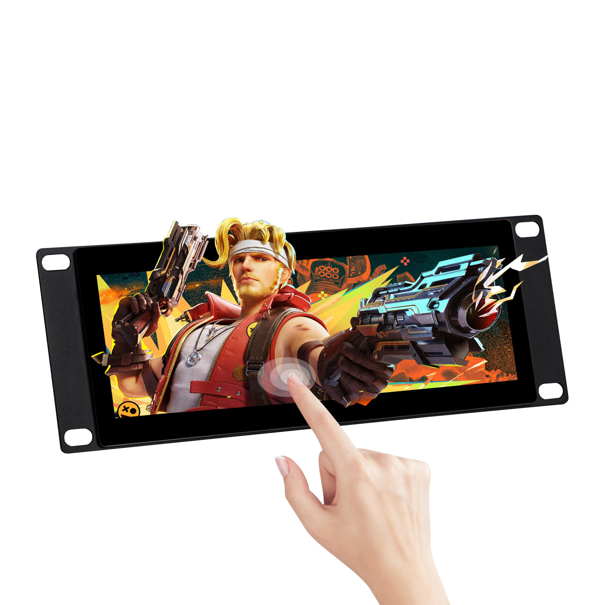
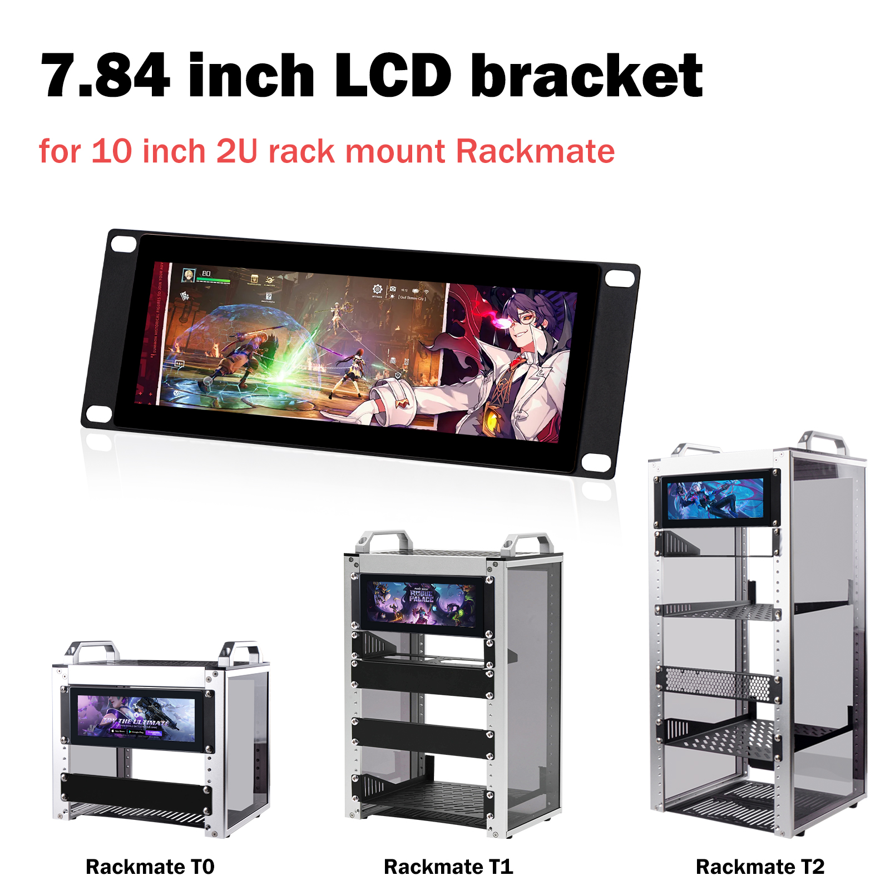
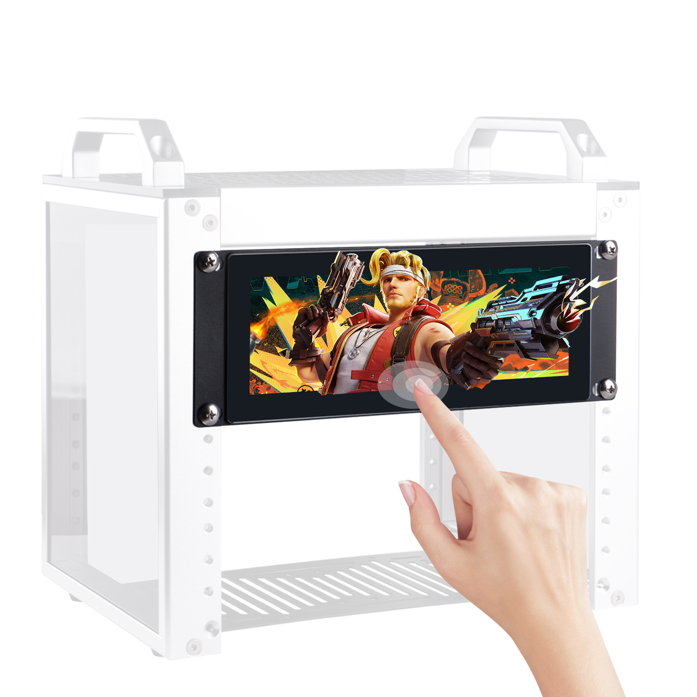
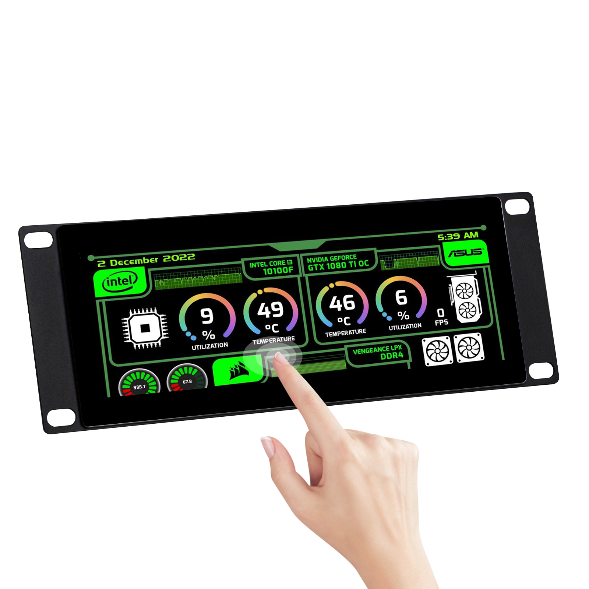
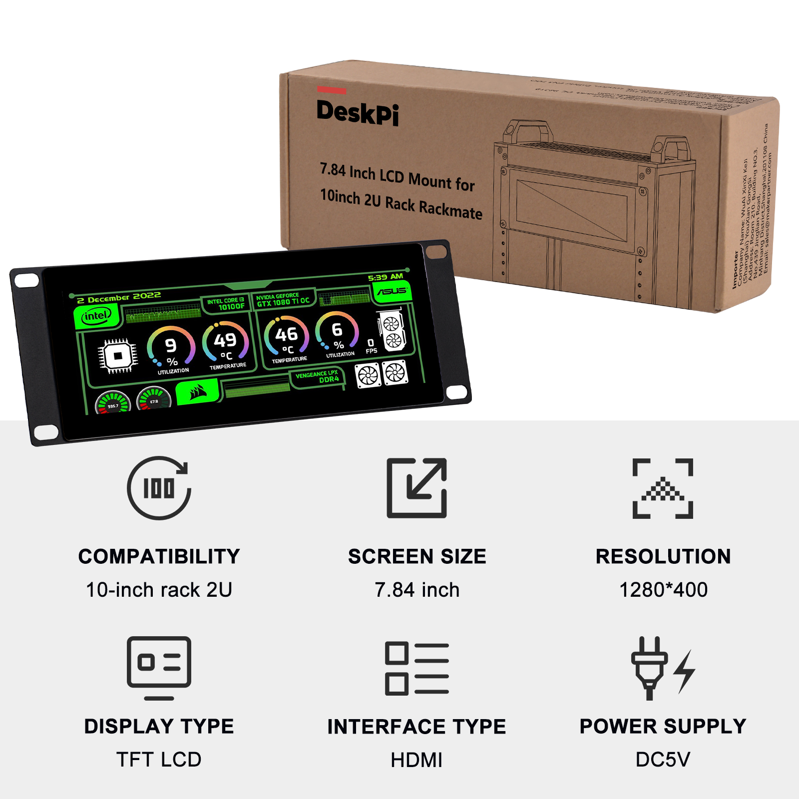
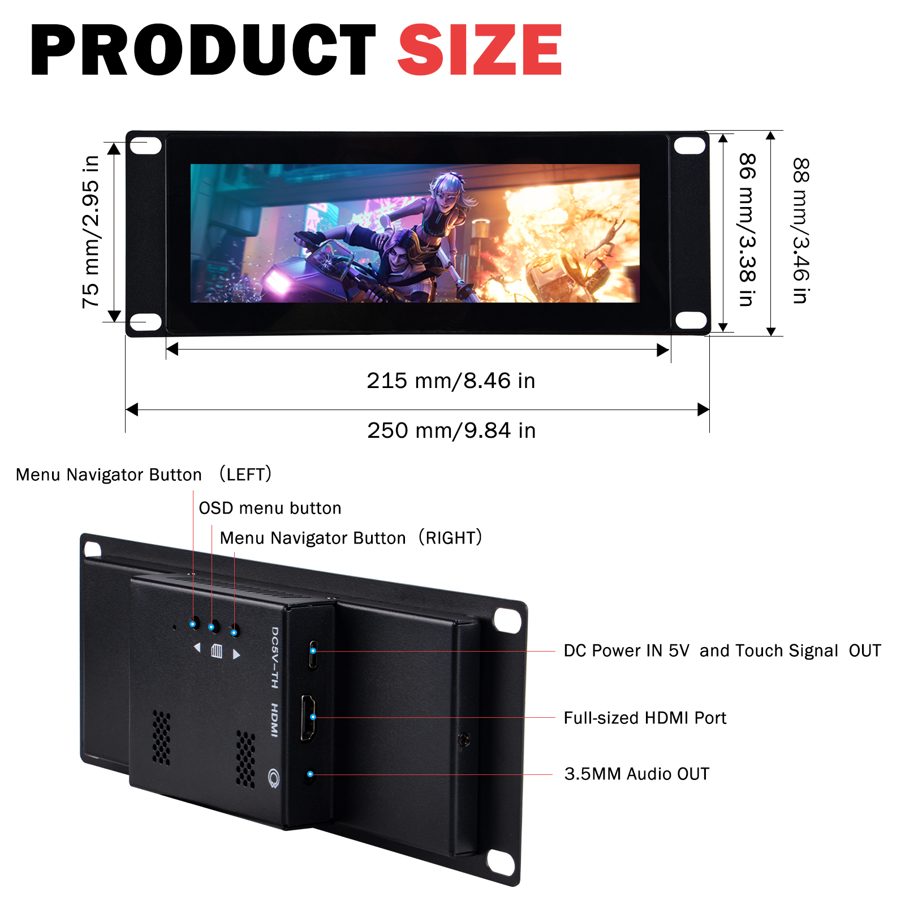
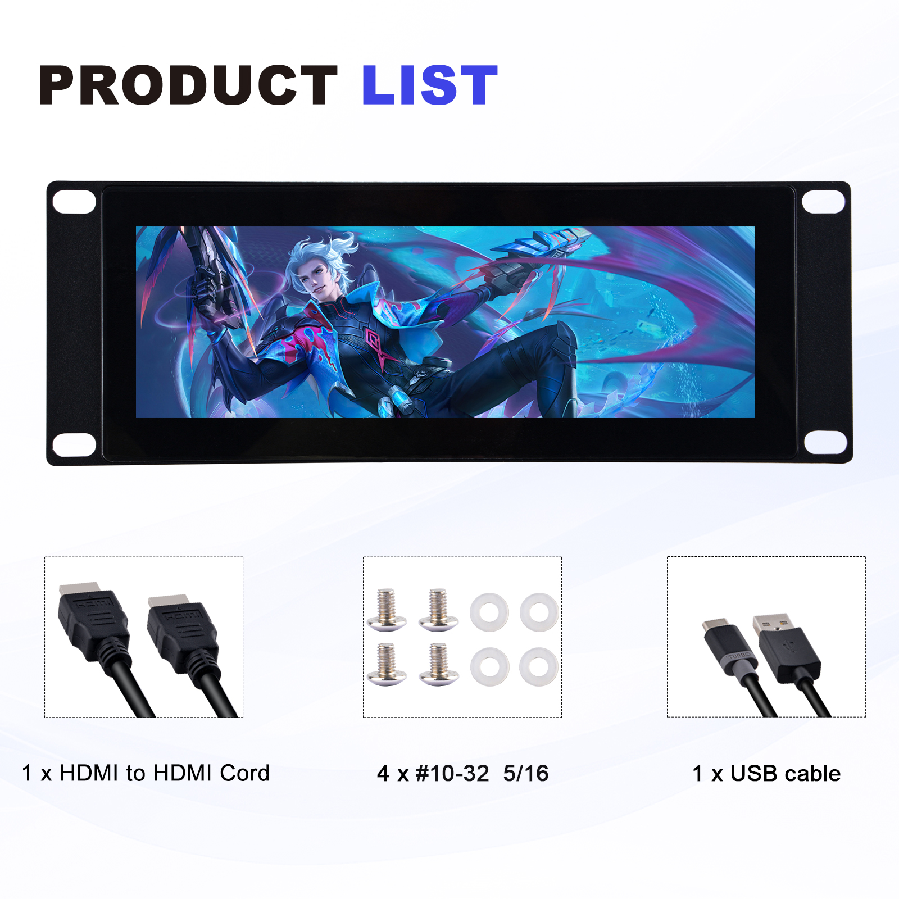
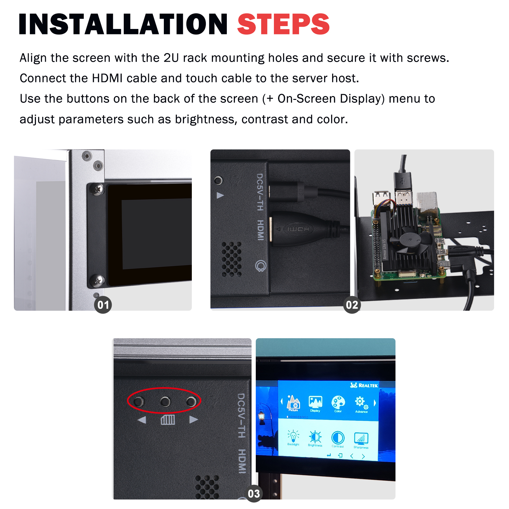
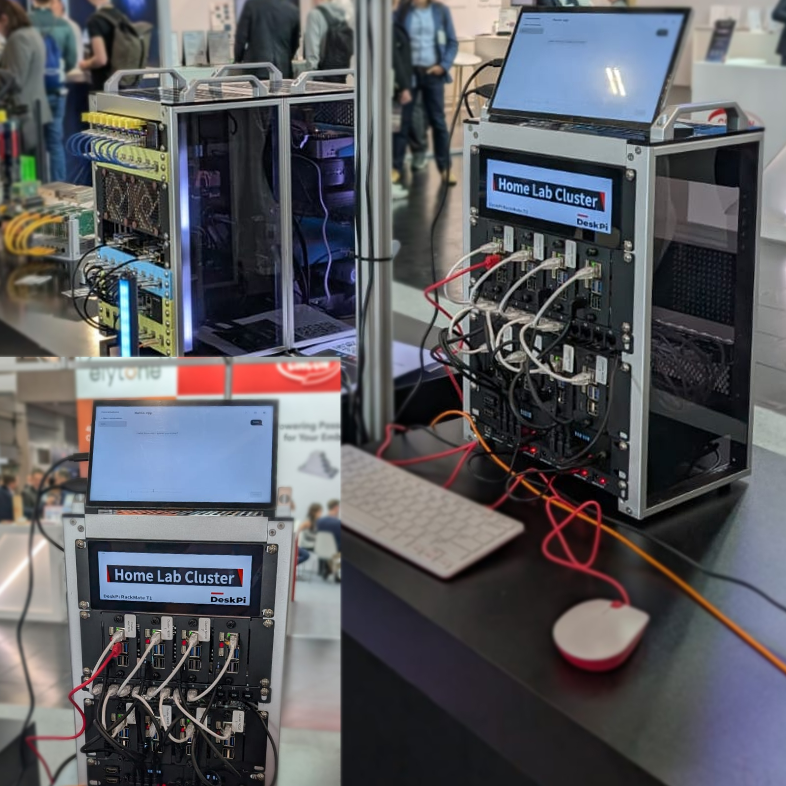
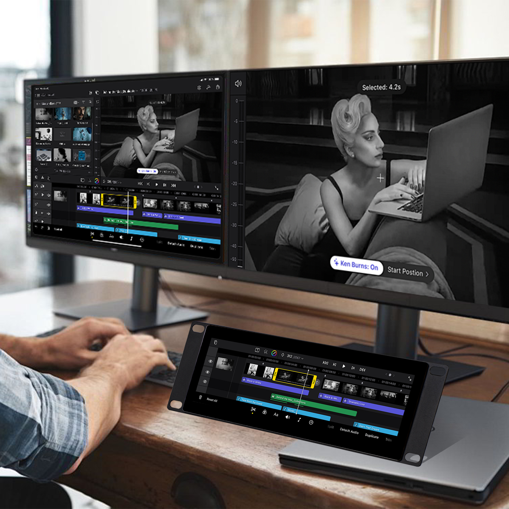

# DeskPi 7.84 inch LCD Mount for 10 inch 2U Rackmate (DP-0059)

The **DeskPi 7.84 inch LCD Mount** is a 10-inch 2U rack-mount display panel designed for the DeskPi Rackmate series. It combines a high-resolution TFT LCD with a multi-touch screen, built-in OSD menu, and multi-language support, making it an ideal plug-and-play monitor for server racks, home labs, cluster dashboards, and maintenance consoles.

## Purchase URL

- **Official Store:** [DeskPi 7.84 inch Touch Screen for 10 inch 2U Rackmate](https://deskpi.com/products/deskpi-7-84-inch-touch-screen-1280x400-tft-lcd-display-for-10-inch-2u-rack-rackmate-supports-installation-of-t0-t1-t2)
- **US Amazon:** <https://www.amazon.com/dp/B0F3C5R2BZ>
- **UK Amazon:** <https://www.amazon.co.uk/dp/B0F3C5R2BZ>
- **DE Amazon:** <https://www.amazon.de/dp/B0F3C5R2BZ>
- **FR Amazon:** <https://www.amazon.fr/dp/B0F3C5R2BZ>
- **IT Amazon:** <https://www.amazon.it/dp/B0F3C5R2BZ>
- **ES Amazon:** <https://www.amazon.es/dp/B0F3C5R2BZ>
- **JP Amazon:** <https://www.amazon.jp/dp/B0F3C5R2BZ>
- **AU Amazon:** <https://www.amazon.com.au/dp/B0F3C5R2BZ>

## Key Features

- **7.84 inch TFT LCD** with a resolution of **1280 x 400**, 350 cd/m² brightness, and 60 Hz refresh rate.
- **Capacitive multi-touch** screen — plug and play, no extra driver installation required.
- **Standard 2U form factor** for 10-inch racks, compatible with DeskPi **Rackmate T0 / T1 / T2** series.
- **HDMI video input** + **USB touch-signal output** for easy connection to a server host or SBC.
- **Built-in OSD menu** with multi-language support for adjusting brightness, contrast, color, sharpness, backlight, and more.
- **3.5 mm audio output** for connecting external speakers or headphones.
- **DC 5V power input** via a standard USB-C power/touch combo port.
- Durable metal bracket with pre-drilled mounting holes for quick rack installation.

## Specifications

| Item | Specification |
|------|---------------|
| Product SKU | DP-0059 |
| Screen Size | 7.84 inch |
| Panel Type | TFT LCD |
| Resolution | 1280 x 400 |
| Brightness | 350 cd/m² |
| Refresh Rate | 60 Hz |
| Touch Type | Capacitive multi-touch |
| Video Input | Full-size HDMI |
| Touch Output | USB (shared with DC 5V input port) |
| Audio Output | 3.5 mm stereo |
| Power Supply | DC 5V |
| Mounting | 10-inch 2U rack mount (Rackmate T0 / T1 / T2) |
| Product Dimensions | 250 mm x 88 mm / 9.84 in x 3.46 in |
| Active Display Area | 215 mm x 75 mm / 8.46 in x 2.95 in |

## Gallery

### Product Overview

The DP-0059 display panel fits perfectly into the 2U front opening of Rackmate T0, T1, and T2 cabinets.

### Product Size & Interfaces

**Rear I/O (from top to bottom):**

1. **DC 5V IN / Touch Signal OUT** — USB-C combo port for power and touch data.
2. **Full-size HDMI Port** — video input from the host device.
3. **3.5 mm Audio OUT** — external audio output.

**OSD buttons on the rear:**

- **Menu Navigator Button (LEFT)** — navigate up / decrease value.
- **OSD Menu Button** — open / close the OSD menu.
- **Menu Navigator Button (RIGHT)** — navigate down / increase value.

### Package Contents

### Installation Steps

1. Align the display with the 2U rack mounting holes and secure it with the included screws.
2. Connect the HDMI cable from the host to the display, and connect the USB cable for touch and power.
3. Press the OSD buttons on the rear to adjust brightness, contrast, color, and other display parameters.

### Application Scenarios

The 7.84 inch LCD panel is widely used as a server-status monitor, home-lab dashboard, cluster console, touch control panel, and secondary display for video editing or live-streaming workflows.

## How to Install

1. **Mount the panel:**
   - Place the DP-0059 panel against the 2U opening on the front of your Rackmate cabinet.
   - Use the four included **#10-32 5/16** screws and washers to fasten the panel.

2. **Connect video:**
   - Plug the included **HDMI-to-HDMI cable** between the host device and the display.

3. **Connect touch and power:**
   - Plug the included **USB cable** into the DC 5V / Touch port on the display.
   - Connect the other end to a 5V USB power source or a USB port on the host device.

4. **Power on:**
   - Once power and HDMI are connected, the display will light up automatically.
   - The touch screen is recognized as a standard HID device — no driver installation is required.

## OSD Menu Operation

The on-screen display (OSD) menu lets you fine-tune the picture quality and language settings.

- Press the **OSD Menu Button** to open the OSD.
- Use the **LEFT / RIGHT Navigator Buttons** to move through menu items or adjust values.
- Available options include:
  - **Picture** — brightness, contrast, sharpness, backlight
  - **Display** — horizontal / vertical position, phase, clock
  - **Color** — color temperature, saturation, hue, red/green/blue gain
  - **Advance (Advanced)** — reset, language, transparency, and other advanced settings
- The OSD supports **multi-language** menus; select your preferred language under **Advance (Advanced)**.

## Package Includes

- 1 x DeskPi 7.84 inch LCD Mount (DP-0059) Pack

> **Note:** A 5V power adapter is not included. Please use a standard USB 5V/2A or higher power source.

## Display Resolution Note

> ⚠️ macOS users: the screen image may appear stretched because macOS cannot output 1280 x 400 natively. The minimum supported resolution on macOS is typically 1280 x 720.
>
> On a Mac, the display will usually be driven at a 16:9 resolution (such as 1280 x 720) and then scaled or letterboxed, which can cause horizontal stretching. For the best picture quality, set a custom resolution of **1280 x 400** via a third-party display utility (for example, SwitchResX or RDM) or adjust the overscan/scaling options in **System Settings > Displays**.

## Notes

- Make sure the host device outputs a resolution compatible with the panel. The recommended resolution is **1280 x 400**.
- If the touch function does not respond, verify that the USB cable is connected to the **DC 5V / Touch Signal OUT** port and that the host recognizes the USB HID device.
- Avoid pressing the screen with excessive force or using sharp objects on the touch surface.
- For rack installation, ensure the cabinet is powered off before connecting cables to the host device.

## Related Products

- [DeskPi RackMate T0 / T1 / T2 Server Cabinets](https://wiki.deskpi.com/rackmate/)
- [DeskPi Rackmate Accessories](https://wiki.deskpi.com/rackmate_accessories_4/)

---

*For more DeskPi product documentation, visit the [DeskPi Products Wiki](https://wiki.deskpi.com/).*
