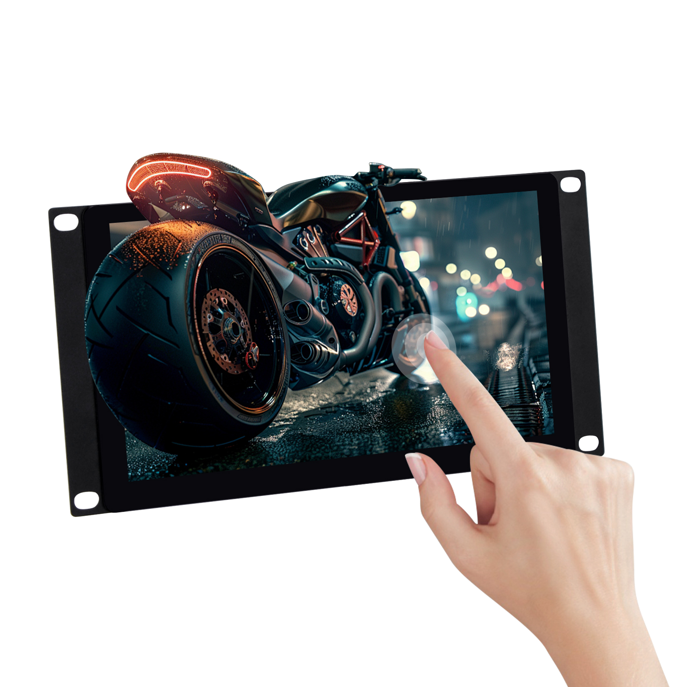
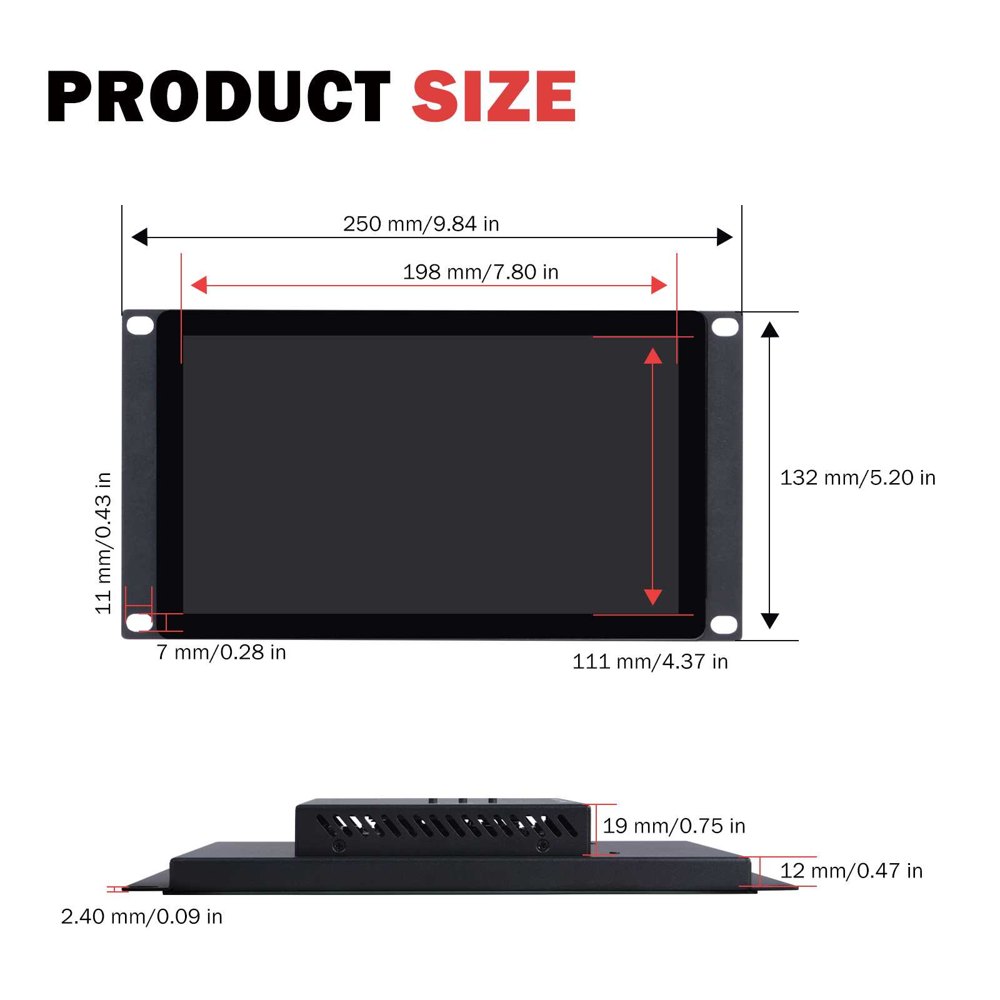
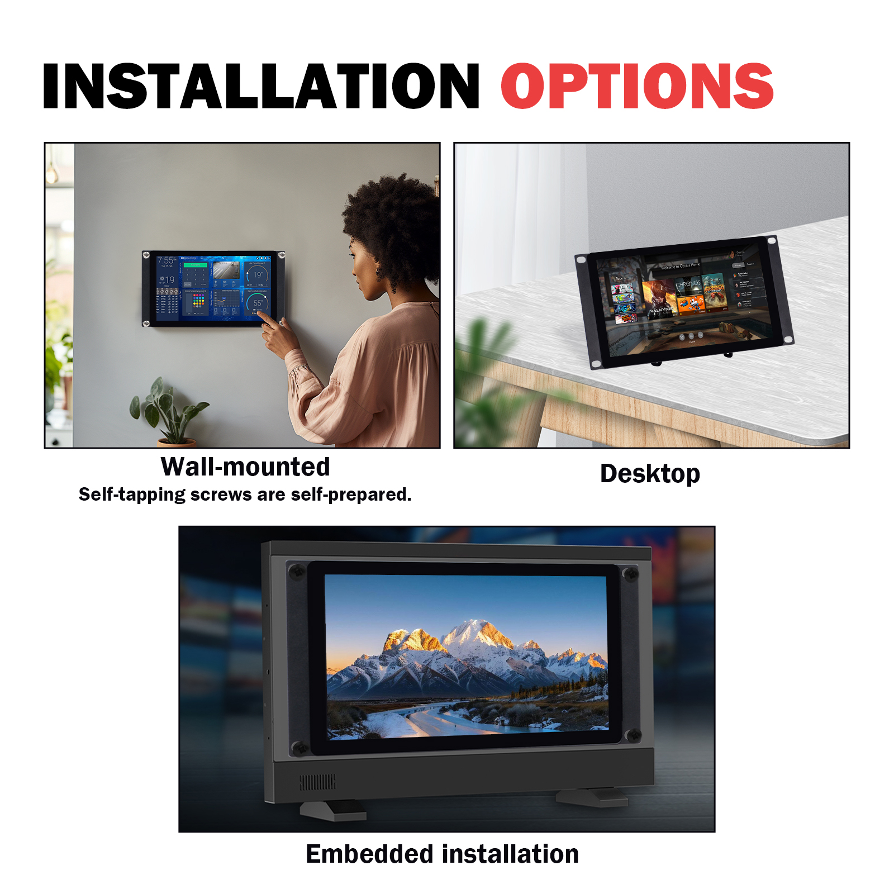
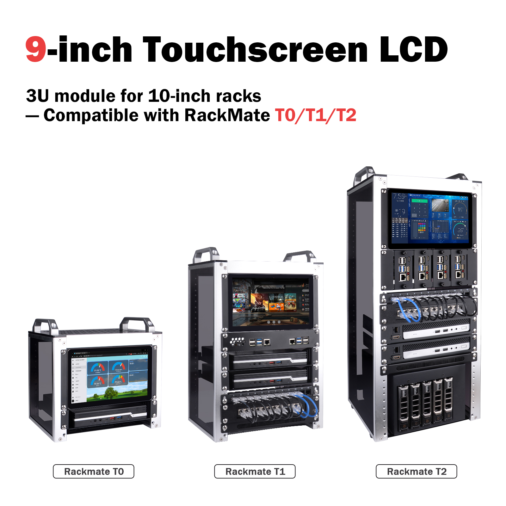
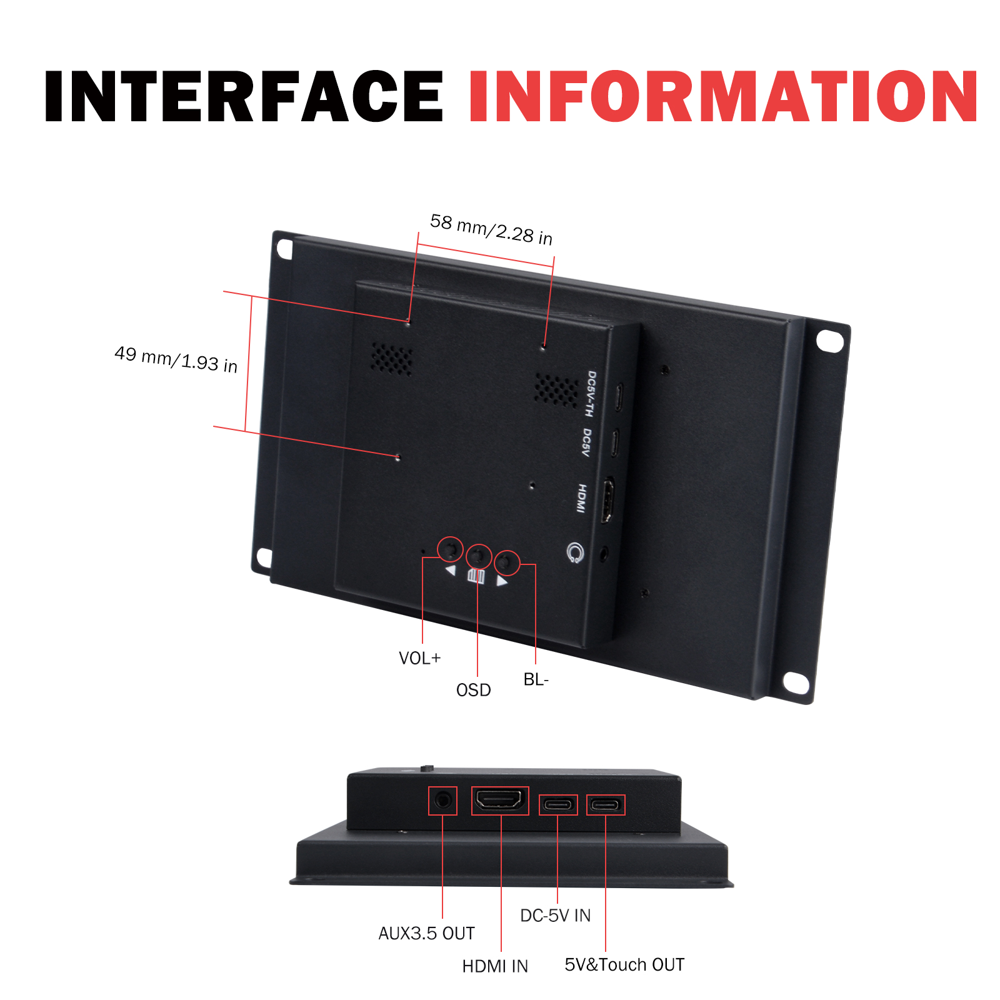
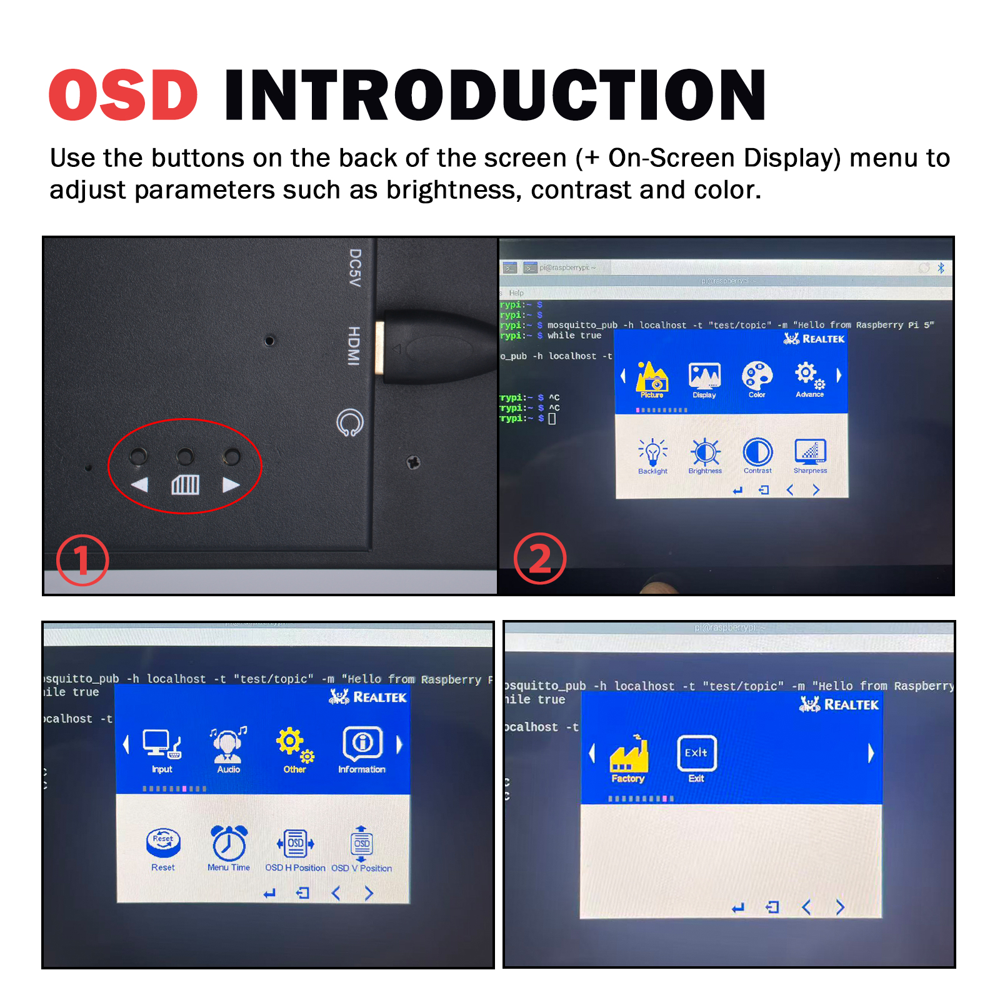
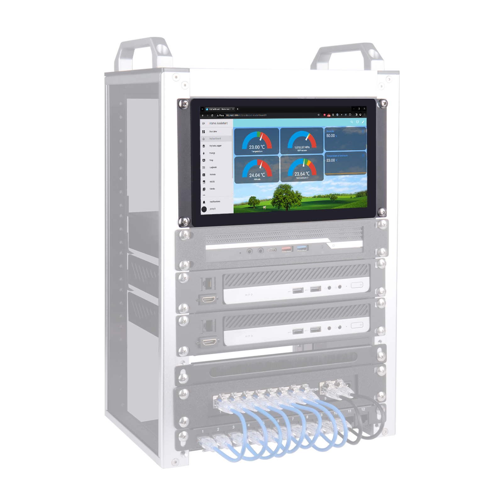
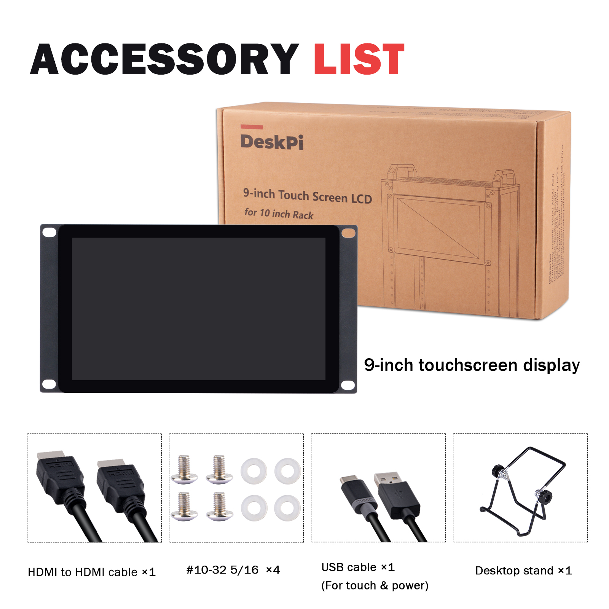
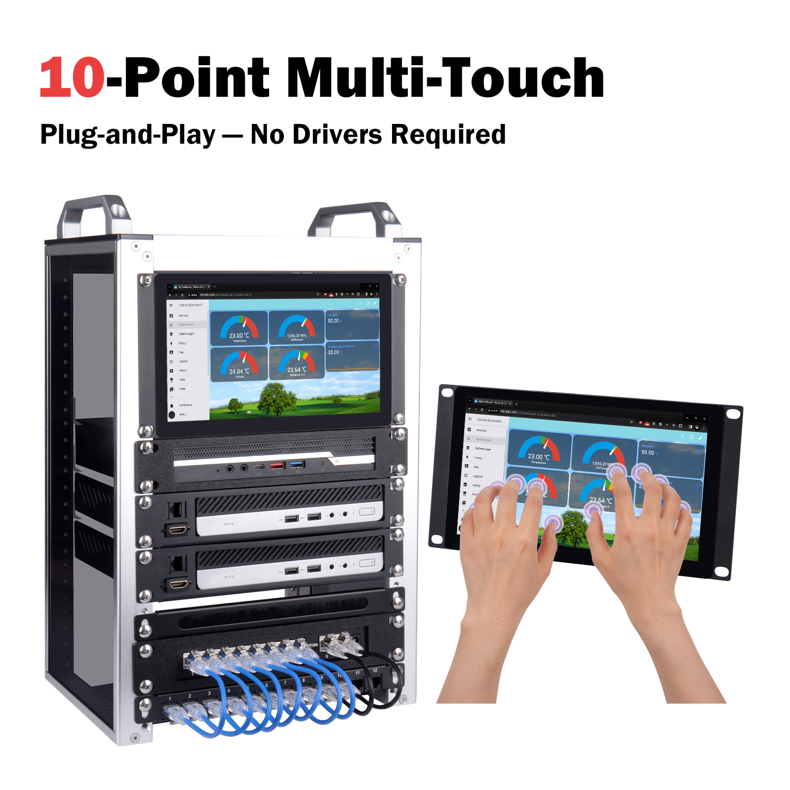

# DeskPi 9-inch Touch Screen LCD Display

## Product SKU

* Product Name: DeskPi 9-inch Touch Screen LCD Display
* SKU: DP-0100

## Product Overview

The DeskPi DP-0100 is a 9-inch touch screen LCD display designed specifically for 10-inch racks, compatible with the DeskPi RackMate T0/T1/T2 series server cabinets. Featuring an industrial-grade design with high-resolution display, stable performance, and easy installation, it is ideal for server monitoring, maintenance data management, self-service terminals, HMI (Human-Machine Interface), and embedded applications.

---

## Product Parameters

| Parameter | Specification |
|-----------|-------------|
| **Model** | Touch P9.0 |
| **Size** | 9 inches |
| **Resolution** | 1280 (H) × 720 (V) |
| **Aspect Ratio** | TFT 16:9 |
| **Brightness** | 500 cd/m² |
| **Contrast Ratio** | 800:1 |
| **Display Colors** | 16.7M |
| **Viewing Angle** | 178° |
| **Response Time** | 10 ms |

---

## Touch Function

- **Touch Screen**: Capacitive 10-point touch
- **Surface Hardness**: ≥ 6H
- **Transmittance**: > 95%
- **Touch Life**: Over 100 million touches

### Smart Features
- **Auto Power-On**: Automatically starts when power is connected
- **Standby Mode**: Automatically enters standby when no signal is detected

### Installation Methods
Supports multiple installation methods:
- **Wall-mounting**
- **Desktop**
- **Embedded installation**

---

## ⚠️ Important Note for macOS Users

> **Touch functionality on macOS devices requires additional drivers. By default, the touch screen will NOT respond to touch input on macOS, but the display function works normally.**
>
> **This issue does NOT exist on Windows and Linux systems — touch and display work out of the box.**

If you need to use the touch function on macOS, please contact DeskPi technical support or visit the Wiki for driver installation instructions.

---

## Compatibility

## Mainboard Function

| Function | Specification |
|----------|-------------|
| **Power Consumption** | Low power, average < 10W |
| **Power Input** | DC 5V / 2A |
| **Interfaces** | Type-C1 (DC5V + Touch) / Type-C2 (DC5V) / HDMI / AUX 3.5mm |

---

## Product Features

| Feature | Specification |
|---------|-------------|
| **Active Area** | 198.912 (H) × 111.888 mm (V) |
| **Dimensions** | 249.97 × 132 × 34.5 mm |
| **Operating Temperature** | -10°C to +50°C |
| **Storage Temperature** | -15°C to +60°C |
| **Relative Humidity** | 5%–95% (non-condensing) |

---

## Product List

The package includes the following accessories:

| Accessory | Quantity |
|-----------|----------|
| 9-inch Touch Screen LCD Display | 1 unit |
| Desktop Stand | 1 piece |
| HDMI to HDMI Cable | 1 piece |
| USB Cable (for touch & power) | 1 piece |
| #10-32 5/16 Screws | 4 pieces |

---

## Product Size

### Front View Dimensions

| Dimension Parameter | Value |
|---------------------|-------|
| Overall Width | 250 mm / 9.84 in |
| Overall Height | 132 mm / 5.20 in |
| Display Area Width | 219 mm / 8.62 in |
| Display Area Height | 111 mm / 4.37 in |
| Active Display Width | 198 mm / 7.80 in |
| Mounting Hole Margin (Top/Bottom) | 11 mm / 0.43 in |
| Mounting Hole Margin (Left/Right) | 7 mm / 0.28 in |

### Side View Dimensions

| Dimension Parameter | Value |
|---------------------|-------|
| Overall Thickness | 12 mm / 0.47 in |
| Protrusion Height | 19 mm / 0.75 in |
| Panel Thickness | 2.40 mm / 0.09 in |

---

## Interface Information

### Rear Interface Layout

| Interface / Button | Function Description |
|--------------------|----------------------|
| **5V & Touch OUT** | 5V power and touch signal output |
| **DC-5V IN** | DC 5V power input |
| **HDMI IN** | HDMI video signal input |
| **AUX 3.5 OUT** | 3.5mm audio output |
| **VOL+** | Volume increase button |
| **BL-** | Backlight adjustment button |
| **OSD** | Menu button |

### OSD Menu Functions
Use the rear buttons (OSD menu) to adjust:
- Brightness
- Contrast
- Color

### Mounting Hole Positions
- Mounting hole spacing: 58 mm / 2.28 in (horizontal)
- Mounting hole to edge distance: 49 mm / 1.93 in (vertical)

## 10-Point Touch Demonstration

The DP-0100 supports 10-point capacitive multi-touch, enabling smooth multi-finger gesture operations for both rack-mounted and standalone use scenarios.

---

## After-Sales Service

For technical support or any questions, please contact our customer service team:

| Contact Method | Information |
|----------------|-------------|
| **Email** | sales@deskpi.com |
| **Official Website** | www.deskpi.com |
| **Wiki** | wiki.deskpi.com |

## Product Specifications Overview

### Display Panel
| Item | Specification |
|------|-------------|
| Model | Touch P9.0 |
| Screen Size | 9 inches diagonal |
| Resolution | 1280 (H) × 720 (V) HD |
| Aspect Ratio | 16:9 |
| Brightness | 500 cd/m² |
| Contrast Ratio | 800:1 |
| Display Colors | 16.7 M |
| Response Time | 10 ms (typical) |
| Viewing Angle | 178° (H) / 178° (V) |

### Touch Panel
| Item | Specification |
|------|-------------|
| Technology | Projected Capacitive, 10-point Multi-Touch |
| Surface Hardness | ≥ 6H |
| Transmittance | > 95% |

### Mechanical Structure
| Item | Specification |
|------|-------------|
| Housing Material | Cold Rolled Steel |
| Active Display Area | 198.91 (H) × 111.88 (V) mm |
| Dimensions | 249.97 × 132 × 34.5 mm |
| Installation Methods | Wall-mount / Desktop / Embedded |

### Electrical Parameters
| Item | Specification |
|------|-------------|
| Power Consumption | Average < 10W |
| Power Input | DC 5V / 2A |
| Interfaces | Type-C1 (DC5V+Touch) / Type-C2 (DC5V) / HDMI / AUX 3.5mm |

### Environmental Parameters
| Item | Specification |
|------|-------------|
| Operating Temperature | -10°C to +50°C |
| Storage Temperature | -15°C to +60°C |
| Relative Humidity | 5%–95% (non-condensing) |

---

## Operating System Compatibility

| Operating System | Display | Touch | Notes |
|------------------|---------|-------|-------|
| **Windows** | ✅ Supported | ✅ Plug & Play | No additional drivers required |
| **Linux** | ✅ Supported | ✅ Plug & Play | No additional drivers required |
| **macOS** | ✅ Supported | ⚠️ **Requires Additional Driver** | Touch does NOT work by default; display works normally |

> **For macOS users:** Please contact DeskPi technical support or visit [wiki.deskpi.com](https://wiki.deskpi.com) to obtain the touch driver and installation instructions.

---

## Package Contents

- [x] 9-inch Touch Screen LCD Display × 1
- [x] Desktop Stand × 1
- [x] HDMI to HDMI Cable × 1
- [x] USB Cable (for touch & power) × 1
- [x] #10-32 5/16 Screws × 4
- [x] User Manual × 1

---

## Document Information

| Item | Content |
|------|---------|
| **Product Model** | DP-0100 |
| **Product Name** | 9-inch Touch Screen LCD for 10 inch Rack |
| **Brand** | DeskPi |
| **Official Website** | www.deskpi.com |
| **Wiki Documentation** | wiki.deskpi.com |
