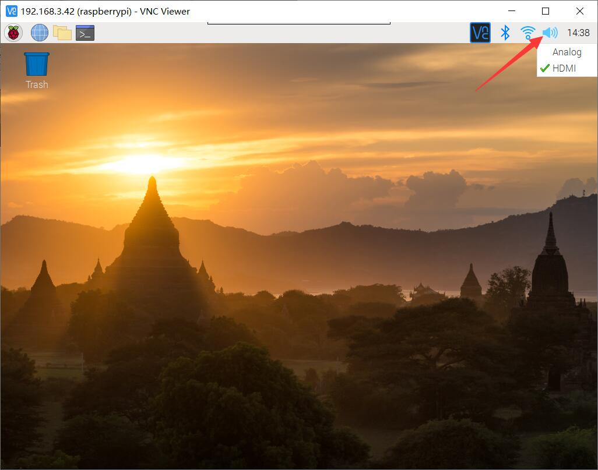

## Getting Start  
.

For order please visit: [DeskPi.com](https://www.deskpi.com/).

## How to check audio output
* The audio output can be two ways: `3.5mm jack`, `HDMI cable`.
If you connect HDMI cable to your DeskPi on `HDMI0` port which is beside USB-C Port on the back of the panel, it will be recognized by Raspbian OS as `HDMI-1`, and the other one is recognized as `HDMI-2`
### How to change audio output.
* **Right Click** the sound icon on the task bar.

* And select which one you want to output: 
**Analog** - It will change audio output to 3.5mm jack.  
**HDMI-1** - It will change audio output to `HDMI0`.  
**HDMI-2** - It will change audio output to `HDMI1`.  
* And then restart your application you will heard the sound.

