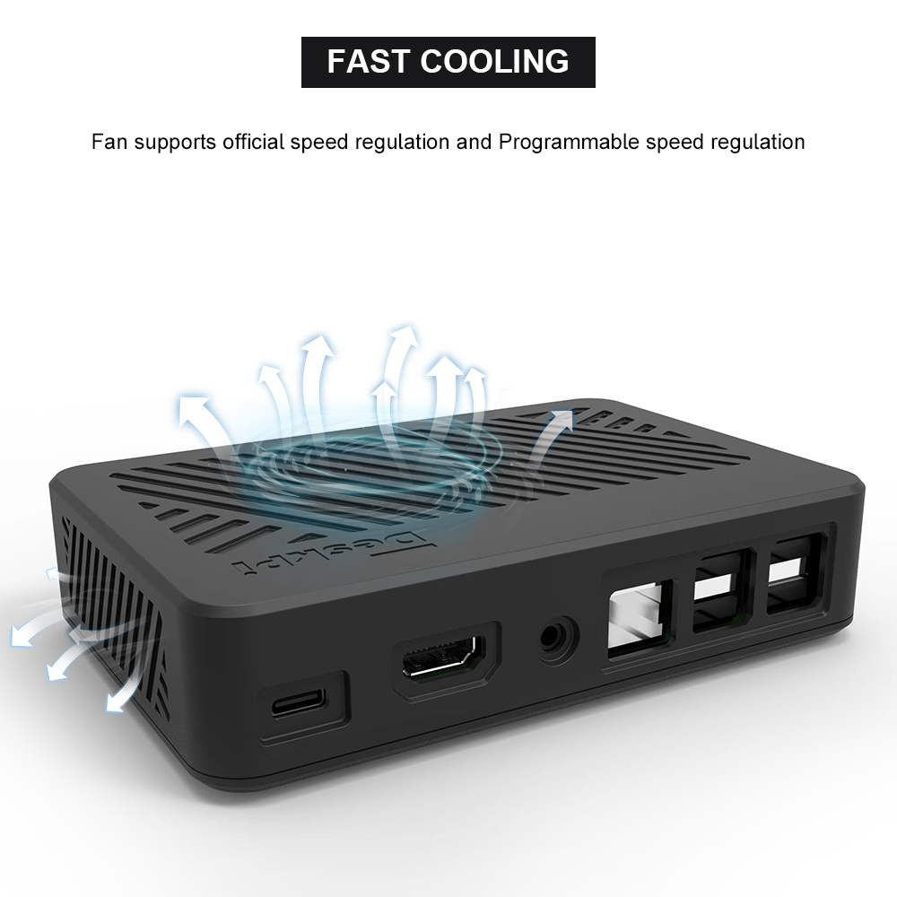
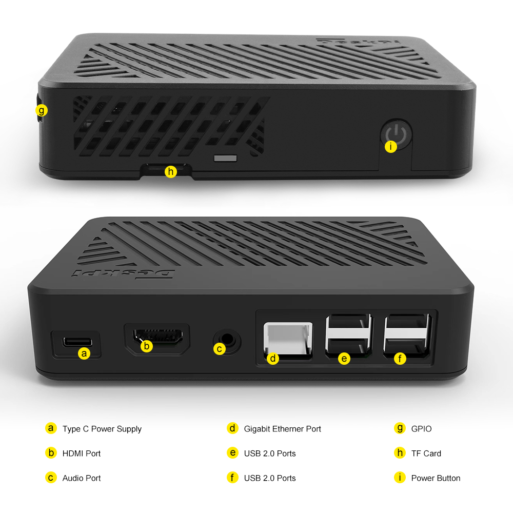
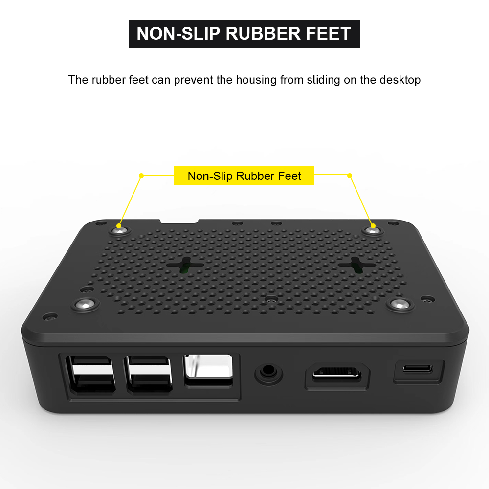
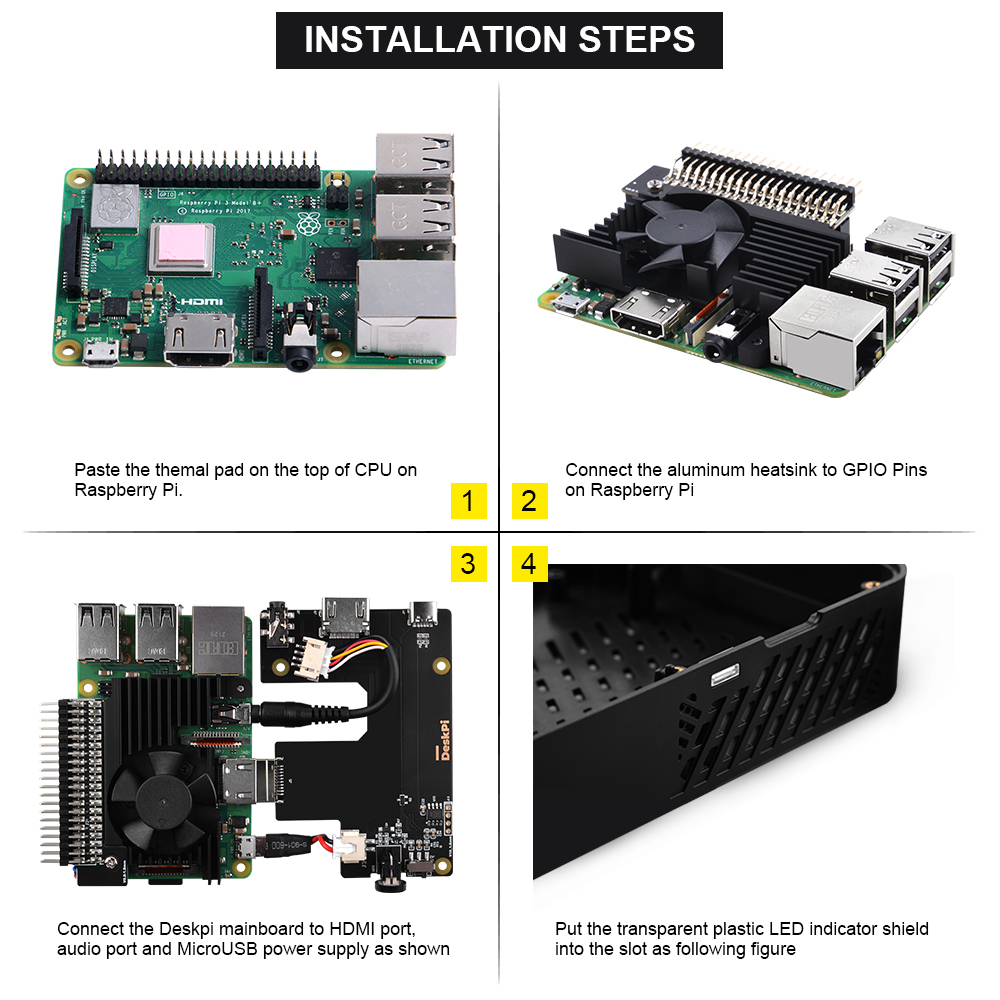
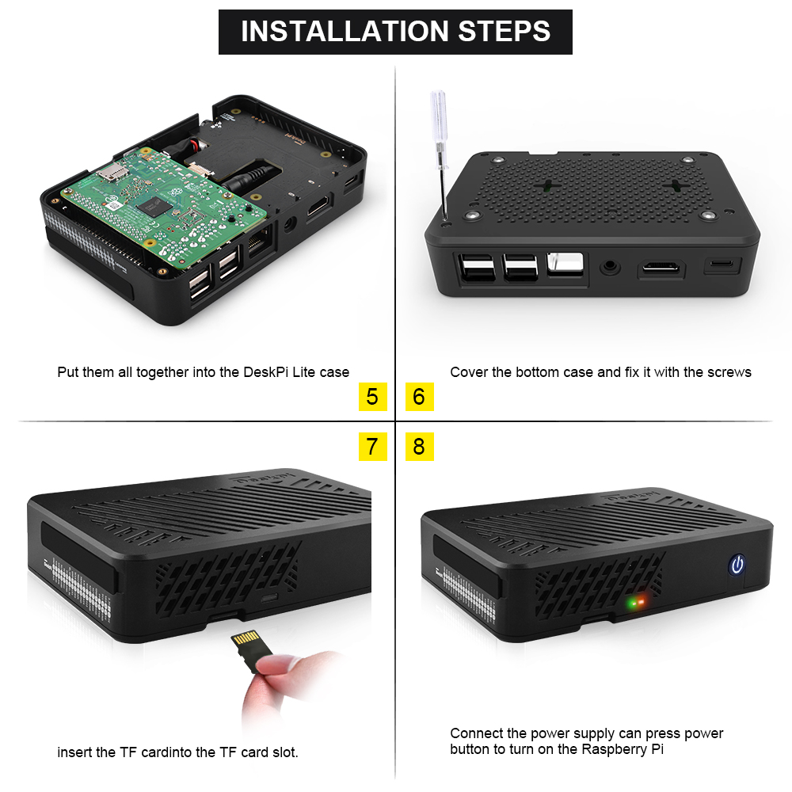

# DeskPi Lite for Raspberry Pi 3B/3B+
.jpg)
## Description 

Introducing the DeskPi Lite for Raspberry Pi 3B/3B+ - a sleek and efficient ABS case designed specifically for Raspberry Pi 3B/3B+ users. With a built-in mainboard, this case helps consolidate the MicroUSB, HDMI port, and 3.5mm audio jack to the back, making cable management a breeze. 

The package includes a PWM adjustable speed fan and an aluminum heatsink for optimal thermal performance.

 The DeskPi Lite combines effective heat dissipation with a stylish design, making it the perfect addition to your Raspberry Pi setup. 

## Purchase 

[DeskPi Lite](https://deskpi.com/collections/deskpi-lite/products/new-deskpi-lite-for-raspberry-pi-3b-3b)

## Features
* Easy-to-assemble ABS enclosure 
* PWM signal adjustable speed fan for optimal Cooling 
* Convenient cable management with rear-facing MicroUSB, HDMI port, and 3.5mm audio jack 
* LED indicator shield for enhanced visual appeal
* Mounting hole support for versatile installation options 
* Elegant desktop-set style design 

## Gallery
* Fast Cooling 


* Port Definitions 


* Anti-slipper rubber feet


## How to assemble
* Step 1 

* Step 2


## Package includes
* 1 x DeskPi Lite for Raspberry Pi 3B/3B+ 
* 1 x PWM adjustable speed fan with aluminum heatsink 
* 4 x Thermal pad for improved heat transfer 
* 2 x M.2 screws for securing the aluminum heatsink 
* 1 x Transparent plastic shield for the LED indicator

## How to cut off the power safely?
After safe shutdown your Linux system by typing this command:
```bash
sudo init 0 
```
and `Long press` the power button until the LED color on power button from `Blue` turn to `Red`.

## How to enable fan temperature control? 

<pre> NOTE: Raspberry Pi OS (Latest) will support this function.</pre>

* Open a terminal and typing following command:

```
sudo raspi-config 
```

Navigate to `Performance Options` -> `P4 Fan` -> `Yes` -> `14` -> `60` -> `yes` -> `finish` -> reboot Raspberry Pi.

The fan is support `PWM` signal control via `GPIO14` which is `physical pin 12`(TXD), it will spinning when the CPU temperature is above `60` degree.

and also you can write your code to control the fan via `GPIO14`, sending `PWM` signal will trigger the fan spinning.

## How to control fan speed by sending PWM signal?
* Create a python file and paste following demo code into it. 
```python
 #!/usr/bin/python3

import RPi.GPIO as GPIO
import time
import subprocess

GPIO.setmode(GPIO.BCM)
GPIO.setup(14, GPIO.OUT)
pwm = GPIO.PWM(14,100)

print("\nPress Ctrl+C to quit \n")
dc = 0
pwm.start(dc)

try:
    while True:
        temp = subprocess.getoutput("vcgencmd measure_temp|sed 's/[^0-9.]//g'")
        if round(float(temp)) >= 45:
            dc = 100
            pwm.ChangeDutyCycle(dc)
            print("CPU Temp:",float(temp)," Fan duty cycle:",dc)
            time.sleep(180.0)
        if round(float(temp)) >= 40:
            dc = 85
            pwm.ChangeDutyCycle(dc)
            print("CPU Temp:",float(temp)," Fan duty cycle:",dc)
            time.sleep(120.0)
        else:
            dc = 70
            pwm.ChangeDutyCycle(dc)
            print("CPU Temp:",float(temp)," Fan duty cycle:",dc)
            time.sleep(60.00)

except KeyboardInterrupt:
    pwm.stop()
    GPIO.cleanup()
    print("Ctrl + C pressed -- Ending program")

```

Then execute it:

```
python3 fan_control.py
```
## FAQ
* Q: Can I power off it by double clicking the power button?

> A: No, It can not send power off signal by adding `dtoverlay=dwc2,dr_mode=host` to enable otg mode on microUSB port on Raspberry Pi 3B/3B+, it can only cut off power by pressing the power button until the LED indicator turns from `blue` to `red`, it just cut off the power supply from power source to Raspberry Pi.


