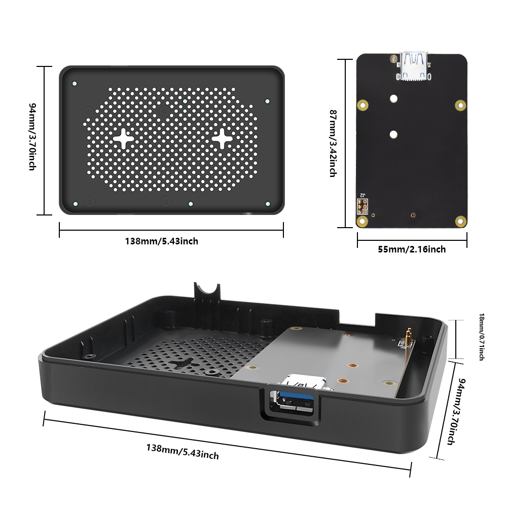

# DeskPi Lite NAS Case


## Description 
The DeskPi Lite NAS is an ABS case with an integrated M.2 SATA SSD expansion board, a cooling heatsink, and a PWM signal controlled fan. This case provides reliable protection for your NAS components, efficient heat dissipation, and the flexibility to adjust fan speed according to your requirements. It is a practical and functional solution for expanding storage capacity while maintaining optimal performance in your NAS system.

## Purchase 

[DeskPi Lite NAS Case](https://deskpi.com/collections/deskpi-lite/products/deskpi-lite-m-2-sata-expansion-board-for-raspberry-pi-4-only-compatible-with-deskpi-lite-case)

## Product Features
* **ABS Case:** The DeskPi Lite NAS features a sturdy ABS (Acrylonitrile Butadiene Styrene) case that provides durability and protection for your M.2 SATA SSD expansion board and other internal components. ABS is known for its strength and impact resistance, making it an ideal material for this type of case.

* **M.2 SATA SSD Expansion Board:** The case is designed with an integrated M.2 SATA SSD expansion board, allowing you to easily install and securely mount an M.2 SATA SSD. This expansion board provides additional storage capacity for your NAS setup, enhancing its versatility and performance.

* **Cooling Heatsink:** To maintain optimal operating temperatures for the M.2 SATA SSD and other components, the DeskPi Lite NAS incorporates a cooling heatsink. The heatsink efficiently dissipates heat generated during extended operation, preventing overheating and ensuring the reliable performance of your NAS system.

* **PWM Signal Controlled Fan:** The cooling heatsink is accompanied by a PWM (Pulse Width Modulation) signal controlled fan. This fan is capable of dynamically adjusting its rotational speed based on temperature requirements. By monitoring the system temperature, the fan can automatically increase or decrease its speed to provide effective cooling while minimizing noise levels.

* **Adjustable Fan Speed:** The PWM signal controlled fan allows you to adjust the fan speed manually, providing flexibility in balancing cooling performance and noise levels according to your preferences. This feature enables you to optimize the cooling efficiency of your DeskPi Lite NAS while maintaining a quieter environment.

* **Efficient Airflow:** The combination of the cooling heatsinks and the PWM signal controlled fan ensures efficient airflow within the case. This airflow helps to dissipate heat effectively, keeping the M.2 SATA SSD and other components within the optimal temperature range, even during demanding usage scenarios.

* **Easy Installation:** The DeskPi Lite NAS is designed for straightforward installation. It typically includes all the necessary mounting hardware and connectors, making it easy to assemble and integrate with your existing NAS setup.

* M.2 SATA SSD Adapter board (`Support M.2 SATA SSD B-KEY Only`)

-----
Note: M.2 SATA SSD drive and Raspberry Pi 4B does not included in the package, additional purchase required.

## Compatibility
* Raspberry Pi 4 model B Only

## Box Content 
* 1 x DeskPi Lite NAS Case
* 1 x M.2 to SATA SSD adapter board
* 1 x USB3.1 Connector 
* 1 x Instruction Manual
* 2 x M2x7+6mm Copper pillar (For fixing Heatsink)
* 6 x M2x7+4mm Copper pillar (For fixing M.2 SATA SSD Adapter board)
* 6 x M2x10+4mm Copper pillar (For fixing DeskPi Lite daughter board 
* 6 x M2x12 Black Long screw(For fixing whole case)
* 4 x Thermal pad

## Gallery
* Package Includes


* Dimension



* Port definitions

- Inside 


- Outside


* M.2 SATA SSD only
.jpg)
* Please NOTE following figure, it's very important!


## LED indicator Meaning
* **Red**: Power on
* **Green**: Disk activity status


## About PWM adjustable Fan 
> NOTE: Please read following note carefully!!!


## How to Assemble it
1. Open your DeskPi Lite, remove ABS bottom case.
2. Fix M2x7+6mm copper pillar to those two positon to keep heatsink steady
3. Fix another two hole with M2x7+4mm copper pillar.
4. Fix M.2 SATA SSD drive to M.2 SATA SSD adapter board with flat head screw.
5. Fix the M.2 SATA SSD adapter board to Raspberry Pi with M2x7+4mm copper pillar.（Make sure the copper pogo-pin contact well with GPIO soldering point.）
6. Fix DeskPi Lite daughter board and upper case with M2x10+4 copper pillar
7. Fix bottom case with screws.
8. Connect the USB3.0 connector on the back of DeskPi Lite on USB3.0 Port.
### Assemble Figure
* Step 1

* Step 2 

### Breakout view

* Please note that copper pillars type and make sure using the right one.


## How to configure M.2 SATA SSD
Connect HDMI cable to HDMI port, Power supply to USB-C port and then connect the mouse and USB keyboard to DeskPi lite, Press power button and waiting for system booting up, log into system and open a terminal.

* Check if the M.2 SATA SSD has been recognized.
Typing:
```bash
lsblk
```

You should see there is one disk called “sda”, that’s your M.2 SATA SSD drive.

* Parted and format partition
```bash
sudo fdisk /dev/sda 
```
press `n` for new partition, and then press `p` for primary partition, press `1` means first partition, and then press twice `enter`, make the whole disk as one partition, press `w` to write the partition table to disk and press `q` to quit.
```bash
sudo partprobe /dev/sda 
sudo mkfs.ext4 /dev/sda1   # format the disk to ext4 filesystem.
Mount Disk drive and upload file
mkdir /home/pi/mydisk    # make a mounting point 

sudo mount -t ext4 /dev/sda1 /home/pi/mydisk     #Mount disk to mounting point 

sudo chmod 777 /home/pi/mydisk      # grant user to access and write permisions.
sudo chown -R pi:pi /home/pi/mydisk    # grant user pi to take ownership of the folder.
```
That’s it. You can also build your own samba server to hold the disk to share with your family or your friends in your local area network (LAN).

## How to enable adjustable speed fan
 1. Press `Ctrl+T` or click terminal Icon to open a terminal and typing: 

```bash
sudo raspi-config
```
Navigate to `4 Performance Options`:

and navigate to P4 Fan and select YES.

Keep `14` as default.

select `yes`, input a temperature in degrees should the fan turn on, Recommend setting to `60` degree.


select yes and reboot your Raspberry Pi.


If you are using other OS on Raspberry Pi, please refer to how to generate PWM signal in your OS.
Here is a demo code, it will help you to control the fan speed according to the temperature of CPU.
### Demo code of fan control
```python 
#File Name: fan_control.py
#!/usr/bin/python3

import RPi.GPIO as GPIO
import time
import subprocess

GPIO.setmode(GPIO.BCM)
GPIO.setwarnings(False)
GPIO.setup(14, GPIO.OUT)
pwm = GPIO.PWM(14,100)

print("\nPress Ctrl+C to quit \n")
dc = 0
pwm.start(dc)

try:
    while True:
        temp = subprocess.getoutput("vcgencmd measure_temp|sed 's/[^0-9.]//g'")
        if round(float(temp)) >= 45:
            dc = 100
            pwm.ChangeDutyCycle(dc)
            print("CPU Temp:",float(temp)," Fan duty cycle:",dc)
            time.sleep(180.0)
        if round(float(temp)) >= 40:
            dc = 85
            pwm.ChangeDutyCycle(dc)
            print("CPU Temp:",float(temp)," Fan duty cycle:",dc)
            time.sleep(120.0)
        else:
            dc = 70
            pwm.ChangeDutyCycle(dc)
            print("CPU Temp:",float(temp)," Fan duty cycle:",dc)
            time.sleep(60.00)

except KeyboardInterrupt:
    pwm.stop()
    GPIO.cleanup()
print("Ctrl + C pressed -- Ending program")
```
Save it and execute it in a terminal:
```bash
python3 fan_control.py
```

## Keywords
* DeskPi Lite M.2 SATA SSD Expansion kit, DeskPi Lite expansion board, M.2 SATA SSD driver board for DeskPi Lite.


