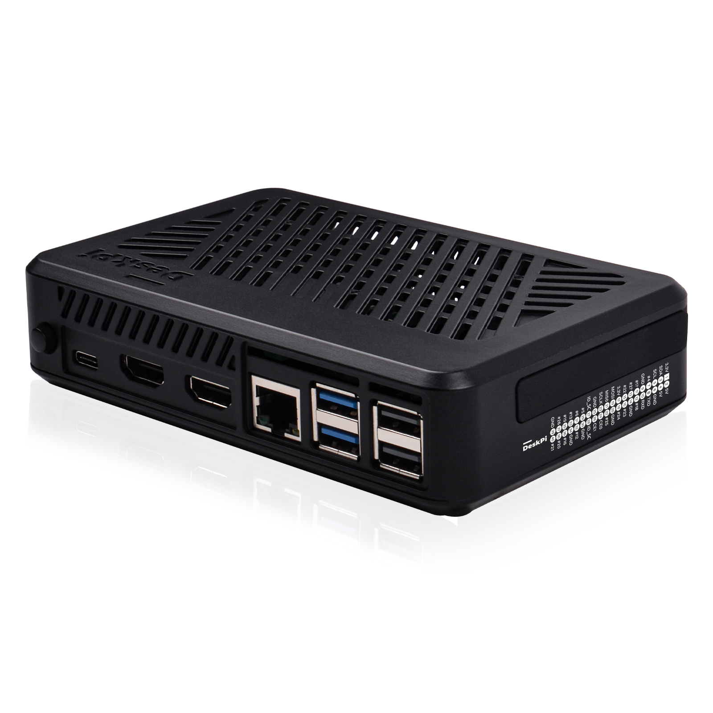
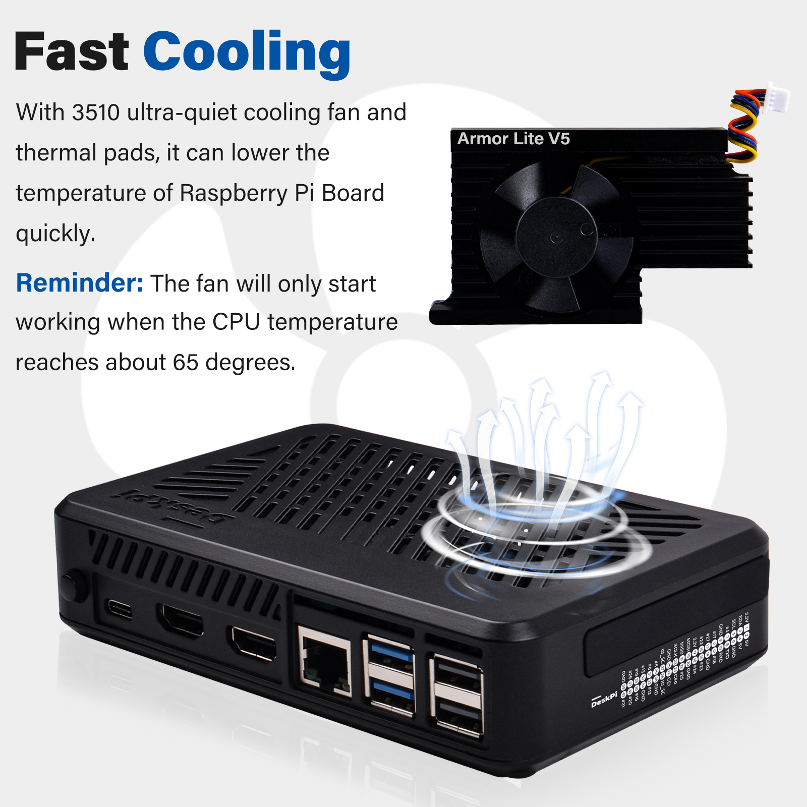
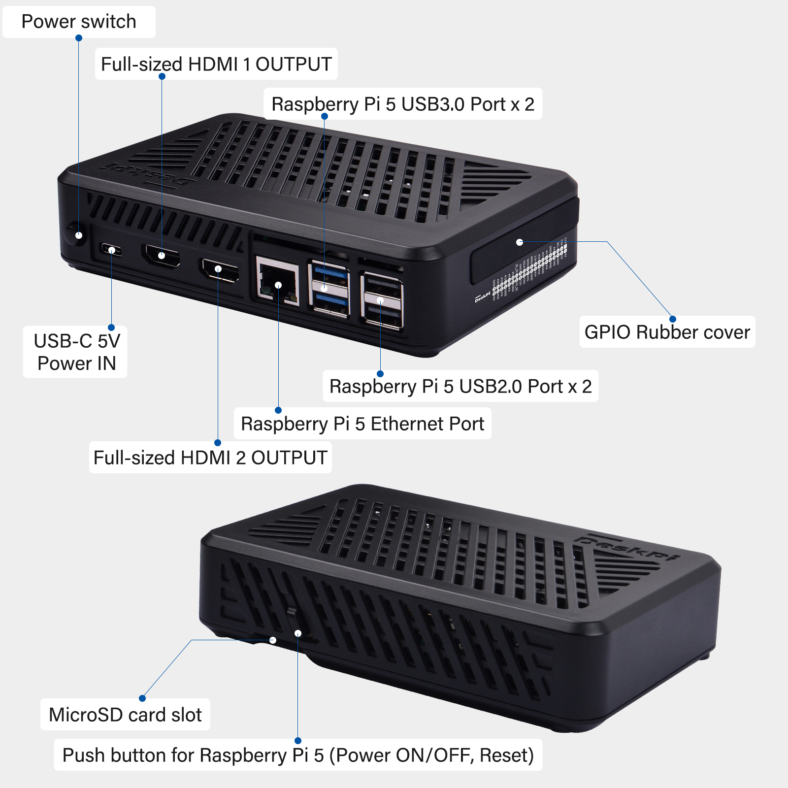
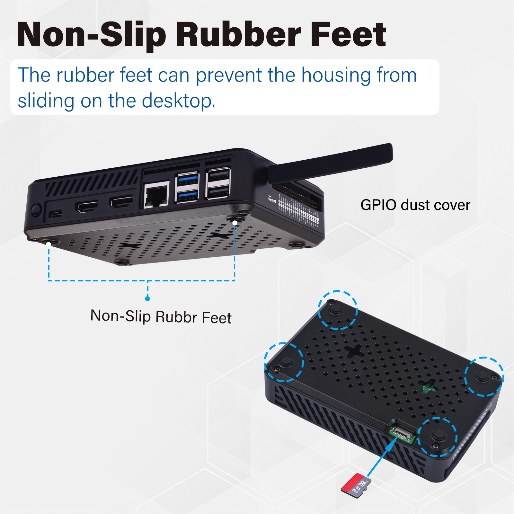
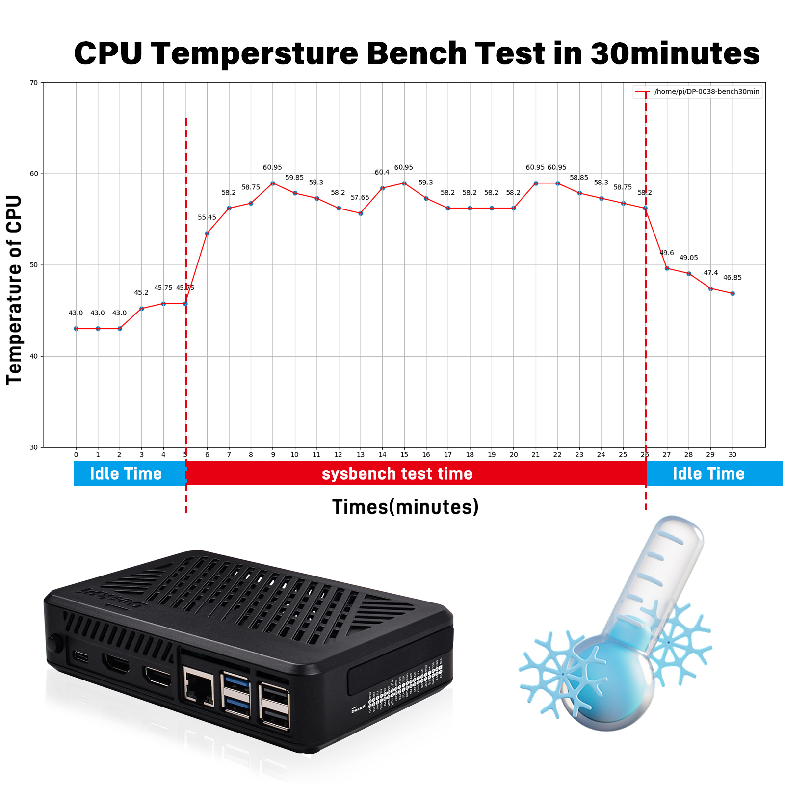
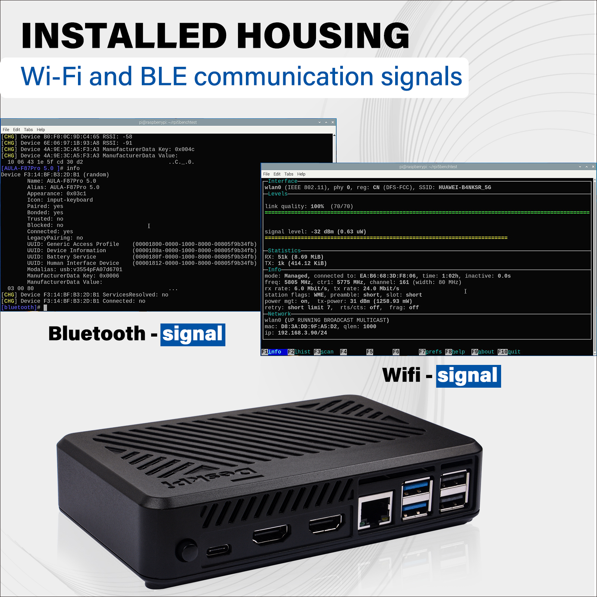
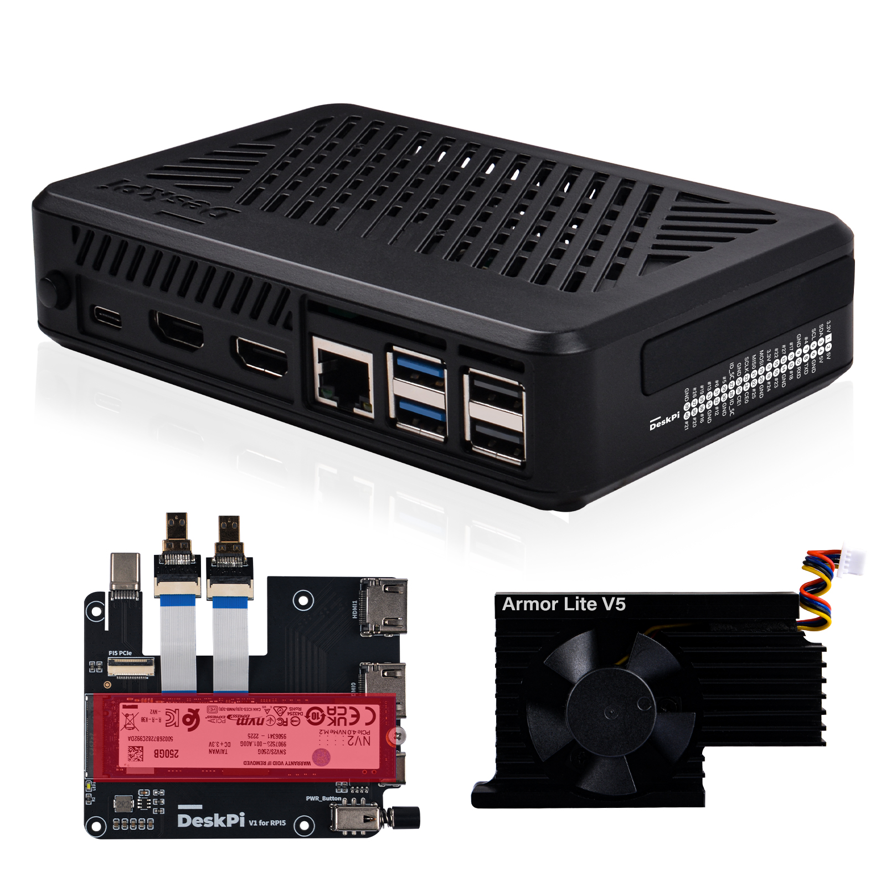
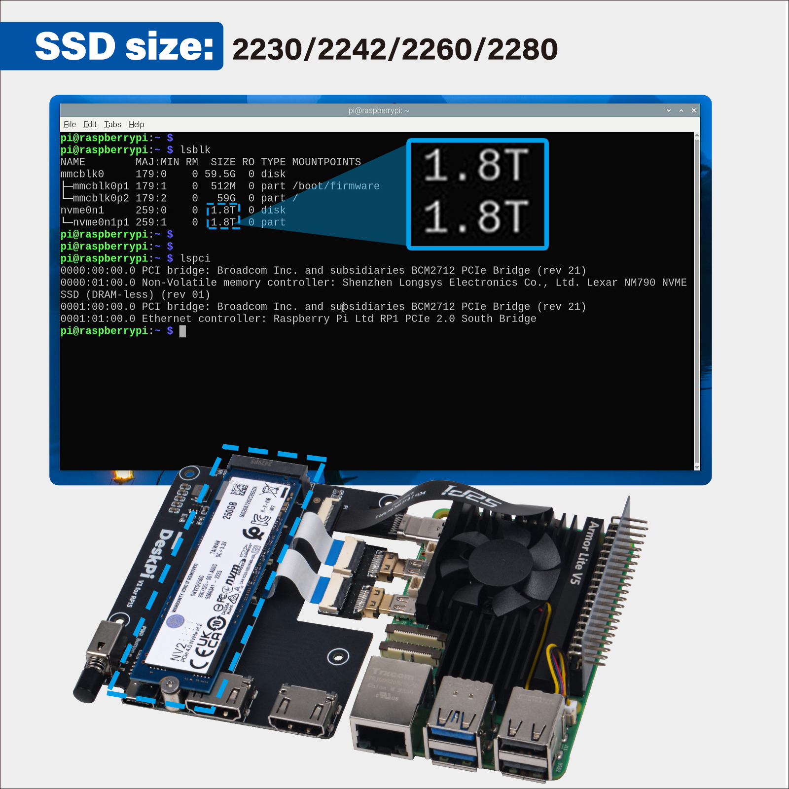
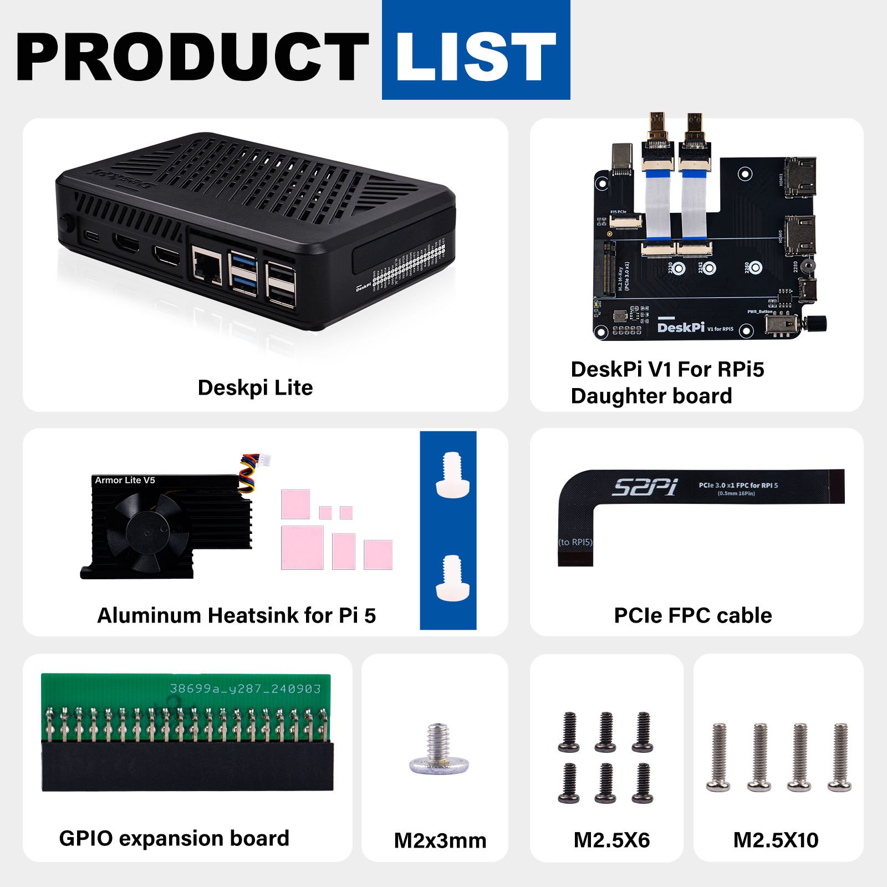

# DeskPi Lite Pi5 Case

The DeskPi Lite Pi5 case is a specially designed enclosure for the Raspberry Pi 5, crafted from durable ABS material. This case is not just a protective shell but a comprehensive solution that enhances the functionality and usability of your Raspberry Pi 5.


## Purchase URL

* Purchase: [DeskPi Lite Pi5 Case](https://deskpi.com/)
* Product SKU: DP-0038

## Key Features

- **Customized Design**: The DeskPi Lite is tailored to fit the Raspberry Pi 5 perfectly, ensuring a snug and secure fit for your device.

- **Advanced Cooling System**: Equipped with an Armor Lite V5 auto-throttling fan, the case provides efficient cooling to maintain optimal performance and extend the life of your Raspberry Pi.

- **Convenient Connectivity**: The case includes a PCB daughter board that offers a MicroHDMI to standard HDMI adapter, allowing for easy connection to displays. It also reroutes the USB-C port to the back for better cable management.

- **Expandability**: The DeskPi Lite supports PCIex1 expansion, enabling the connection of M.2 NVMe SSDs in various sizes (2230, 2242, 2260, 2280). It is also compatible with the Hailo-8L module from the official Raspberry Pi AI kit, though not as a full HAT.

- **GPIO Access**: The case features a GPIO expansion board and a GPIO dust cover, making it easy to access and protect the GPIO pins.

- **Non-Slip Feet**: Rubber feet are included to prevent the case from sliding on desktop surfaces, ensuring stability during use.

- **Power Management**: The case comes with a power switch button for easy on/off control and a reset push button for the Raspberry Pi 5.

## Gallery 

* Product Outlook

> NOTE: Raspberry Pi 5 does not include in the package,
> additional purchase required.




* Armor Lite V5 cooling system  

> 3510 Ultra-quiet cooling fan 
> Automatically spin associate with the CPU temperature changing
> Fan will stop spin when the CPU temperature is lower than 60 degree 



* Port definitions 

- **Self-lock Power Switch** - External Power ON/OFF 
> It will cut off power from whole device, please make sure the Raspberry Pi 5 has been shutdown
> properly and then click this button to `cut off power`. 

- **Power On/Off/Reset button** - Raspberry Pi 5's feature 
> Press the button in front, it will pop up a screen on your deskptop to ask if
> you want to shutdown or reboot your Raspberry Pi 5. `double-click` this button
> will shutdown the Raspberry Pi 5 immidiately. `long-press` will shutdown your
> Raspberry Pi 5 forcely, anything unsaved will be lost! `Be caution`. 
> If you just want to turn off the Raspberry Pi 5 but do not want to cut off the
> power, you don't have to release the self-lock power switch. 



* Anti-dust design and anti-slippery



* Heat dissipation effect 

> Test Envionment: Raspberry Pi 5 8G, Heavy duty mode, 30minutes bench test with
> sysbench and glmark2-wayland. 



* Wi-Fi and Bluetooth Signal Status 

> Following figure will show you the Wi-Fi signal status and Bluetooth status
> when I put the Raspberry Pi 5 and M.2 NVMe SSD into the case.
> It will not block your Wi-Fi sigal.



* M.2 NVMe SSD Support

> Support Gen2.0/Gen3.0: Raspberry Pi 5 Official supports PCIe Gen2.0, but you can work on PCIe Gen3.0
> without Raspberry Pi official certificated.
> M.2 NVMe size supports: 2230/2242/2260/2280 



* Application senarios 

The DeskPi Lite Pi5 case is an excellent choice for those looking to create a home lab, a media center, or any project that requires the power and flexibility of the Raspberry Pi 5. Its design and features make it a must-have accessory for any Raspberry Pi enthusiast.



> We have test various brands as following charts:

* Tested NVMe SSD Disk information Charts

| Id | Brand |Disk Size |  Disk Capacity | Test Result |  
| :---: | :---: | :---: | :---: | :---: |  
| 1 | Lexar NQ790 | M.2 2280 PCIe Gen4x4 NVMe SSD | 2TB | <font color=green>TEST OK</font> |
| 2 | SAMSUNG 990 Pro |  M.2 2280 PCIe Gen4.0 NVMe SSD | 2TB | <font color=green>TEST OK</font> | 
| 3 | Fanxiang | M.2 2242 PCIe NVMe SSD | 256GB  | <font color=green>TEST OK</font> | 
| 4 | KingSton NV2 | M.2 2280 PCIe4.0 NVMe SSD | 250GB  | <font color=green>TEST OK</font> | 
| 5 | KingSpec | M.2 2242 PCIe NVMe SSD | 128GB  | <font color=green>TEST OK</font> | 
| 6 | aigo P3500 | M.2 2280 PCIe NVMe SSD| 512GB | <font color=green>TEST OK</font> | 
| 7 | Lexar NQ790 | M.2 2280 PCIe Gen4x4 NVMe SSD| 2TB | <font color=green>TEST OK</font> | 
| 8 | Netac |  M.2 2280 PCIe Gen4x4 NVMe SSD| 128GB  | <font color=green>TEST OK</font> | 
| 9 | WD_Black SN770 | M.2 2280 NVMe SSD| 2TB | <font color=green>TEST OK</font> | 


## How to assemble the case 

TBD.

## Package Includes

- DeskPi Lite Case
- Armor Lite V5 Fan
- DeskPi V1 for RPi5 Daughter Board
- PCIe FPC Cable
- GPIO Expansion Board
- M2x3mm, M2.5x6, M2.5x10 Screws




## Enabling and Configuring PCIe Interface on Raspberry Pi 5 for Gen3.0 Usage

The Raspberry Pi 5 introduces a new level of performance with its PCIe interface, allowing for high-speed data transfer and the use of advanced peripherals. 
Here’s a step-by-step guide to enable and configure the PCIe interface on your Raspberry Pi 5 for Gen3.0 usage.

### Enabling the PCIe Interface

- **Access the Config File**: To enable the PCIe external connector, you need to edit the `config.txt` file located in the `/boot/firmware/` directory.

- **Add the Enable Line**: Open the `config.txt` file and add the following line to enable the PCIe external connector, add it under `[all]` section:

```bash 
[all]
dtparam=pciex1
```

This line can also be aliased as:

```bash
[all]
dtparam=nvme
```
After adding this line, save and close the file.

- **Reboot Your Raspberry Pi**: For the changes to `take effect`, `reboot` your Raspberry Pi.

### Setting PCIe to Gen3.0

By default, the PCIe connection on the Raspberry Pi 5 is certified for Gen2.0 speeds (5 GT/sec). 
However, you can force it to operate at Gen3.0 speeds (10 GT/sec) for improved performance.

- **Edit the Config File Again**: Open the `config.txt` file once more.

- **Add the Gen3.0 Line**: Add the following line to force the PCIe interface to Gen3.0:

```bash
[all] 
dtparam=pciex1 
dtparam=pciex1_gen=3
```
    This setting is experimental and may not work with all devices, so proceed with caution and test stability.

- **Reboot Again**: Save the file and reboot your Raspberry Pi to apply the new settings.

### Testing and Stability

After enabling the PCIe interface and setting it to Gen3.0, it’s important to test the stability and performance of your setup. Connect your desired PCIe device and monitor its operation. Look for any signs of instability such as frequent disconnections or performance issues.

### Conclusion

Enabling and configuring the PCIe interface on the Raspberry Pi 5 for Gen3.0 usage can significantly enhance the performance of your projects. 
Always ensure to test the stability of your setup, especially when pushing the limits with Gen3.0 speeds. The Raspberry Pi 5's PCIe capabilities open up a world of possibilities for high-speed computing and advanced peripheral integration.

### Setting Up NVMe Boot on Raspberry Pi 5

To boot your Raspberry Pi 5 from an NVMe device, you need to ensure that the PCIe interface is `enabled` and the boot order is set correctly in the bootloader configuration.


### Setting NVMe as Boot Device

- **Edit the EEPROM**: To set the NVMe device as the boot device, you need to change the `BOOT_ORDER` in the Raspberry Pi's bootloader configuration. 
    You can do this by running:

```bash
sudo rpi-eeprom-config --edit
```

- **Change Boot Order**: In the EEPROM configuration, change the `BOOT_ORDER` line to:

```bash
BOOT_ORDER=0xf416
```
   This setting tells the Pi to attempt NVMe boot first.

- **Save and Reboot**: Write the changes to the file and exit the editor. 
    Reboot your Raspberry Pi 5 to apply the new boot order.

### Flashing the NVMe SSD with Raspberry Pi OS

- **Method 1**:
    Before you can boot from the NVMe SSD, it needs to have a valid Raspberry Pi OS installed on it. 
    You can use the Raspberry Pi Imager on a computer to flash the OS onto the NVMe drive connected via a USB to NVMe adapter.

- **Method 2**: 
    You can just boot from MicroSD Card and then format the SSD device by using: `sudo fdisk /dev/nvme0n1` command and copy image from MicroSD card or a
    downloaded image file to `nvme` device by using `SD card copier` tool in Raspberry Pi OS.

### Testing the NVMe Boot

After completing the above steps, your Raspberry Pi 5 should boot from the NVMe device. 
If you encounter any issues, ensure that your bootloader is up to date and that the `BOOT_ORDER` is set correctly.
Also, verify that the NVMe SSD is properly connected and recognized by the system.
Remember, not all NVMe SSDs are compatible with the Raspberry Pi 5, and some specific models have known compatibility issues. 
Always check the compatibility list before purchasing an NVMe SSD for use with your Raspberry Pi 5.

[GO back to Home](https://wiki.deskpi.com/)

