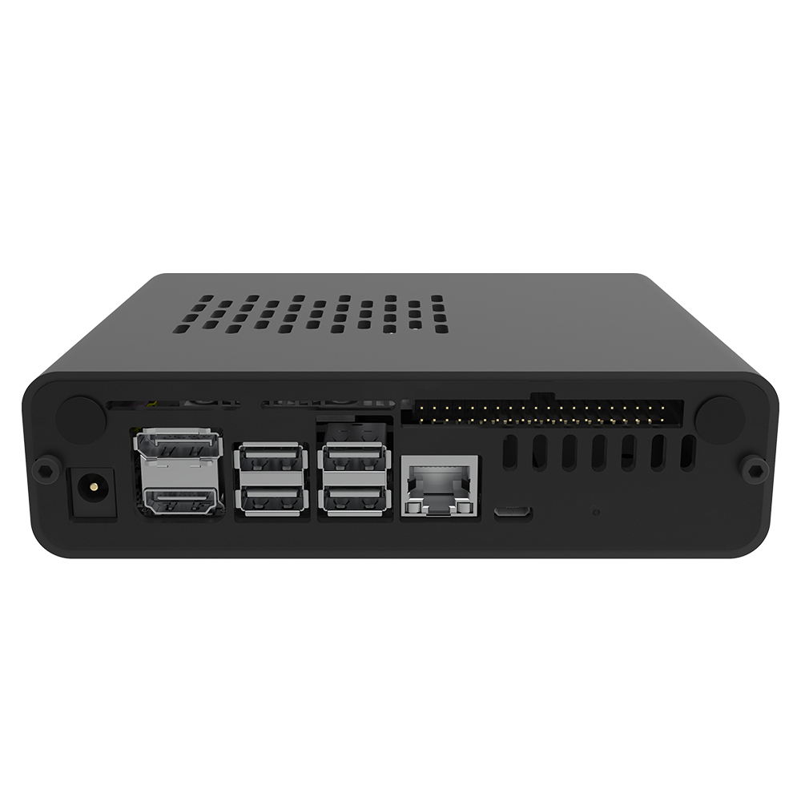
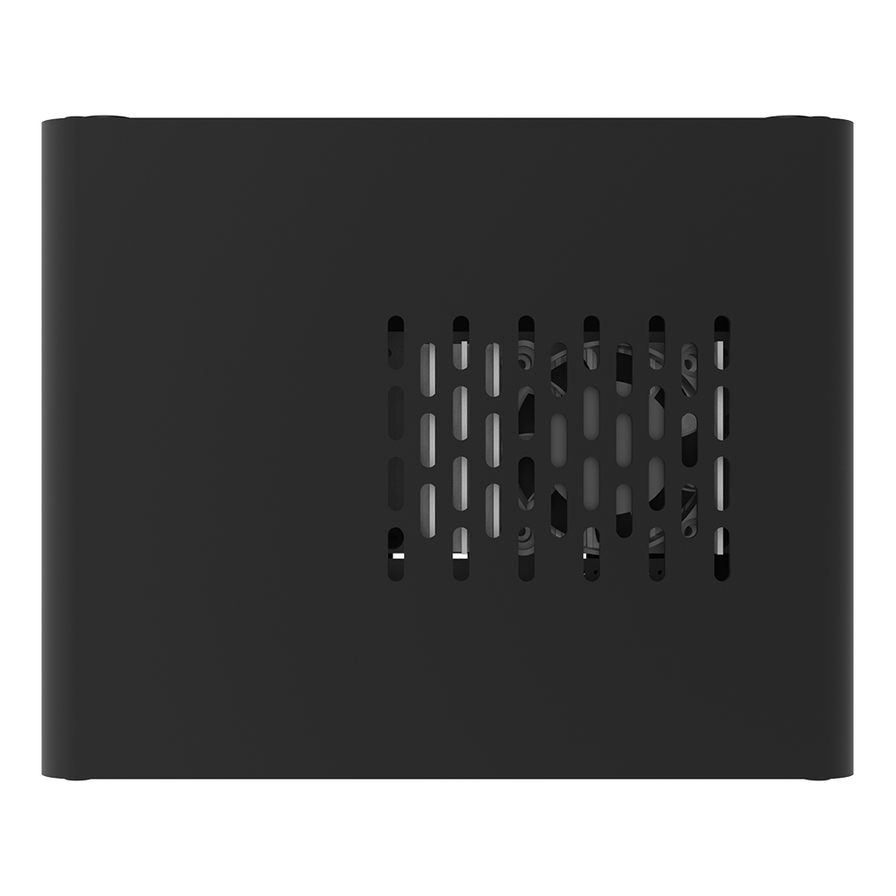
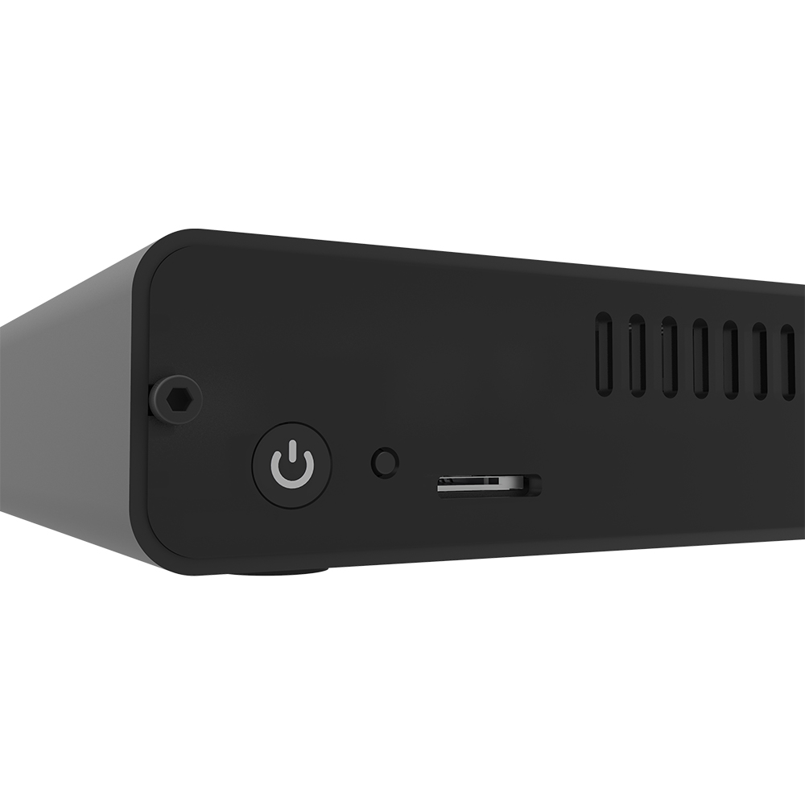
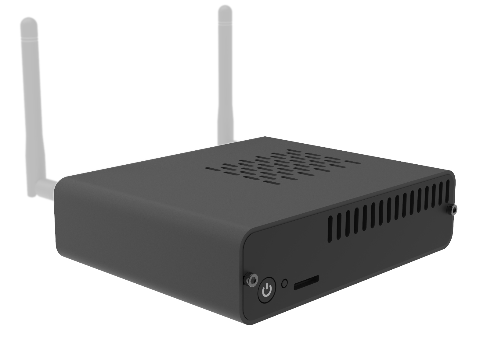
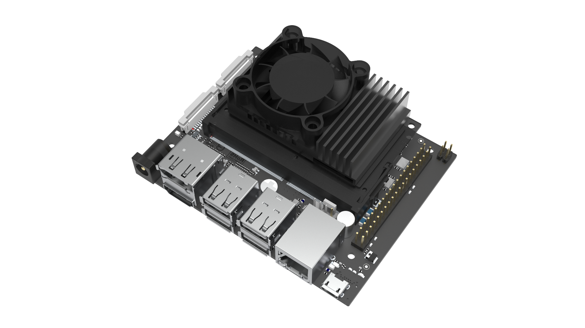
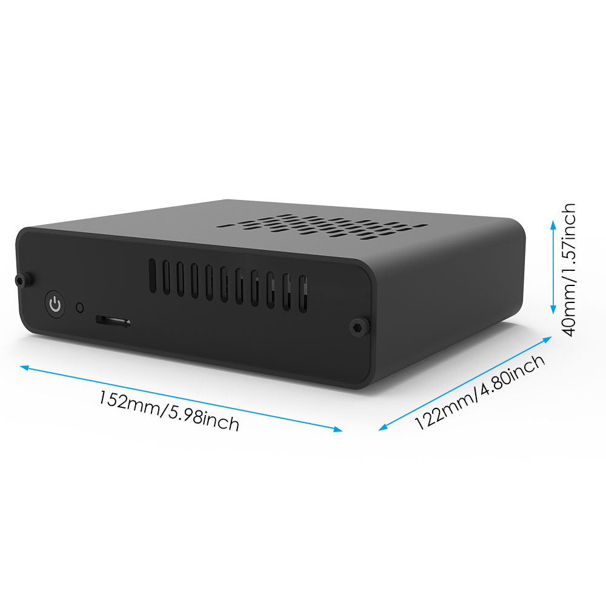
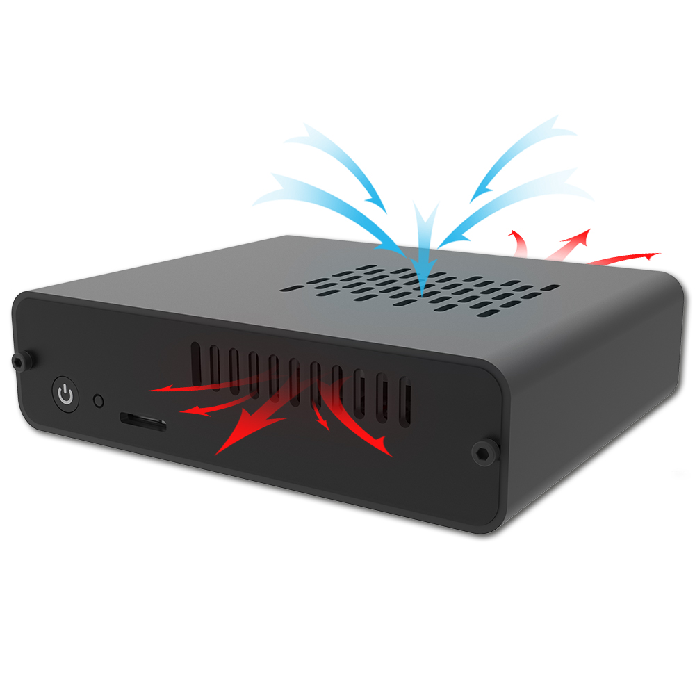

# DeskPi Nano For Jetson Nano
## Description 
DeskPi Nano is a DeskPin style aluminum alloy shell kit. It is a customized shell for Jetson Nano B01 version. It also provides a GPIO expansion board and a TF card expansion board. In addition to protecting the Jetson Nano motherboard, the appearance is also very good. Pretty.

<pre>NOTE: Jetson Nano dose not include in the package 
and it only fit for Jetson Nano B01 Version.</pre>

## Purchase 

[DeskPi Nano](https://deskpi.com/collections/deskpi-nano)

## Features 
* Only for Jetson Nano B01 Version
* Ultra-thin PWM fan radiator
* Fixable TF Card Adapter Board
* GPIO Adapter Board

## Gallery 
* Product Outlook

Frontal face 

Back face 

Top side

Power button and TF card slot

45 degree angle view


## Fan Details


## Dimention


## Heat Dissipation effect


## How to enable PWM Fan
Turn on DeskPi Nano and open a terminal, typing following command:

```bash
 sudo jetson-clocks 
```
It will enable fan control via system detection and sending PWM signal to the fan. you will see the fan is spinning.

## Package Includes
* 1 x DeskPi Nano Case (Pack)
## How to assemble it
* [YouTube Tutorial Video](https://youtu.be/wkWsdbRo3yU)
## Keywords
* DeskPi Nano, Jetson Nano case, DeskPi
