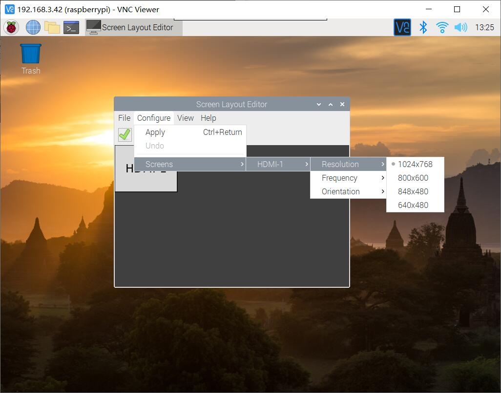

# DeskPi Pro
## Description
The DeskPi Pro is a hardware kit for converting a standard Raspberry Pi 4 from a naked SBC, with limited storage, into a mini PC complete with a power button, cooling, better ports and, via SATA then USB3, 2.5" or M.2 SATA SSD storage.

<pre>Note: Support M.2 SATA SSD only, Does not support M.2 NVME SSD </pre>

## Currently tested operating systems that can support Deskpi scripts
* Raspberry Pi OS(32bit) - tested 
* RaspiOS (64bit) - tested 
* Ubuntu-mate OS(32bit) - tested
* Ubuntu OS (64bit) - tested 
* Manjaro OS (32bit) - tested 
* Manjaro OS (64bit) - To be tested
* Kali-linux-arm OS (32bit) - tested
* Kali-linux-arm OS (64-Bit) - To be tested
* Twister OS v2.0.2 (32bit) - tested 
* DietPi OS (64bit) - tested
* Volumio OS Version: 2021-04-24-Pi (32bit) - tested 
* RetroPie OS (32bit) - tested

## Please Read this section carefully
* if you are using 64bit OS, The script to control the fan is in the `drivers/c/` directory. The file suffix with `64` means `64bit`, and the other one is a `32bit` executable file.
* Before you install this script, please make sure your Raspberry Pi can access internet and can access github website.

## How to install it.
### For Raspbian and RetroPie OS. (32bit)

```bash
cd ~
git clone https://github.com/DeskPi-Team/deskpi.git
cd ~/deskpi/
chmod +x install.sh
sudo ./install.sh
```
### For Ubuntu 64bit OS
```bash
cd ~
git clone https://github.com/DeskPi-Team/deskpi.git
cd ~/deskpi/
chmod +x install-ubuntu-64.sh
sudo ./install-ubuntu-64.sh
```
### For Ubuntu-mate OS
```bash
cd ~
git clone https://github.com/DeskPi-Team/deskpi.git
cd ~/deskpi/
chmod +x install-ubuntu-mate.sh
sudo ./install-ubuntu-mate.sh
```
### For Manjaro OS

```bash
cd ~
git clone https://github.com/DeskPi-Team/deskpi.git
cd ~/deskpi/
chmod +x install-manjaro.sh
sudo ./install-manjaro.sh
```
### For Kali-linux-arm OS.
* Image Download URL: https://images.kali.org/arm-images/kali-linux-2020.3a-rpi3-nexmon.img.xz <br>
```bash
cd ~
git clone https://github.com/DeskPi-Team/deskpi.git
cd ~/deskpi/
chmod +x install-kali.sh
sudo ./install-kali.sh
```
### For Twister OS v2.0.2
`OS image: TwisterOSv2-0-2.img`
* Image Download URL:https://twisteros.com/twisteros.html <br>
```bash
cd ~
git clone https://github.com/DeskPi-Team/deskpi.git
cd ~/deskpi/
chmod +x install.sh
sudo ./install.sh
```
### For 64 bit Raspberry Pi OS (aarm64)
* Image Download URL: http://downloads.raspberrypi.org/raspios_arm64/images/raspios_arm64-2021-05-28/

```bash
cd ~
git clone https://github.com/DeskPi-Team/deskpi.git
cd ~/deskpi/
chmod +x install-raspios-64bit.sh
sudo ./install-raspios-64bit.sh

```
* Uninstall: 
```
cd ~/deskpi/
chmod +x install-raspios-64bit.sh
sudo ./uninstall-raspios-64bit.sh
```
### For DietPi OS 64bit 
* Make sure your OS can access internet and please install `git` first.
* Execute this command in terminal:
```
apt-get update && apt-get -y install git 
```
* Image Download URL:  https://dietpi.com/downloads/images/DietPi_RPi-ARMv8-Bullseye.7z

```bash
cd ~
git clone https://github.com/DeskPi-Team/deskpi.git
cd ~/deskpi/
./install.sh
```
### For Volumio OS Version: 2021-04-24-Pi
* Image Download URL: https://updates.volumio.org/pi/volumio/2.882/volumio-2.882-2021-04-24-pi.img.zip
* Getting Start:　https://volumio.github.io/docs/User_Manual/Quick_Start_Guide.html
* Make sure your Volumio can access internet. 
* There are some steps need to do.

```bash
sudo nano /etc/network/interface
```

make sure following parameters in file `/etc/network/interface` 

```bash
auto wlan0 
allow-hotplug wlan0 
iface wlan0 inet dhcp
wpa-ssid "YOUR WIFI SSID"
wpa-psk "YOUR WIFI PASSWORD"
```

and enable the internet access by typing this command in terminal:

```bash
volumio internet on
```

and then reboot your DeskPi.

```bash
sudo reboot
```

* Download DeskPi driver from github:

```bash
git clone https://github.com/DeskPi-Team/deskpi.git
cd deskpi/
sudo ./install.sh
```

* TEST it after rebooting.

```bash
deskpi-config
```
Select `4` and press `Enter`, you would see the fan is spinning and the front USB port are now available.

## How to Uninstall deskpi

```bash
DeskPi-uninstall 
```
And then select the number against to your OS Type.

### For Windows IoT OS
* Unsupported due to lacking of driver.
* Testing version: Midnight falcon

## How to control fan speed mannualy.

* Open a terminal and typing following command:

```bash
deskpi-config
```

You can follow the instructions to setup fan speed level by typing numbers as
following example:

### Selection explain

* The number from 1 to 4 is to setting your fan speed to a static level.

* Number 5 is just turn off the fan.

* Number 6 is to guide you to create a file located to /etc/deskpi.conf and you
can specify the threshold of temperature and fan speed level according to your
idea, once the file has been created, the program will according to the
configuration file to setup your fan.

* Number 7 is to enable automatic fan control by default paramaters. 

** Default arguments:  

```bash
TEMP   : Fan_SPEED_LEVEL
<40C   : 0%  
40~50C : 25%  
50~65C : 50%  
65~75C : 75%  
>75C   : 100%  
```


** If you want to change it, just typing :

```bash
deskpi-config
```

Select `6` and then input `45` and enter, and then input `50` means setup the fan speed level to `50%` when CPU temp is above 45 degree it has 4 level to setup.
NOTE: 50% Speed level means you have already send `PWM50` to `/dev/ttyUSB0` port, and this port will available when you add `dtoverlay=dwc2,dr_mode=host` to `/boot/config.txt` file and `reboot` your DeskPi. 

## How to boot from USB SSD/HDD?

After initial Raspberry Pi Configuration and once you have Internet Connectivity established, Install the DeskPi Pro Utilities from `https://github.com/DeskPi-Team/deskpi.git`

Open a Terminal / Console and run the following commands:  

```bash 
sudo apt update
sudo apt full-upgrade
sudo rpi-update
```

When complete, run:

```bash
sudo reboot
```

Upon reboot, open Terminal again:

```bash
sudo raspi-config
```
* go to Advanced Options 
* Select Boot Order, select #1 `USB Boot`, Return to Advanced Options,
* Select Boot Loader Version, choose `Latest Version`
* Save & exit

### Reboot again (to restart with new settings)

```bash
sudo reboot 
```

After reboot, re-open Terminal again

```bash
sudo -E rpi-eeprom-config --edit
```

- do not change anything, it is unnecessary
- press Ctrl-X to save, answer Y to overwrite file.

```bash
sudo reboot    
```
Now you are ready to install Raspberry-OS onto your USB Boot Device.
You can use the Raspberry Imager from `www.raspberrypi.org` website. 
Depending on device the new SD Card Copier can transfer the SD-Card image to the USB Device (ensure you select generate a new UUID). 
Once your USB drive is imaged & ready to boot, shutdown your Deskpi-Pro, remove the SD-Card and power-up to boot from the USB Boot drive, once running & configured you can install your additional software and proceed as usual. 
<br>

* [Tutorial Video On YouTube](https://youtu.be/wUHZb9E_WDQ)

## How to Use IR function onboard.
1. You need to enable `gpio-ir` function by modify `/boot/config.txt` file.
uncomment this line if not exsit please add it.

```bash
dtoverlay=gpio-ir,gpio_pin=17 
```

2. Install `lirc` package:

```bash
sudo apt-get install lirc
```

3. Modify configuration file on location: /etc/lirc/lirc_options.conf and make sure it has following parameters:

```bash
driver          = default
device          = /dev/lirc0
```

4. Reboot your Raspberry Pi and test it with following command:

```bash
mode2 -d /dev/lirc1
```

## FAQs 

## OS Issues 

### What operating systems are currently tested on DeskPi Pro and works fine?

* `Raspbian OS` - 32bit version: 2020-08-12 [Raspberry Pi OS](https://www.raspberrypi.org/software/operating-systems/).
* `Ubuntu-mate OS` - 32bit version:20.04.1-desktop--armhf+raspi [Ubuntu mate 20.04 LTS 32Bit](https://releases.ubuntu-mate.org/focal/armhf/ubuntu-mate-20.04.1-desktop-armhf+raspi.img.xz).
* `Manjaro OS` - 32bit verison: 20.2 [Manjaro XFCE 20.2](https://manjaro.org/downloads/official/xfce/)
* `Kali-linux-arm OS` - 32bit version: 2020.4 [Kali Linux RaspberryPi 2, 3, 4 and 400](https://www.offensive-security.com/kali-linux-arm-images/).

### Dose it support 64bit OS such as Ubuntu 20.10? 
* It depends on Raspberry Pi offical support, we suggest that you can refer to offical source here:[Raspberry Pi OS](https://www.raspberrypi.org/software/operating-systems/).

## Front USB Issues 
### Why the USB on the front panel of my DESKPI cannot be used? I have burned the system many times?

* Please check your /boot/config.txt file and make sure it contains `dtoverlay=dwc2,dr_mode=host`, and if you add it by yourself, it need to reboot Raspberry Pi to take effect.


## Disk drive Issues 
### Why does my SSD hard drive not work normally after my Logitech wireless mouse and keyboard dongle is connected to DeskPi?  

* Because the 2.4G frequency used by Logitech's mouse and keyboard interferes with DeskPi's USB transfer interface, it will cause the disk to work in an unstable state. This problem with Logitech's keyboard and mouse also occurs on desktop computers. The current solution is best to replace the wireless keyboard and mouse or use a wired keyboard and mouse.

### Why is it normal when I start the Raspberry Pi with a TF card, but the SATA SSD hard disk cannot appear on the desktop? 

* The disk cannot be displayed on the desktop may be caused by the following reasons:
* `Hardware connection` - The hardware is not connected properly, such as forgetting to install the USB adapter.
* `Not Initialized Before` - The SATA SSD hard disk is a RAW Disk, the brand new one has not been partitioned, formatted, or mounted.
* `Unavailable file system format` - file sytem format not recognized by the Linux system is used, for example: NTFS 

### Solution and diagnostic 
* `Reconnect SATA SSD to DeskPi Disk Adapter board` 
* `Format partitions and mount disks manually` - Following steps:
```
  1. Open a terminal or press "Ctrl+Alt+T".
  2. Typing: "sudo fdisk -l" to check if the disk has been recognized or typing: "sudo lsusb -t", typing: "dmesg |grep -i usb" to make sure disk has been connected.
  3. If the disk can be found by those commands, manually format and mount the partition:  
   for example: 
   3.1 `sudo fdisk /dev/sda` - sda means my first SCSI type disk which recognized by my system.
   3.2 `p` - typing `p` means print current partions that contains on the disk.
   3.3 `n` - new partion -> `p` - primary partion -> `1` -> partion number -> `Enter`-> first celinder -> `Enter` last celinder -> make the whole disk as a partion -> `w` - write the partion table to disk and quit. 
   3.4 `sudo partprobe /dev/sda` - make it recognized by linux kernel.
   3.5 `mkdir /home/pi/mydata` - create mounting directory.
   3.6 `sudo mkfs.ext4 /dev/sda1` - format partion `/dev/sda1` to `ext4` type which support `journal` on data saving.
   3.7 `sudo mount -t ext4 /dev/sda1 /home/pi/mydata` - mount the partion to mount point so that we can access it.
   3.8 `sudo chmod -R 777 /home/pi/mydata` - Set premission to the folder so that we can write and read date to disk.
  4. How To Automount File Systems on Raspbian(Linux)
   4.1 `sudo blkid` - Get the Name, In the output of this command, the first column is the name of your drives. The second column is the label of the drive (if you set a label for it) and the third column is the UUID of your drives.
First you need to know the name of the drive that is going to be automatically mounted. 
   4.2 `sudo nano /etc/fstab` - [Dangerous] If the operation fails, the system will not start, add your partion information and let it auto mount after rebooting, We need to append one line of code at the end of the file. The format of this line of code is as follows:
`UUID=<uuid-of-your-drive>  <mount-point>  <file-system-type>  <mount-option>  <dump>  <pass>`
* Note that you need to separate these items with `Tab key`. For example, I added the following line to the end of /etc/fstab.
`UUID=eb67c479-962f-4bcc-b3fe-cefaf908f01e  /home/pi/mydata  ext4  defaults  0  2`
Save and close the file. Then run the following command to see if it works.
* `sudo mount -a` - Test automount.
* `df -Th` - Check if there is a partion has been mounted on /home/pi/mydata.
```
### Some Explanations
* The `defaults` mount option will give users read and write access to the file system.
* The value of `dump` field is usually zero.
* The `pass` field is used by the fsck program to determine the order in which filesystem checks are done at reboot time. As you can see in this file, the value of the pass field for the root file system is 1. Swap partitions do not need to be checked and the value for them is zero. All other file systems should have a value of 2. So I set the pass value as 2 for my drive.

## HDMI issue
### My screen goes to black when I was booting up my deskpi. 

* Please try to shift HDMI cable from HDMI0 to HDMI1 which is beside 3.5mm audio jack and try again.

## USB booting issue
### Why does it take so much time when I boot it from USB booting?

* It seems to be some tough question, some issues may caused by the usb controller chip performance issue.

## HOWTOs
### How to check OS Version
* Open a terminal and typing:
```bash
lsb_release -a
```
* Check the kernel version:
```bash
uname -a
```
### How to check wifi connection status

* Open a terminal and typing:
```bash
ifconfig -a
```
* Wi-Fi adapter is called `wlan0`
### How to check wifi signal level?
```bash
sudo apt update 
sudo apt -y install wavemon
sudo wavemon -i wlan0
```


* Check if Raspberry Pi can connect to Internet
```bash
ping -c 4 wwww.apache.org
```

* Check if DNS configuration is correctly.
```bash
cat /etc/resolv.conf
```
make sure the `nameserver` is available, if not, please contact to your `ISP`(Internet Service Provider).

### How to check SSD/HDD status
* Check if the SSD/HDD has been recognized by OS, just check USB controller's status will be ok due to it is connected via an `USB adapter`.
```bash
dmesg |grep -i usb
```
* Check if the it supports `UASP`, USB Attached SCSI (UAS) or USB Attached SCSI Protocol (UASP) is a computer protocol used to move data to and from USB storage devices such as hard drives (HDDs), solid-state drives (SSDs), and thumb drives. UAS depends on the USB protocol, and uses the standard SCSI command set. Use of UAS generally provides faster transfers compared to the older USB Mass Storage Bulk-Only Transport (BOT) drivers.

UAS was introduced as part of the USB 3.0 standard, but can also be used with devices complying with the slower USB 2.0 standard, assuming use of compatible hardware, firmware and drivers. 
* Command:
```bash
lsusb -t
```
If you can not find `uas` in the output message, it means it does not support `uasp`. 
if not, and the disk still not show up on your Raspberry Pi desktop, please check your hardware and repeat following steps:
### Hareware checking steps:
1. Please make sure the USB adapter is connect well.
2. Please check the harddisk adapter board's 4Pin pinheader is connect properly.
3. Please tell me what kind of OS did you use? Raspbian OS ?
4. Please use the wall charger that we provide in the package.
5. Please send us the result of those commands in terminal so that we can help you to diagnose the problem.
6. Reboot your Raspberry Pi by typing:
```bash
sudo sync
sudo reboot
```
### Software checking steps:
1. Make sure the drive can be recognized.
```bash
sudo fdisk -l |grep -i 'dev' 
```
or
```bash
lsusb -t 
```
or 
```bash
lsblk 
```
2. Make sure the drive is not raw disk or has `NTFS` filesystem on it.
here `/dev/sda` is my test result, you shall change this as your result from `sudo fdisk -l |grep -i 'dev'` command. 
```bash
sudo fdisk -l /dev/sda
```
If it is a `raw disk`, means it has never been partied before, you need to `make partition` and `format` it, and `mount` it to a directory so that you can access it.
3. Make Partitions
```bash
sudo fdisk /dev/sda
p
n
p
1
Enter
Enter
w
```
#### Explanation:<br>

** `p` means: print partition table. ** <br>
** `n` means: new - create new partition. ** <br>
** `p` means: primary partition.** <br>
** `1` means: the first partition number. ** <br>
** `Enter` means: select default cylinder as start cylinder.** <br>
** `Enter` means: select the whole disk as end cylinder.    ** <br>
** `w` means: save the change to partition table and quit.  ** <br>

4. Format partition
```bash
sudo mkfs.ext4 /dev/sda1 
```
It will format `/dev/sda1` partition to an `ext4` type filesystem which can be supported by most Linux distributions.

5. Mount partition
You need to mount the partition to a folder(directory) before you can use it.
```bash
cd 
mkdir mydata
sudo mount -t ext4 /dev/sda1 mydata -v
sudo chmod 777 /home/pi/mydata
```
#### Explanation:
`cd` means go back to your home directory.<br>
`mkdir` means create a directory for your partition.<br>
`sudo mount -t ext4 /dev/sda1 mydata -v` means mount `/dev/sda1` partition to directory `mydata` with `ext4` type filesystem format and `-v` will show the details when you mount this partition.<br>
`sudo chmod 777 /home/pi/mydata` means everyone can have full privilledges on this mounting point. you have `read`,`write`, `execute` permission on this directory.<br>
### How to check if it has been mounted on
```bash
df -Th
```
or 
```
sudo mount 
```

### How to check front USB port
* First, you need to check if /boot/config.txt file contains this parameter:
```bash
dtoverlay=dwc2,dr_mode=host
```
The front USB function is coming from `dwc2` overlay, it selects the dwc2 USB controller driver, and `dr_mode` can be `host`, `peripheral` or `otg`.
here, `dwc2` mode must be `host`.
* And if you want to add it without editing /boot/config.txt file manually, just typing this command in a terminal:

```bash
sudo sed -i '$a\dtoverlay=dwc2,dr_mode=host' /boot/config.txt 
```

### How to check HDMI configuration

* Some people give us a feedback said there is a black screen when booting up Raspberry pi in a deskPi case, it may caused by several reasons.

#### Solution 1 
* You can solve this problem by according steps:
1. Modify /boot/config.txt file and adding this:
```bash
hdmi_force_hotplug=1
hdmi_group=2
config_hdmi_boost=4
```
2. Save it and reboot Raspberry Pi.
```bash
sudo sync
sudo reboot
```
#### Solution 2
* Unplug HDMI cable and shift it to HDMI1 which is near by 3.5mm audio jack.

#### Solution 3 
* Change Resolution on desktop by click `raspberry` icon and select the app according to following picture.
1. Navigate to Screen Configuration

2. Navigate to `configure`-> `Screens` -> `HDMI-1` or `HDMI-2` -> `Resolution` -> Select whatever your Screens Resolution is. 

3. Apply the change.


### How to check IR remote

* Enable `gpio-ir` function by editing `/boot/config.txt` file.
```bash 
dtoverlay=gpio-ir,gpio_pin=17
```

* Install `lirc` software.
```bash
sudo apt-get -y install lirc
```

* Modify configuration file `/etc/lirc/lirc_options.conf` and make sure it contains those two parameters:
```bash
driver 	= default
device  = /dev/lirc0
```

* Save it and reboot Raspberry Pi.
```bash
sudo sync
sudo reboot
```
* Test it by:
```bash
mode2 -d /dev/lirc1
```
**NOTE** Please aim your IR remote controller direct to the power button. 
and different IR remote controller may have different response time.

### How to check audio output
* The audio output can be two ways: `3.5mm jack`, `HDMI cable`.
If you connect HDMI cable to your DeskPi on `HDMI0` port which is beside USB-C Port on the back of the panel, it will be recognized by Raspbian OS as `HDMI-1`, and the other one is recognized as `HDMI-2`
### How to change audio output.
* **Right Click** the sound icon on the task bar.

* And select which one you want to output:<br>
**Analog** - It will change audio output to 3.5mm jack. <br>
**HDMI-1** - It will change audio output to `HDMI0`.<br> 
**HDMI-2** - It will change audio output to `HDMI1`.<br> 
* And then restart your application you will heard the sound.
## DeskPi home
More Product and information please visit: 
[DeskPi Home](https://www.deskpi.com/)
