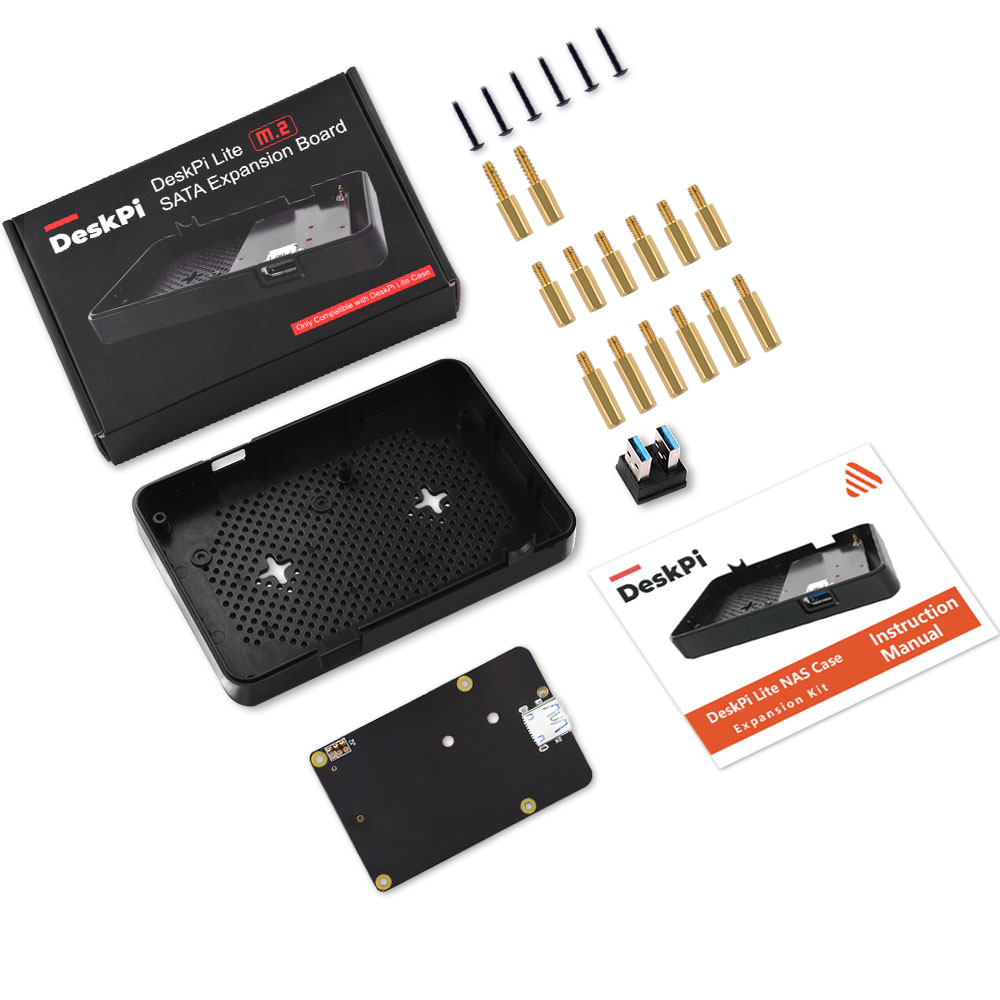
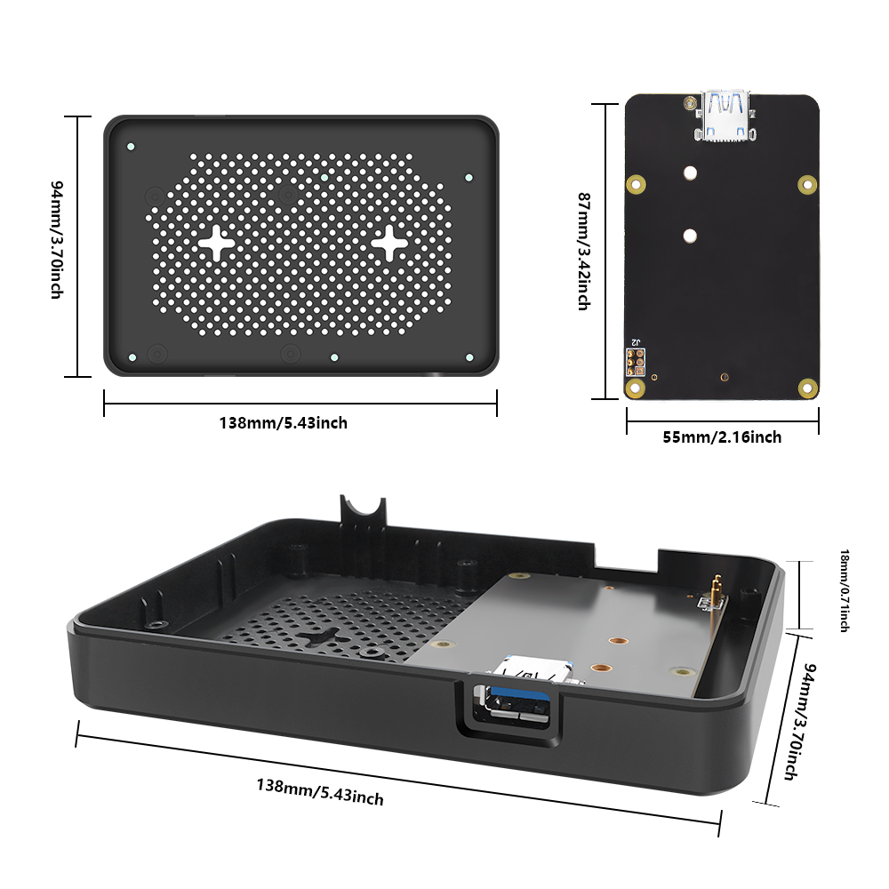
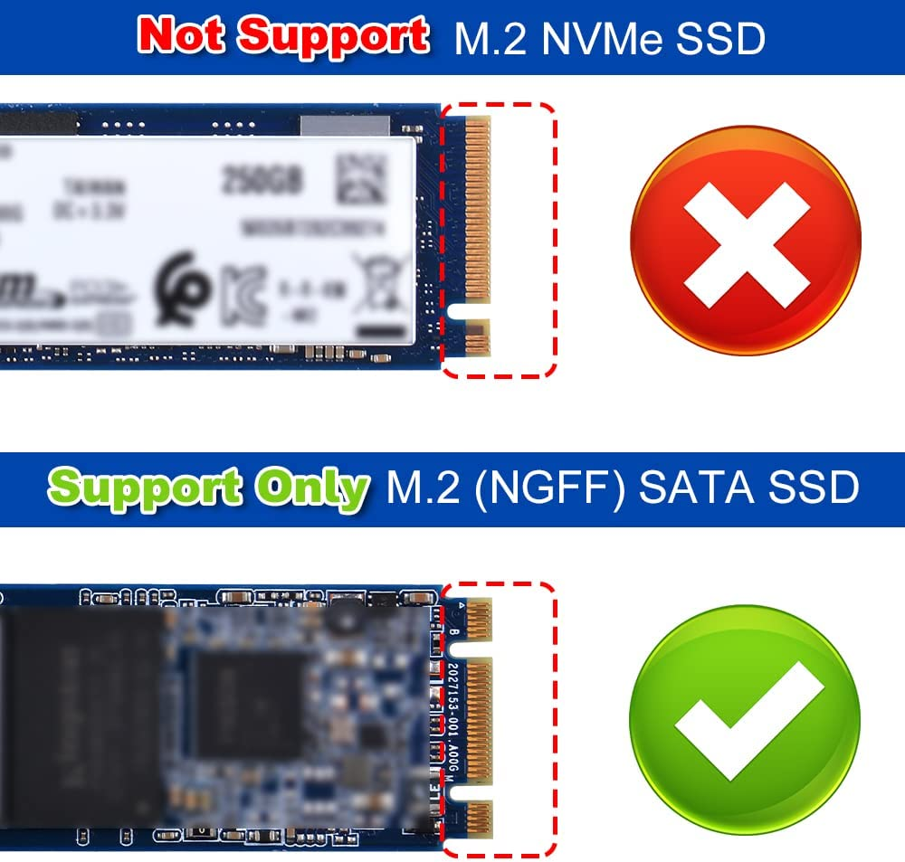
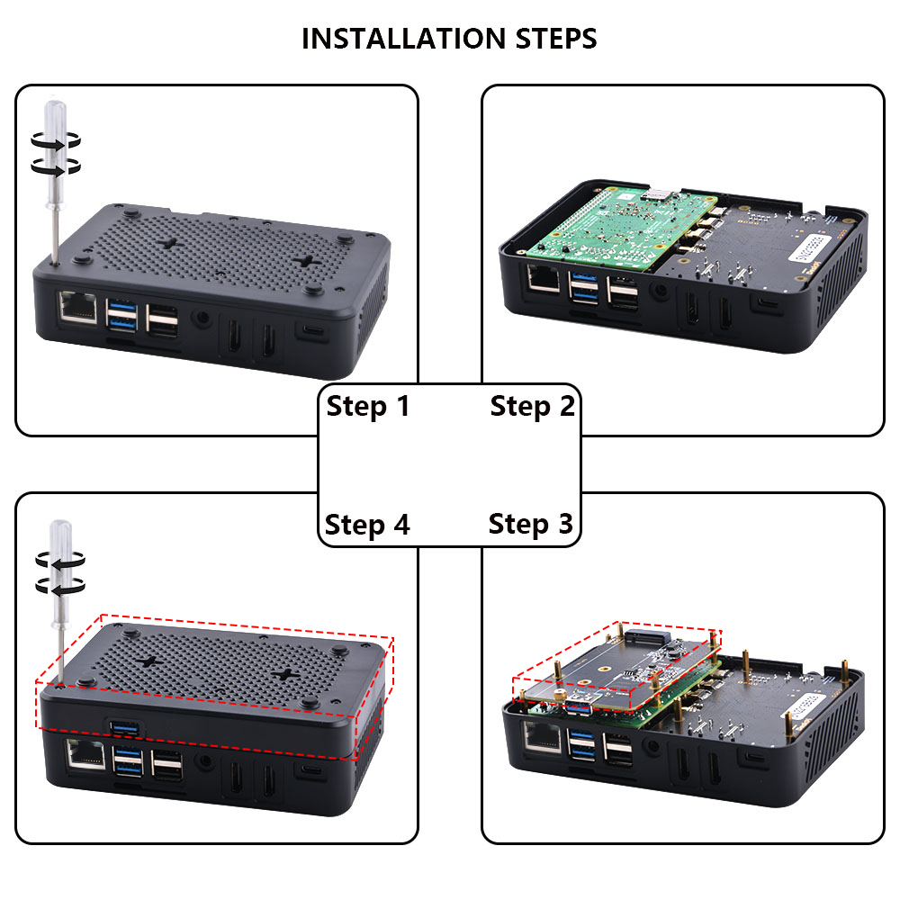
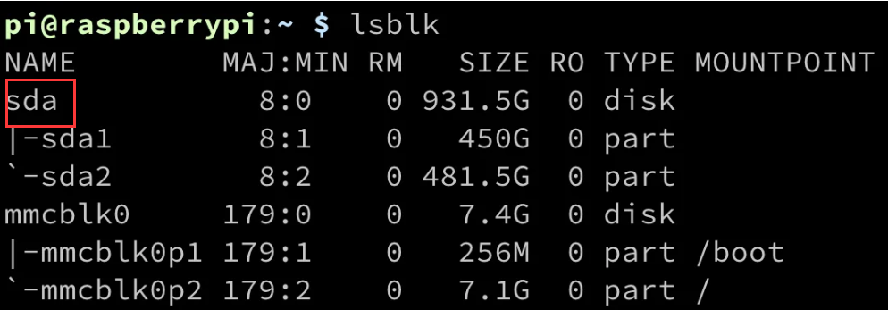

# DeskPi Lite Expansion kit
.jpg)
## Description 
The M.2 SATA SSD driver expansion board for DeskPi Lite is an add-on component that allows you to expand the storage capacity of your DeskPi Lite enclosure. It is specifically designed to accommodate M.2 SATA solid-state drives (SSDs), which are high-performance storage devices known for their fast data transfer speeds and reliability.

This expansion board connects to the DeskPi Lite main board, providing an additional M.2 slot where you can install an M.2 SATA SSD. The M.2 form factor offers a compact and space-saving design, making it ideal for small form factor systems like the DeskPi Lite.

When describing the M.2 SATA SSD driver expansion board for DeskPi Lite, you can highlight its key features and functionalities.

Overall, the M.2 SATA SSD driver expansion board for DeskPi Lite enhances the storage capabilities of your DeskPi Lite system, enabling you to enjoy faster data access and increased capacity for your files and applications.

> NOTE: The DeskPi lite NAS expansion kit itself does not contain the DeskPi Lite shell and needs to be purchased additionally. This kit is only for upgrading the NAS function of the DeskPi lite, and is suitable for users who own the DeskPi lite and need to expand the external disk

> Note: DeskPi Lite case and M.2 SATA SSD does not include in the package, additional purchase required.

## Purchase 

[DeskPi Lite M.2 SATA SSD Expansion Kit](https://www.amazon.de/dp/B0C6SSHS65?ref=myi_title_dp)

## Features
* **Storage Expansion:** The expansion board allows you to add extra storage to your DeskPi Lite system, enabling you to store more files, applications, and media.  

* **M.2 SATA Compatibility:**  It is compatible with M.2 SATA SSDs, which are widely available and offer high-speed data transfer rates.

* **Easy Installation:** The board is designed for easy installation within the DeskPi Lite enclosure. It connects seamlessly to the main board, ensuring a hassle-free setup process.

* **Performance and Speed:** By utilizing the M.2 SATA interface, the expansion board enables fast and reliable data transfer, resulting in improved overall system performance.

* **Compact Design:** The expansion board is specifically designed to fit within the DeskPi Lite enclosure, ensuring a neat and tidy integration without occupying additional space.

* **Versatility:** With the M.2 SATA SSD driver expansion board, you can choose from a variety of M.2 SATA SSDs available in the market, allowing you to customize your storage capacity according to your needs.

## Gallery
* Package Includes


* Dimension


* M.2 SATA SSD only
.jpg)
* Please NOTE following figure, it's very important!


## Compatibilities
* Raspberry Pi 4 model B Only
* DeskPi Lite Case Only

## Package Includes
* 1 x DeskPi Lite NAS Case Expansion Kit
* 1 x M.2 to SATA SSD adapter board
* 1 x USB3.1 Connector
* 1 x Instruction Manual
* 2 x M2x7+6mm Copper pillar (For fixing Heatsink)
* 6 x M2x7+4mm Copper pillar (For fixing M.2 SATA SSD Adapter board)
* 6 x M2x10+4mm Copper pillar (For fixing DeskPi Lite daughter board


## How to Assemble it
1. Open your DeskPi Lite, remove ABS bottom case.
2. Fix M2x7+6mm copper pillar to those two positon to keep heatsink steady
3. Fix another two hole with M2x7+4mm copper pillar.
4. Fix M.2 SATA SSD drive to M.2 SATA SSD adapter board with flat head screw.
5. Fix the M.2 SATA SSD adapter board to Raspberry Pi with M2x7+4mm copper pillar.（Make sure the copper pogo-pin contact well with GPIO soldering point.）
6. Fix DeskPi Lite daughter board and upper case with M2x10+4 copper pillar
7. Fix bottom case with screws.
8. Connect the USB3.0 connector on the back of DeskPi Lite on USB3.0 Port.
### Assemble Figure


## Prepare to boot up
Connect HDMI cable to HDMI port, Power supply to USB-C port and then connect the mouse and USB keyboard to DeskPi lite, Press power button and waiting for system booting up, log into system and open a terminal.

* Check if the M.2 SATA SSD has been recognized.
Typing:
```bash
lsblk
```

You should see there is one disk called “sda”, that’s your M.2 SATA SSD drive.

* Parted and format partition
```bash
sudo fdisk /dev/sda 
```
press `n` for new partition, and then press `p` for primary partition, press `1` means first partition, and then press twice `enter`, make the whole disk as one partition, press `w` to write the partition table to disk and press `q` to quit.
```bash
sudo partprobe /dev/sda 
sudo mkfs.ext4 /dev/sda1   # format the disk to ext4 filesystem.
Mount Disk drive and upload file
mkdir /home/pi/mydisk    # make a mounting point 

sudo mount -t ext4 /dev/sda1 /home/pi/mydisk     #Mount disk to mounting point 

sudo chmod 777 /home/pi/mydisk      # grant user to access and write permisions.
sudo chown -R pi:pi /home/pi/mydisk    # grant user pi to take ownership of the folder.
```
That’s it. You can also build your own samba server to hold the disk to share with your family or your friends in your local area network (LAN).

## Keywords
* DeskPi Lite M.2 SATA SSD Expansion kit, DeskPi Lite expansion board, M.2 SATA SSD driver board for DeskPi Lite.


