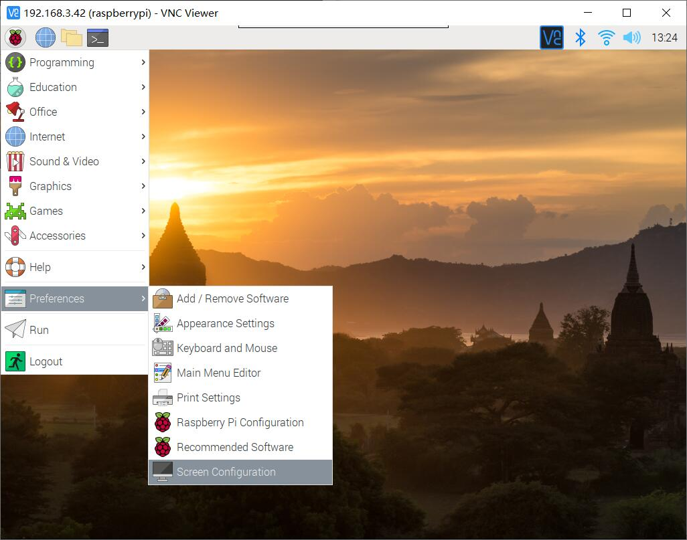
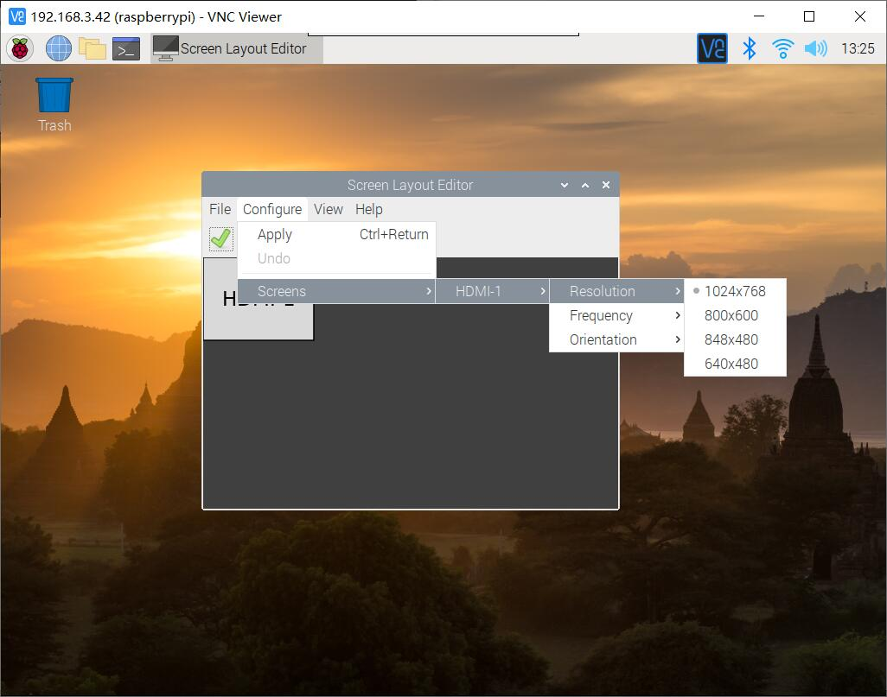
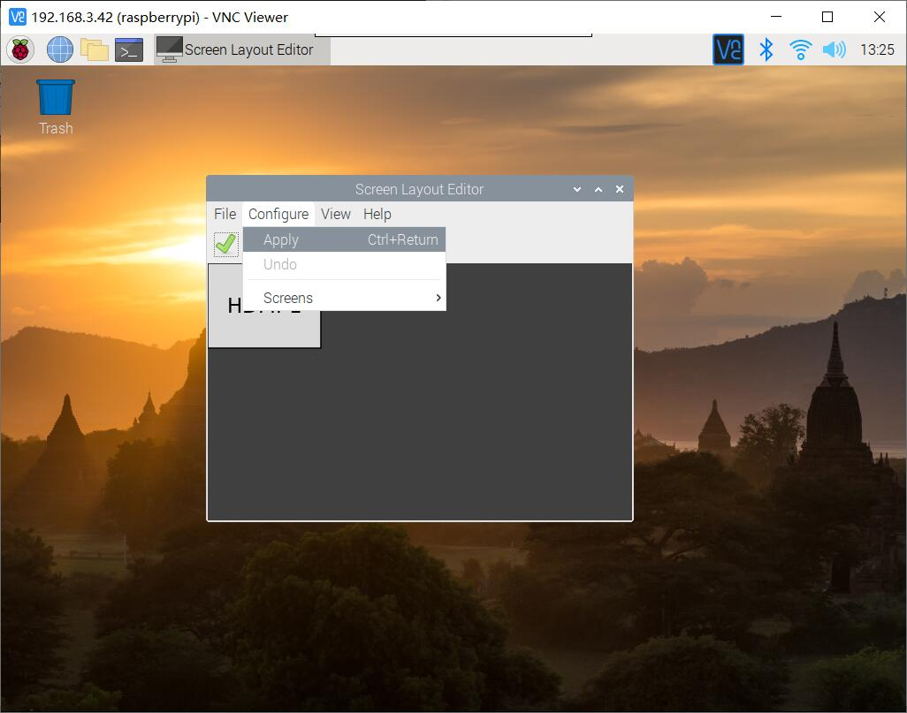

## Getting Start  
.

For order please visit: [DeskPi.com](https://www.deskpi.com/).

## How to check HDMI configuration

* Some people give us a feedback said there is a black screen when booting up Raspberry pi in a deskPi case, it may caused by several reasons.

### Solution 1 
* You can solve this problem by according steps:
1. Modify /boot/config.txt file and adding this:
```bash
hdmi_force_hotplug=1
hdmi_group=2
config_hdmi_boost=4
```
2. Save it and reboot Raspberry Pi.
```bash
sudo sync
sudo reboot
```
### Solution 2
* Unplug HDMI cable and shift it to HDMI1 which is near by 3.5mm audio jack.

### Solution 3 
* Change Resolution on desktop by click `raspberry` icon and select the app according to following picture.
1. Navigate to Screen Configuration

2. Navigate to `configure`-> `Screens` -> `HDMI-1` or `HDMI-2` -> `Resolution` -> Select whatever your Screens Resolution is. 

3. Apply the change.


