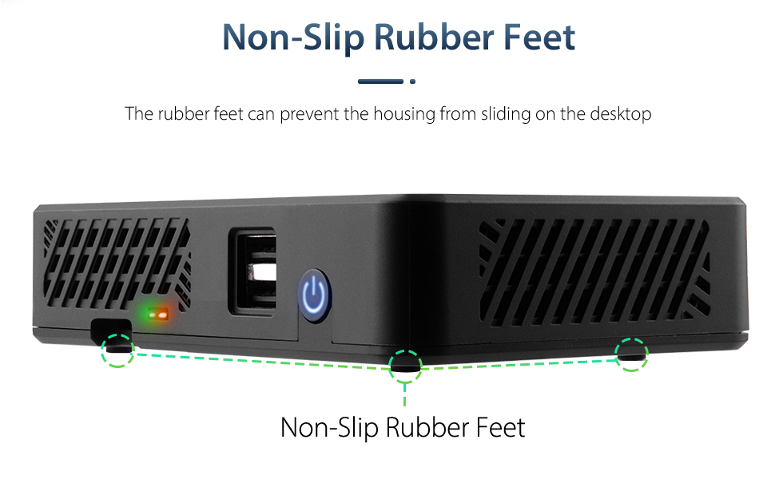

# DeskPi Series Product Wiki

Here you can provide product descriptions, product features, product documents, product application cases and some common problem solutions of DeskPi series products, and also provide some Demo code file downloads.

## Product List
### DeskPi Series
  - DeskPi Pro [DP-0001](https://deskpi.com/collections/frontpage) 

  - DeskPi Nano [DP-0002](https://deskpi.com/collections/deskpi-nano) 

  - DeskPi Lite [DP-0009](https://deskpi.com/collections/deskpi-lite) 

### PicoMate Series
  - PicoMate [DP-0012](https://deskpi.com/collections/deskpi-picomate/products/new-deskpi-picomate-v1-0-for-raspberry-pi-pico-pico-w):  

  - PicoMate with Pico W [DP-0014](https://deskpi.com/collections/deskpi-picomate/products/new-deskpi-picomate-v1-0-with-raspberry-pi-pico-w-board):  

  - PicoMate with Pico [DP-0015]( https://deskpi.com/products/new-deskpi-picomate-v1-0-with-raspberry-pi-pico-board?pr_prod_strat=use_description&pr_rec_id=24acf3543&pr_rec_pid=7503104868508&pr_ref_pid=7503105425564&pr_seq=uniform)  

[Buy from DeskPi Official Website](https://deskpi.com/){ .md-button .md-button--primary }
