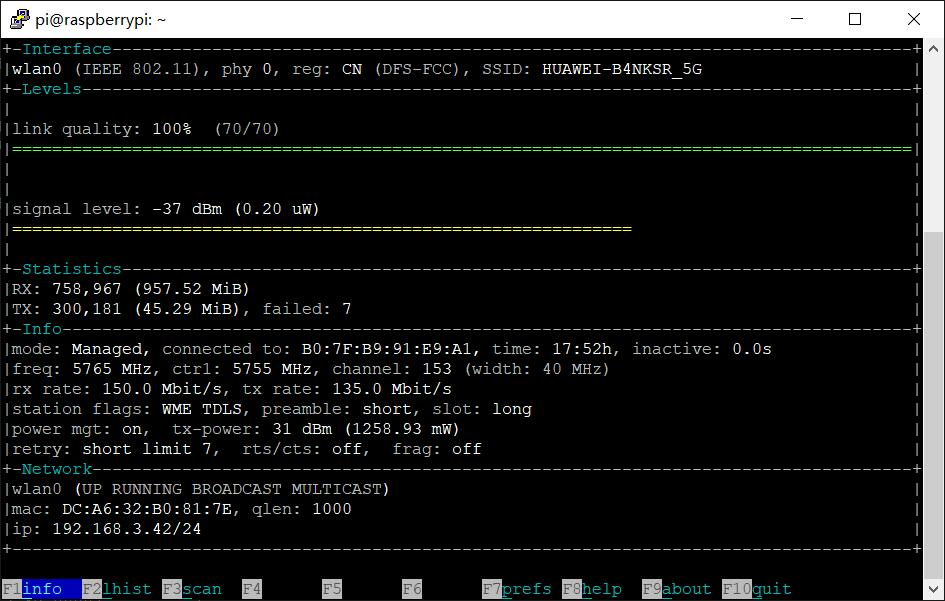

## Getting Start  
.

For order please visit: [DeskPi.com](https://www.deskpi.com/).

## How to check wifi connection status
* Open a terminal and typing:
```bash
ifconfig -a
```
* Wi-Fi adapter is called `wlan0`
### How to check wifi signal level?
```bash
sudo apt update 
sudo apt -y install wavemon
sudo wavemon -i wlan0
```


* Check if Raspberry Pi can connect to Internet
```bash
ping -c 4 wwww.apache.org
```

* Check if DNS configuration is correctly.
```bash
cat /etc/resolv.conf
```
make sure the `nameserver` is available, if not, please contact to your `ISP`(Internet Service Provider).

