# DeskPi PicoMate User Manual
## Description
DeskPi PicoMate is an all-in-one and versatile prototyping kit designed for Raspberry Pi Pico and Pico W. It includes one expansion dock for Raspberry Pi Pico and Pico W, 12 detachable modules and all in one- piece of PCB design. All modules are pre-wired to the Pico Dock, no soldering and wiring required and out-of-box. Of course, you can also detach the modules and connect them using the cables included in the box. 


[Buy DeskPi PicoMate](https://deskpi.com/collections/deskpi-picomate)

[Visit DeskPi Official Website](https://deskpi.com/){ .md-button .md-button --primary }

## Features

* Designed for Raspberry Pi Pico and Pico W
* All modules are pre-wired, no soldering and wiring required and out-of-box
* 12 detachable and easy-to-use modules:
* Push Button
* WS2812 RGB LED
* Rotary Encoder
* Buzzer
* Digital Microphone (ZTS6531S)
* Digital PIR Sensor (AS312)
* 6-Axis IMU Sensor (LSM6DS3TR-C)
* Digital Optical Sensor (LTR-381RGB-01)
* 3-Axis Magnetometer (MMC5603NJ)
* Temperature & Humidity Sensor (SHT30-DIS)
* 0.96” 128x64 OLED Display (SSD1315)
* 204 Pins Breakout Board
* All Pico GPIOs available via headers and up to 11 Grove connectors available
* Built-in battery connector for on-the-go projects
* MicroPython libraries support for all modules
* 3.3V IO operating voltage

## Package Includes 
* 1x DeskPi PicoMate
* 1x Raspberry Pi Pico with pre-soldered pin headers
* 1x 3*AA Battery Holder with On/Off Switch
* 6x Grove Cable
* 1x Micro USB Cable

## Pinout Diagram


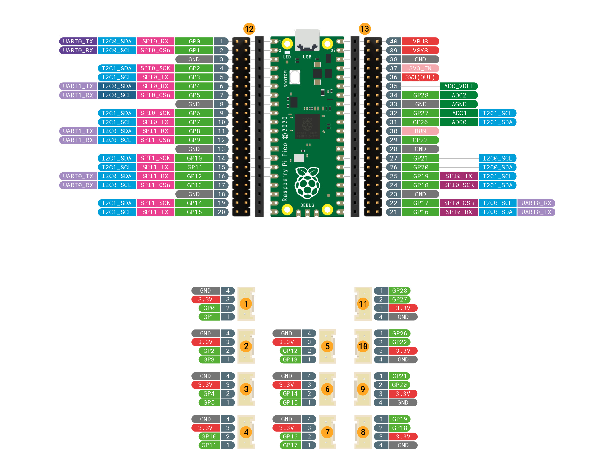


## Getting Start

### Getting Started with Python

The DeskPi PicoMate can be programmed using the popular Python programming language. Raspberry Pi Pico is supported by CircuitPython, which is based on MicroPython, and features unified Python core APIs and a growing list of device libraries and drivers that work with it.

This section describes how to set up CircuitPython on DeskPi PicoMate. Examples are also provided to help you to get started in a very short time

### Installing CircuitPython

Download the [official CircuiPython for Raspberry Pi Pico](https://circuitpython.org/). Choose the latest stable release and then download the .uf2 file.

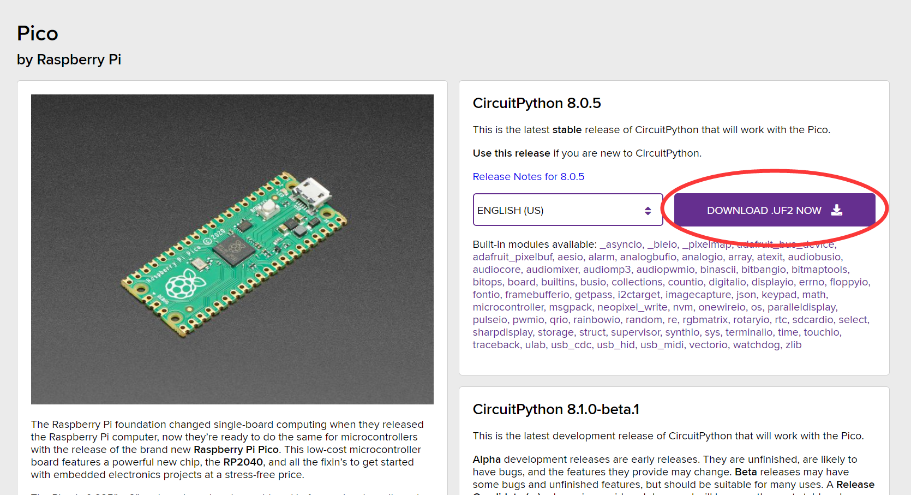

Then go ahead and:

1. Push and hold the `BOOTSEL` button and plug your Pico into the USB port of your computer. Release the `BOOTSEL` button after your Pico is connected.
2. It will mount as a Mass Storage Device called `RPI-RP2`.
3. Drag and drop the CircuitPython UF2 file onto the RPI-RP2 volume. Your Pico will reboot. A new drive named `CIRCUITPY` should appear.

## Installing Mu Editor

Mu Editor is a simple Python code editor for beginner programmers. Go to [Mu Editor Download page](https://codewith.mu/), choose your Operational System and follow the instructions.

[MU Editor](https://codewith.mu/)


Once the Mu Editor is installed, open it, go to `Mode` menu, select `CircuitPython` and press `OK`.

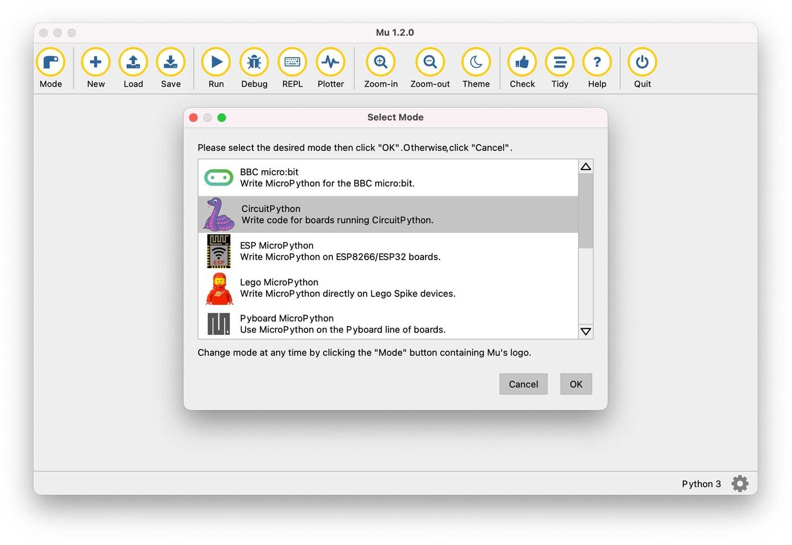
In the text editor, try some Python code:

```python

print('Hello, DeskPi PicoMate!')

```
Select Save on Top Menu. A window will appear. Give the name `code.py` for your code and save it on the `CIRCUITPY` drive. Your code will run as soon as the file is done saving.

The `Serial` button opens a serial data connection to the Pico. This will result in a new panel between the text editor and Mu s footer, which prints the data from the Pico.

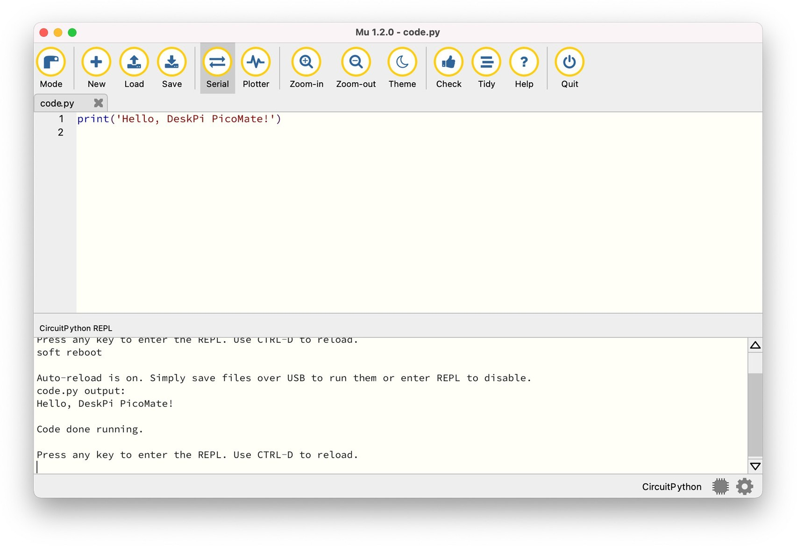

If you need to drop into the CircuitPython REPL you should make sure the panel has keyboard focus (just click it!) and then type `CTRL+ C`.

Now that you have the Python prerequisites installed, it is time to explore more examples for the DeskPi PicoMate.

##Python Examples

This section consists of several example codes. The examples are organized in different levels of codes to demonstrate the Python API usage.

### Blink RGB LED
DeskPi PicoMate has a WS2812 RGB LED pre-wired to `GP22` on the Pico. We can use the `NeoPixel` library to blink the RGB LED.

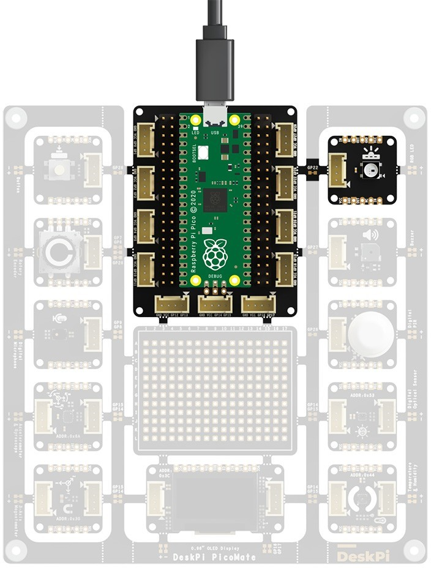

#### Breakable Design 
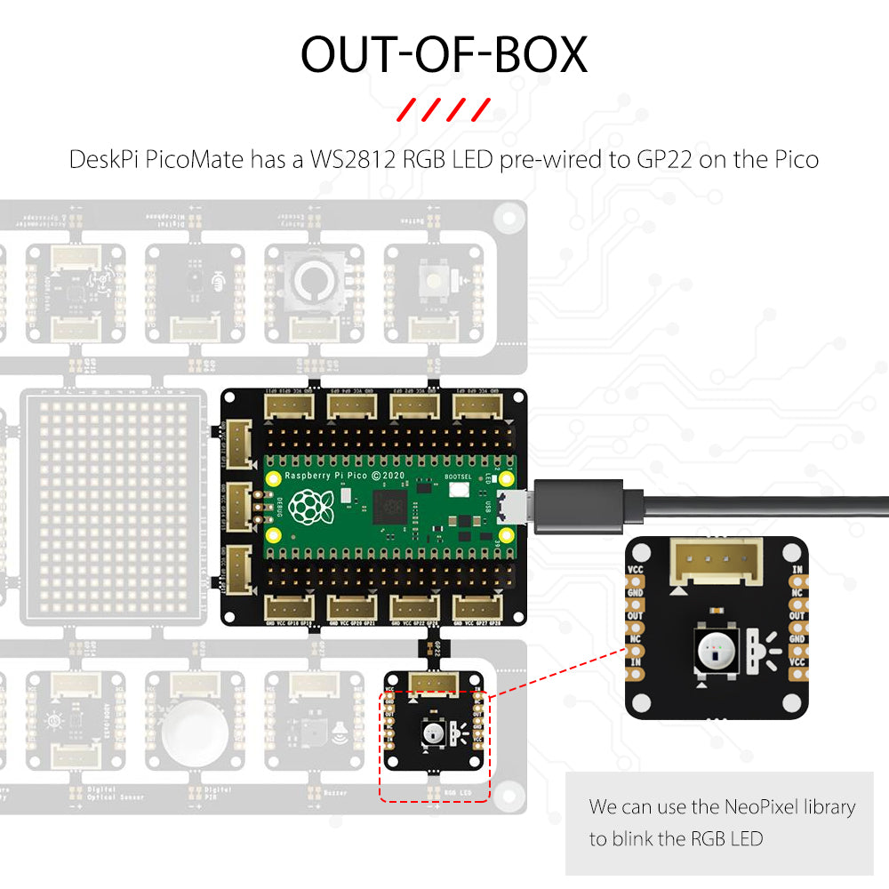

Download the NeoPixel library and copy neopixel.py into the CIRCUITPY/lib folder.This should give you the following folder structure:

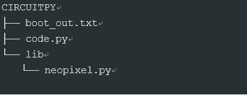

Copy and paste the following code to the Mu Editor and press `Save`:


```python
import time
import board
import neopixel

R = (50, 0, 0)
G = (0, 50, 0)
B = (0, 0, 50)

COLORS = (R, G, B)

pixels = neopixel.NeoPixel(board.GP22, 1)

while True:
    for color in COLORS:
        pixels[0] = color
        time.sleep(1)
```

Your code will run as soon as the file is done saving. Observe that the RGB LED starts to blink. For more details about the Neopixel API reference, please check out [Read the Docs](https://docs.circuitpython.org/projects/neopixel/en/latest/index.html)

### Button 
DeskPi PicoMate has a Push Button pre-wired to `GP26` on the Pico. The example prints a message to the console each time the state of the button changes. When the button is pressed, the input level of `GP26` will be `low` (False) level.
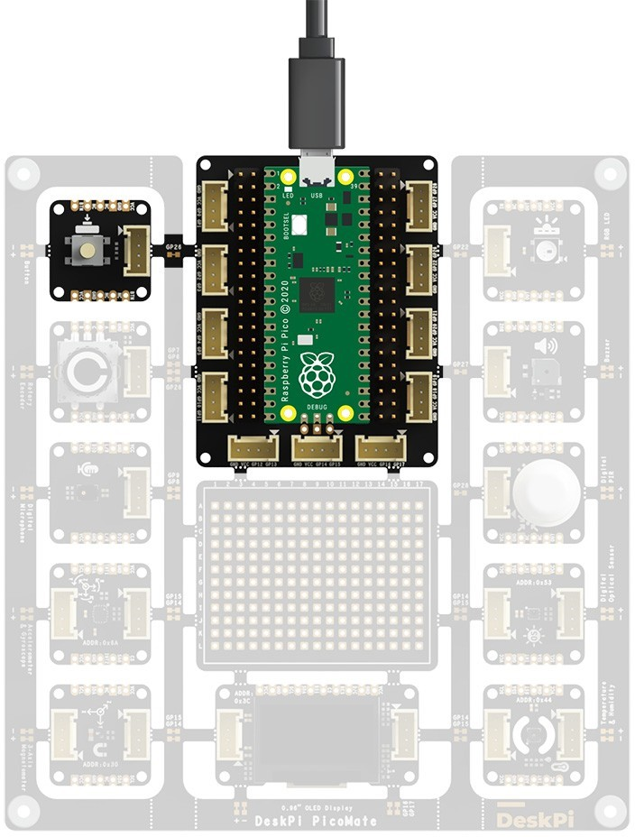
Copy and paste the following code to the Mu Editor and press `Save`:
<br>

```python 
import board
import digitalio

# Button
button = digitalio.DigitalInOut(board.GP26) 

button.direction = digitalio.Direction.INPUT 

button.pull = digitalio.Pull.UP

last_value = button.value

while True:
    if last_value != button.value: 
        last_value = button.value
        print('Button is ' + ('released' if button.value else 'pressed'))

```


Press the button and observe the Serial Console, you will see the message printed each time the state of the button changes:

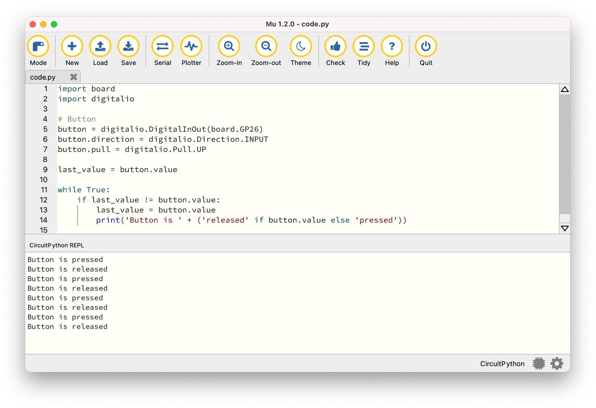

### Rotary Encoder
DeskPi PicoMate has an incremental rotary encoder pre-wired to the Pico, which converts the motion of the switch (clockwise or counterclockwise) into an output signal that can be used to determine what direction the knob is being rotated.

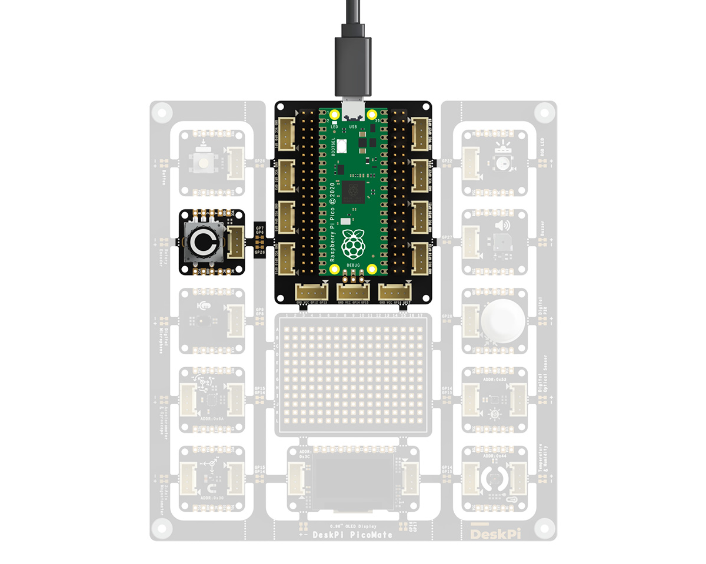
The table below shows the connections of each pin of the rotary encoder:

| Rotary Encoder Pin | On Pico|
|:----:|:----:|
|A | GP7 |
|B | GP6 |
|Swith(Optional, Active High Level) | GP26 |

Copy and paste the following code to the Mu Editor and press `Save`:


```python 

import rotaryio 
import board 
import digitalio

encoder = rotaryio.IncrementalEncoder(board.GP7, board.GP6)

switch = digitalio.DigitalInOut(board.GP26) 

switch.direction = digitalio.Direction.INPUT 

switch.pull = digitalio.Pull.DOWN

last_position = encoder.position 

switch_state = switch.value

while True:

    position = encoder.position

    if last_position is None or position != last_position: 
        print(f"Rotary: {position}")

    last_position = position

    if switch_state != switch.value: 
        switch_state = switch.value
        print('Switch is ' + ('ON' if switch.value else 'OFF'))

```

Now, open the Serial Console, then try rotating the knob slowly clockwise or counterclockwise, and try pressing down on the knob.

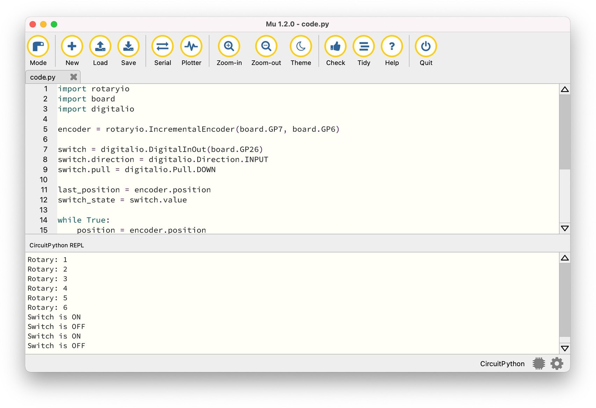


### Buzzer 
DeskPi PicoMate has a buzzer pre-wired to `GP27` on the Pico. To control the buzzer from CircuitPython we will use its built in PWM, or pulse-width modulation, signal generation capabilities.

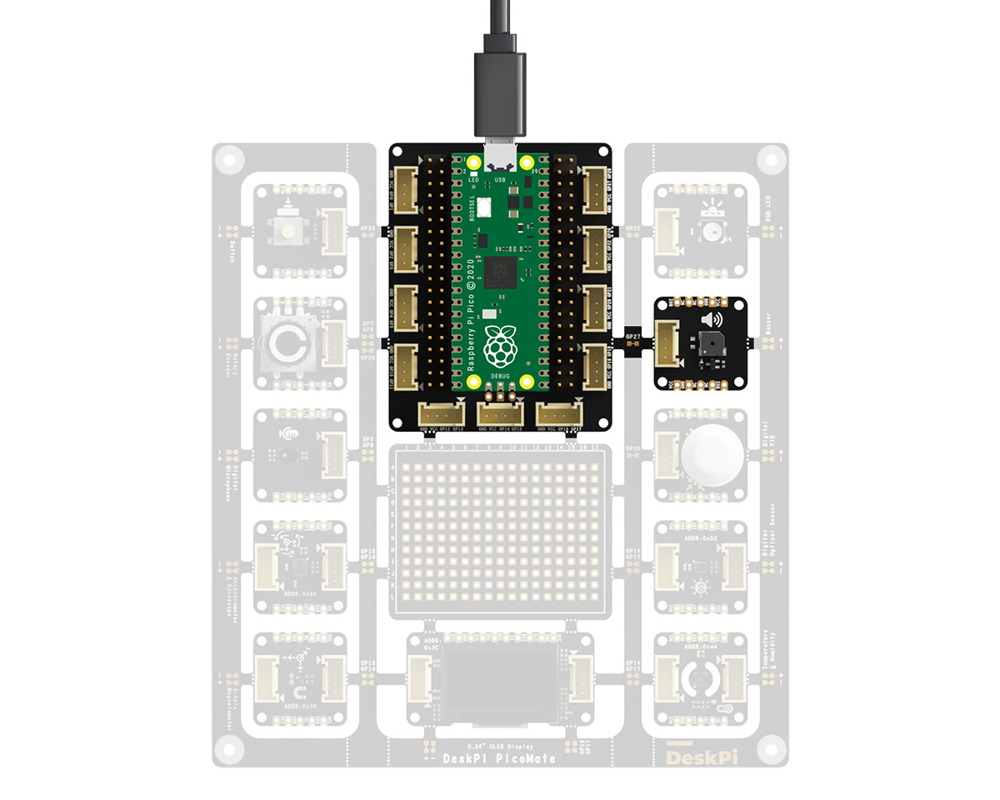

Copy and paste the following code to the Mu Editor and press Save:


```python 

import time
import board 
import pwmio

# Define a list of tones/music notes to play. 

TONE_FREQ = [
	1047,	1047,	1568,	1568,	1760,	1760,	1568,	0,
	1397,	1397,	1319,	1319,	1175,	1175,	1047,	0,
	1568,	1568,	1397,	1397,	1319,	1319,	1175,	0,
	1568,	1568,	1397,	1397,	1319,	1319,	1175,	0,
	1047,	1047,	1568,	1568,	1760,	1760,	1568,	0,
	1397,	1397,	1319,	1319,	1175,	1175,	1047,	0,
]								

# Buzzer 
buzzer = pwmio.PWMOut(board.GP27, variable_frequency=True)

buzzer.frequency = TONE_FREQ[0]
buzzer.duty_cycle = 32768

while True:
    for note in TONE_FREQ:
        if note:
            buzzer.frequency = note
        time.sleep(0.1)

```

The music playback will immediately start as soon as the code is done saving. 

### 0.96” 128x64 OLED Display
DeskPi PicoMate has a 0.96" 128x64 OLED Display module, which is pre-wired to the Pico using `I2C0` with the device address `0x3C`. 

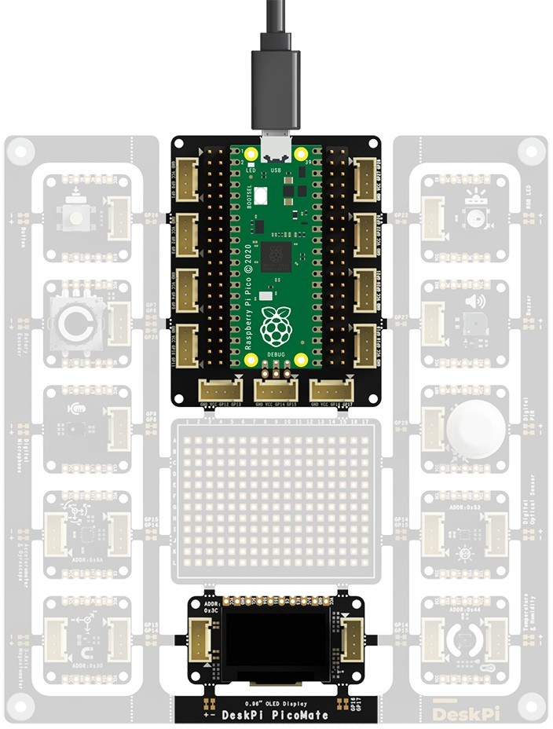
The table below shows the connections of each pin of the OLED:

| 0.96" 128x64 OLED Pin | On Pico
|:----:|:----:|
|SCL| GP17/I2C0_SCL|
|SDA| GP16/I2C0_SDA|

Before we can use the display module, we need the following modules installed:

- adafruit_register 
- adafruit_framebuf  
- adafruit_ssd1306 

Copy the libraries into the CIRCUITPY/lib folder. This should give you the following folder structure:

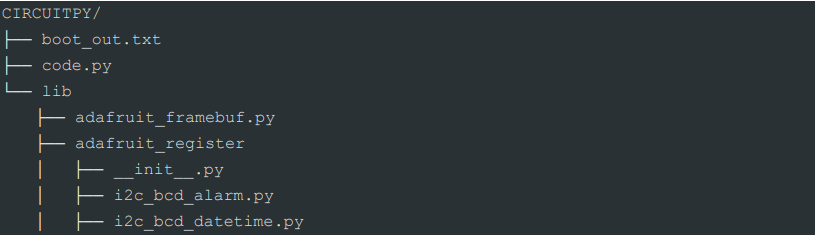
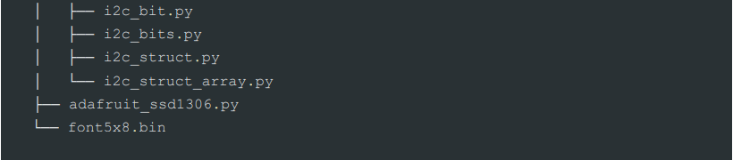

Then, copy and paste the following code to the Mu Editor and press `Save`:
<br>

```python 

import time
import board 
import busio
from adafruit_ssd1306 import SSD1306_I2C

i2c0 = busio.I2C(scl = board.GP17, sda = board.GP16) 

# 0.96" 128x64 OLED Display

display = SSD1306_I2C(128, 64, i2c0)

def display_text(str, line):
    display.text(str, 0, (line % 8) * 8, 1, font_name="/lib/font5x8.bin")


while True:
    display.fill(0)

    display_text("Hello, World!", 0) 

	display_text("It's DeskPi PicoMate!", 2)

    display.show()

    time.sleep(0.5)

```

Try to change the display text and observe what is printed on the OLED.

### PDM Microphone

DeskPi PicoMate has a high quality, low power PDM digital output top-ported omni-directional MEMS microphone.

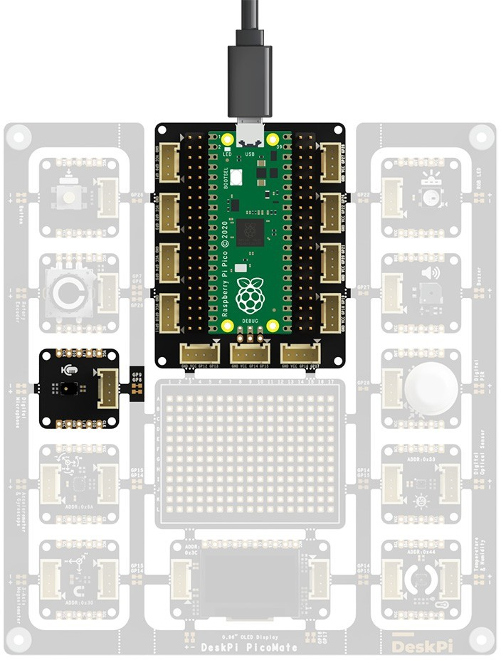

The PDM microphone is pre-wired to the Pico. The table below shows the connections of each pin of the PDM microphone:

|PDM Microphone Pin|On Pico
|:---:|:---:|
|CLK|GP9|
|DATA|GP8|

As PDMIn is built into CircuitPython, no separate libraries are necessary for this example! 

Copy and paste the following code to the Mu Editor and press `Save`:
<br>

```python  

import time 
import array 
import math 
import board 
import audiobusio


# Remove DC bias before computing RMS.

def mean(values):
    return sum(values) / len(values)


# Calculate the Normalized RMS value of samples
def normalized_rms(values): 
    minbuf = int(mean(values)) 
    samples_sum = sum(
        float(sample - minbuf) * (sample - minbuf) for sample in values)

    return math.sqrt(samples_sum / len(values))

# PDM Microphone
mic = audiobusio.PDMIn(board.GP9,board.GP8, sample_rate=16000, bit_depth=16)

samples = array.array('H', [0] * 160)

while True:
    mic.record(samples, len(samples)) 
    magnitude = normalized_rms(samples) 
    print((magnitude,)) 
    time.sleep(0.1)

```

On Serial Console, you will see the Normalized RMS value of the audio captured by the Microphone. Try to make some sound. You will see the magnitude changes. You can also use the plotter for data inspection. Press the `Plotter` button on the top menu.
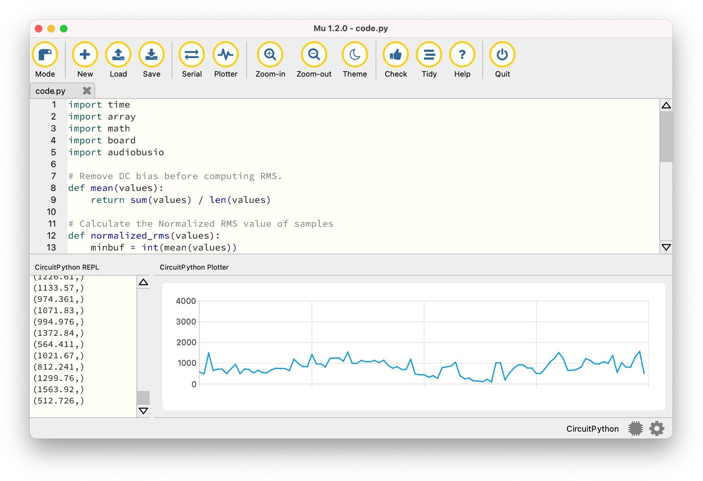

### Digital PIR Sensor
DeskPi PicoMate has a Digital PIR sensor pre-wired to `GP28` on the Pico. 
The Digital PIR sensor allows you to sense motion, almost used to detect whether a human has moved in or out of the sensors range.

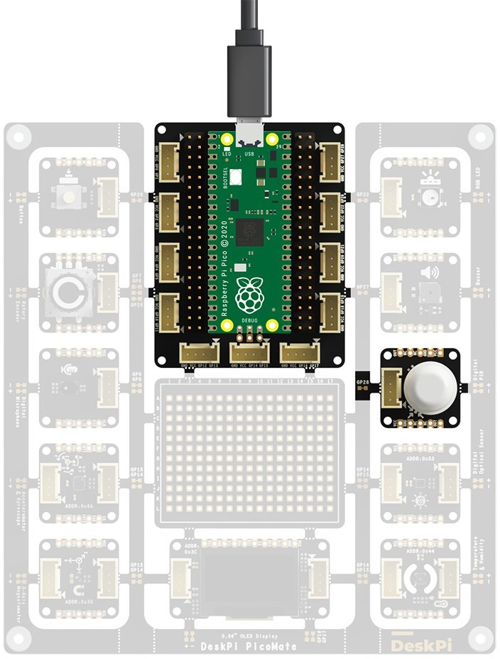

The Digital PIR sensor acts as a digital output. When the sensor is triggered, the input level of `GP28` will be `High` (True) Level.

Copy and paste the following code to the Mu Editor and press `Save`:
<br>

```python 

import board
import digitalio


# PIR sensor
pir_sensor = digitalio.DigitalInOut(board.GP28) 

pir_sensor.direction = digitalio.Direction.INPUT 

pir_sensor.pull = digitalio.Pull.DOWN

last_value = pir_sensor.value


while True:
    if last_value != pir_sensor.value: 
        last_value = pir_sensor.value
        print('Motion ' + ('detected!' if pir_sensor.value else 'removed!'))

```

Try moving your body and see messages printed on the Serial Console.

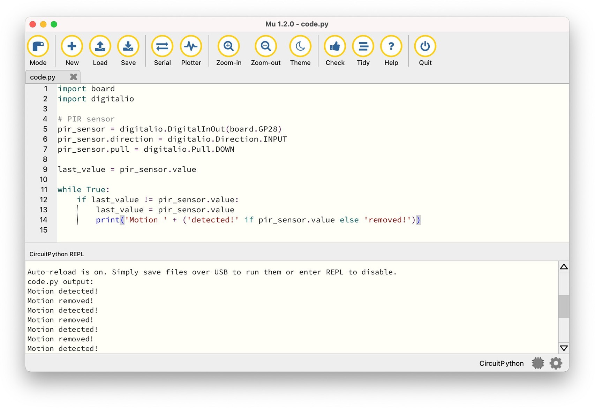

### 6-Axis IMU Sensor
DeskPi PicoMate has a 6-Axis IMU sensor (LSM6DS3TR-C) featuring a 3D digital accelerometer and a 3D digital gyroscope. The sensor is pre-wired to the Pico using `I2C1` with the device address `0x6A`.
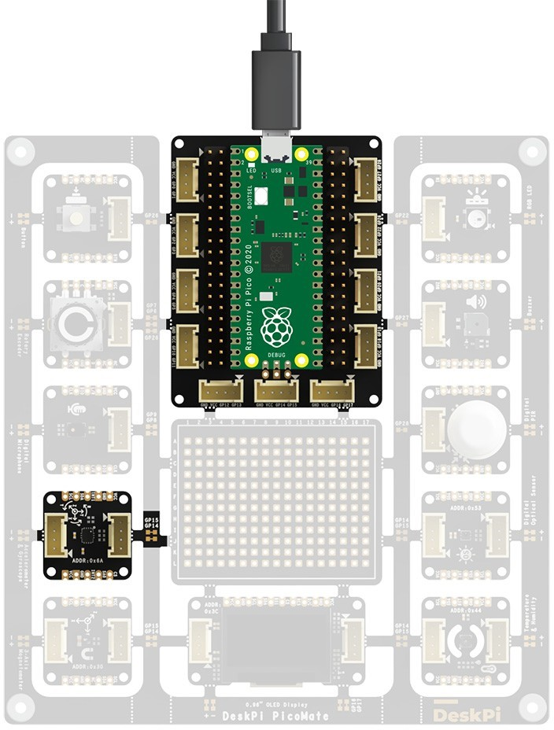

The table below shows the connections of each pin of the sensor:

| 6-Axis IMU sensor Pin	 | On Pico |
|:---:|:---:|
|SCL| GP15/I2C1_SCL |
|SDA| GP14/I2C1_SDA |

Before we can use the sensor, we need the following modules installed:

- adafruit_register
- adafruit_lsm6ds

Copy the libraries into the CIRCUITPY/lib folder. This should give you the following folder structure:


```bash 

CIRCUITPY/
├── boot_out.txt
├── code.py
└── lib
├── adafruit_lsm6ds
│	├── __init__.py
│	├── ism330dhcx.py
│	├── lsm6ds3.py
│	├── lsm6ds33.py
│	├── lsm6ds3trc.py
│	├── lsm6dso32.py
│	└── lsm6dsox.py
└── adafruit_register
    ├── __init__.py
    ├── i2c_bcd_alarm.py
    ├── i2c_bcd_datetime.py
    ├── i2c_bit.py
    ├── i2c_bits.py
    ├── i2c_struct.py
    └── i2c_struct_array.py
```

Then, copy and paste the following code to the Mu Editor and press `Save`:
<br>

```python 

import time 
import board 
import busio
from adafruit_lsm6ds.lsm6ds3trc 
import LSM6DS3TRC 


i2c1 = busio.I2C(scl = board.GP15, sda = board.GP14)

# 6-Axis IMU Sensor 
imu_sensor = LSM6DS3TRC(i2c1)

# Acceleration plotter
while True:
    print(imu_sensor.acceleration) 
    time.sleep(0.1)

# Gyro plotter 
# while True:
#     print(imu_sensor.gyro) 
#     time.sleep(0.1)

``` 

Press the `Plotter` button on the top menu, and try moving your board and see the changes in plotter.

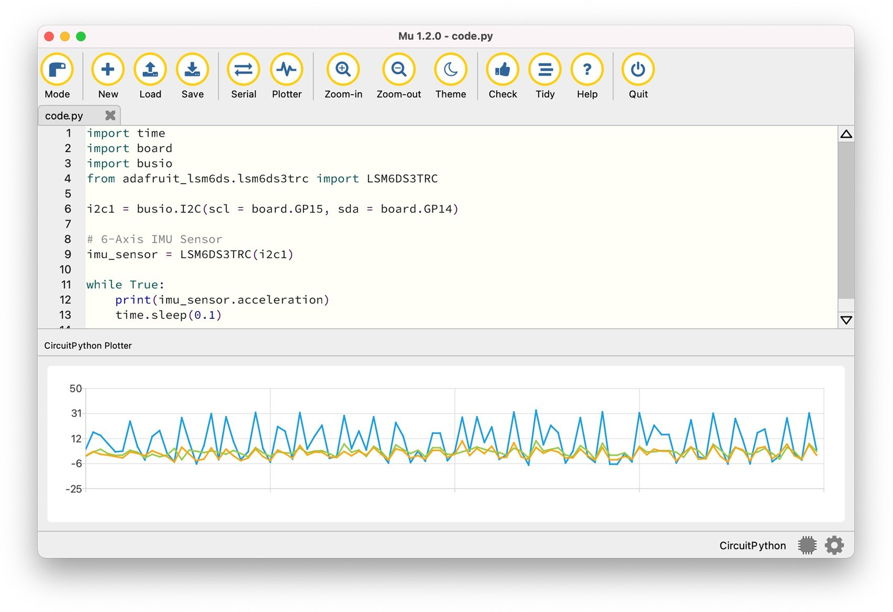


### 3-Axis Magnetometer

DeskPi PicoMate has a 3-Axis Magnetometer (MMC5603NJ) that can measure magnetic fields surrounding the device. The sensor is pre-wired to the Pico using I2C1 with the device address `0x30`.

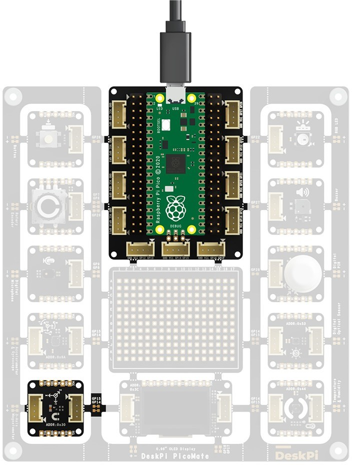
The table below shows the connections of each pin of the sensor:

| 3-Axis Magnetometer Pin	| On Pico |
|:---:|:---:|
|SCL|GP15/I2C1_SCL|
|SDA|GP14/I2C1_SDA|

Before we can use the sensor, we need the following modules installed:

- adafruit_register
- adafruit_mmc56x3

Copy the libraries into the CIRCUITPY/lib folder. This should give you the following folder structure:

```bash

CIRCUITPY/
├── boot_out.txt
├── code.py
└── lib
    ├── adafruit_mmc56x3.py
    └── adafruit_register
        ├── init .py
        ├── i2c_bcd_alarm.py
        ├── i2c_bcd_datetime.py
        ├── i2c_bit.py
        ├── i2c_bits.py
        ├── i2c_struct.py
        └── i2c_struct_array.py
```
Then, copy and paste the following code to the Mu Editor and press `Save`:
<br>

```python  

import time 
import board 
import busio
from adafruit_mmc56x3 import MMC5603


i2c1 = busio.I2C(scl = board.GP15, sda = board.GP14) 

# MMC5603 magnetometer
magnetometer = MMC5603(i2c1)

magnetometer.data_rate = 1000   # in Hz, from 1-255 or 1000 

magnetometer.continuous_mode = True


# Magnetic plotter
while True:
    print(magnetometer.magnetic)
    time.sleep(0.1)

```

Press the `Plotter` button on the top menu, and try moving your board and see the changes in plotter.
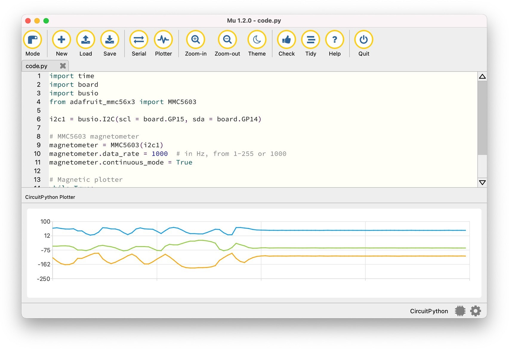

### Digital Optical Sensor

DeskPi PicoMate has a Digital Optical Sensor (LTR-381RGB-01) that integrates an ambient light sensor (ALS) and a color sensor (CS). With the advanced RGB color sensor, this sensor converts light (Red, Green, Blue, and IR) intensity to a digital output signal capable of direct I2C interface. The ALS provides a linear response over a wide dynamic range, which is well suited to applications under very low or bright ambient brightness.

The sensor is pre-wired to the Pico using I2C1 with the device address `0x53`.

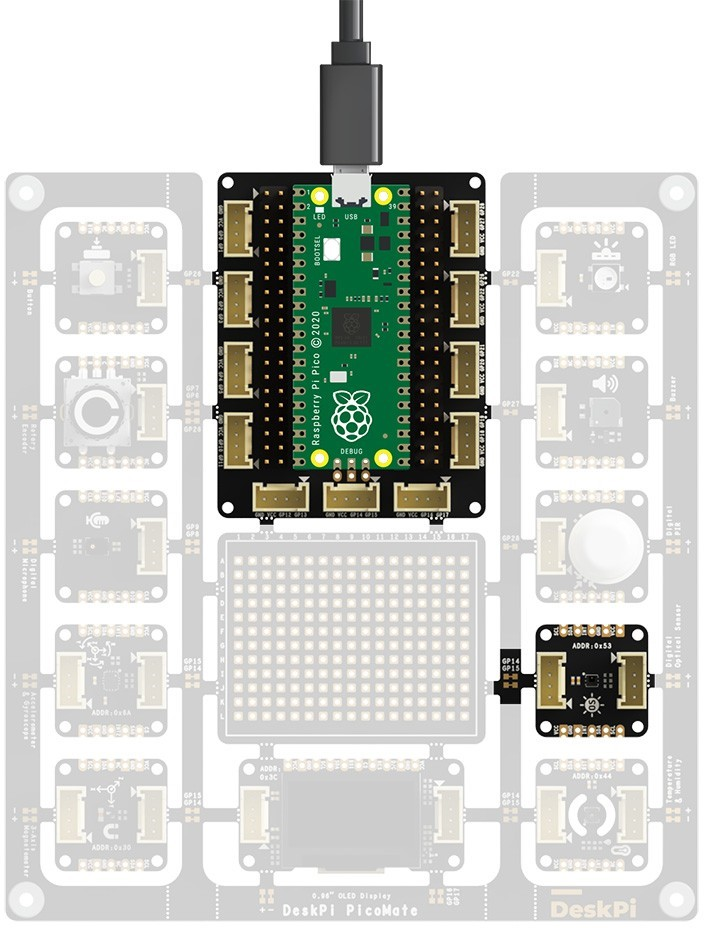

The table below shows the connections of each pin of the sensor:

|Digital Optical Sensor Pin	| On Pico |
|:---:|:---:|
|SCL|GP15/I2C1_SCL|
|SDA|GP14/I2C1_SDA|

Before we can use the sensor, we need the following modules installed:

- adafruit_register
- ltr381rgb

Copy the libraries into the CIRCUITPY/lib folder. This should give you the following folder structure:

```bash

CIRCUITPY/
├── boot_out.txt
├── code.py
└── lib
    ├── adafruit_register
    │	├── init .py
    │	├── i2c_bcd_alarm.py
    │	├── i2c_bcd_datetime.py
    │	├── i2c_bit.py
    │	├── i2c_bits.py
    │	├── i2c_struct.py
    │	└── i2c_struct_array.py
    └── ltr381rgb.py

```
Then, copy and paste the following code to the Mu Editor and press `Save`:
<br>

```python 

import time 
import board 
import busio
from ltr381rgb import LTR381RGB


i2c1 = busio.I2C(scl = board.GP15, sda = board.GP14) 

# Optical Sensor
optical = LTR381RGB(i2c1) 
optical.mode = "CS" 
optical.enable()

# ALS and raw data plotter
while True:
    print(f"ALS: {optical.lux} lx") 
    print(optical.raw_data) 
    time.sleep(0.5)

```

On Serial Console, you will see the calculated lux of ambient light. 
Try to lit up or dim the sensor. You will see the value changes. 
You can also use the plotter for raw data inspection.
Press the Plotter button on the top menu.

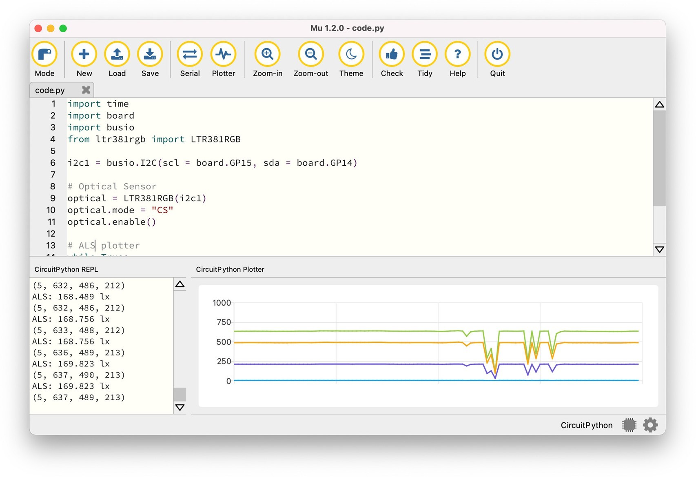

### Temperature & Humidity Sensor

DeskPi PicoMate has a temperature and humidity sensor (SHT30-DIS), which is pre-wired to the Pico using I2C1 with the device address `0x44`.

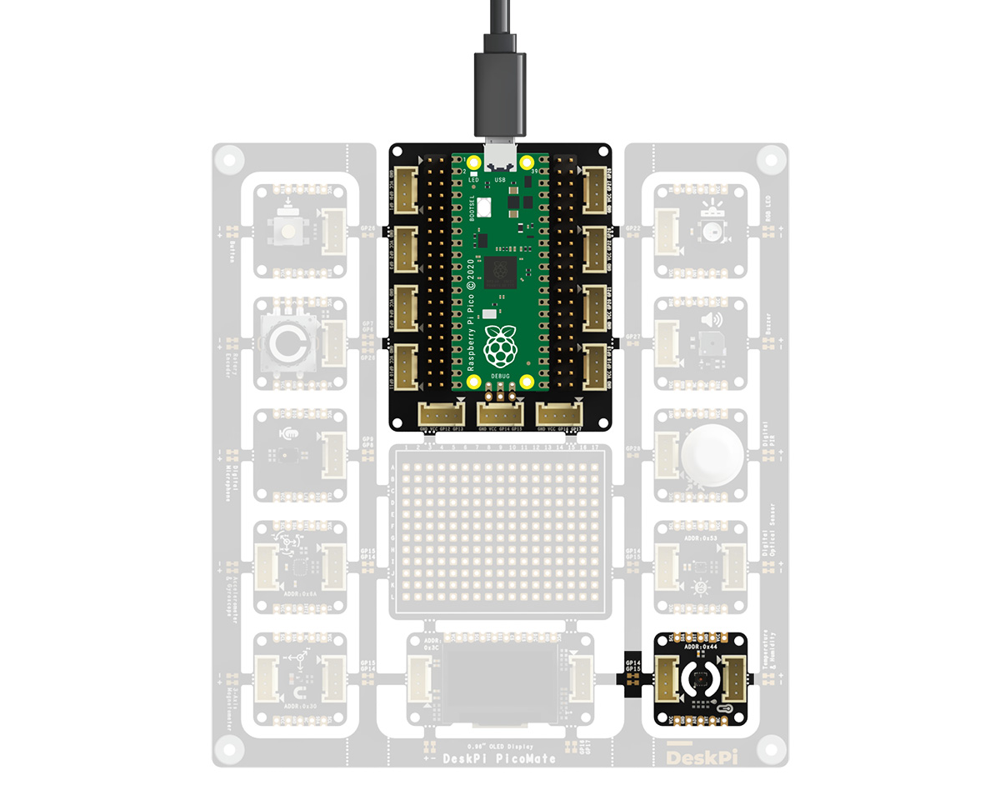

The table below shows the connections of each pin of the sensor:

|Temperature & Humidity Sensor Pin|	On Pico|
|:---:|:---:|
|SCL|GP15/I2C1_SCL|
|SDA|GP14/I2C1_SDA|

Before we can use the sensor, we need the following modules installed:
- adafruit_register
- adafruit_sht31d

Copy the libraries into the CIRCUITPY/lib folder. This should give you the following folder structure:

```bash

CIRCUITPY/
├── boot_out.txt
├── code.py
└── lib
├── adafruit_register
│	├── init .py
│	├── i2c_bcd_alarm.py
│	├── i2c_bcd_datetime.py
│	├── i2c_bit.py
│	├── i2c_bits.py
│	├── i2c_struct.py
│	└── i2c_struct_array.py
└── adafruit_sht31d.py
```
Then, copy and paste the following code to the Mu Editor and press `Save`:
<br>

```python  

import time 
import board 
import busio
from adafruit_sht31d import SHT31D


i2c1 = busio.I2C(scl = board.GP15, sda = board.GP14) 

# Temperature & Humidity Sensor
sht_sensor = SHT31D(i2c1)

loopcount = 0

while True:
    print("\nTemperature: %0.1f C" % sht_sensor.temperature) 
    print("Humidity: %0.1f %%" % sht_sensor.relative_humidity) 
    loopcount += 1
    time.sleep(2)

    # every 10 passes turn on the heater for 1 second
    if loopcount == 10: 
        loopcount = 0 
        sht_sensor.heater = True
        print("Sensor Heater status =", sht_sensor.heater) 
        time.sleep(1)
        sht_sensor.heater = False
        print("Sensor Heater status =", sht_sensor.heater)

```

On Serial Console, you will see the temperature and humidity printed every `2s`.

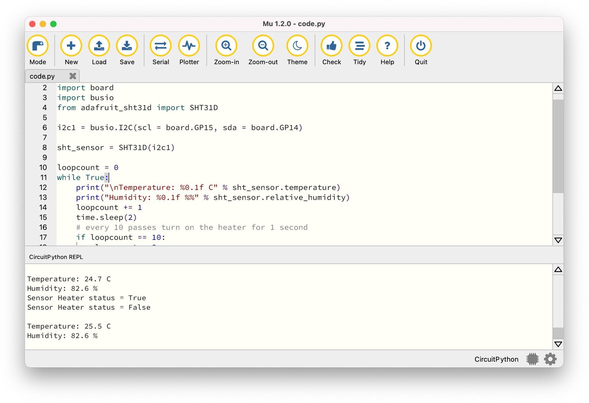

## Libraries download

* Firmware Download: [firmware](./attachments/adafruit-circuitpython-raspberry_pi_pico-en_US-7.3.3.uf2)
* libraries Download: [libraries](./attachments/libraries.zip)

## FAQ
* Q: Should I download the libraries from internet?
  A: Yes, if you want to use the latest version of the libraries.

## Appendix A: DeskPi PicoMate Pinout Diagram 
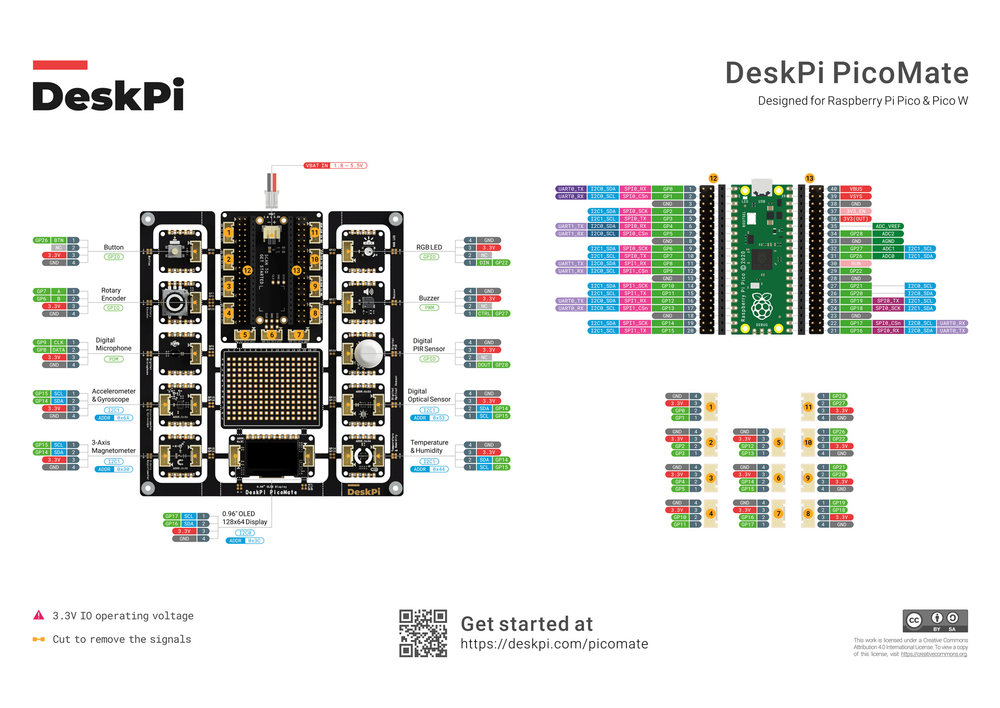

