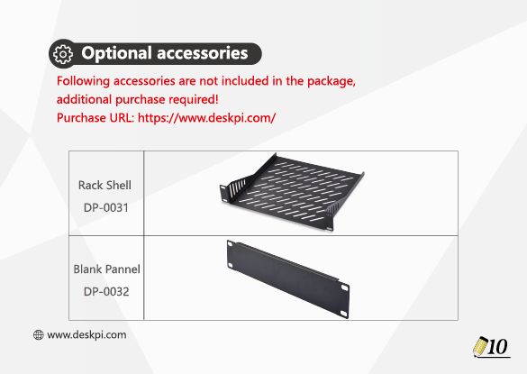
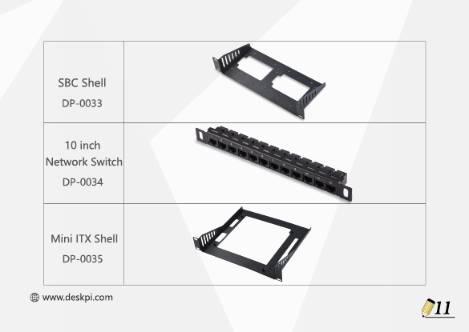

# DeskPi RackMate T1

## Description
DeskPi Rack Mate T1 is Aluminum Alloy and Acrylic Frame Mini Chassis which you can setup your own cluster or home assistant server farm into the Mini Chassis. 
Thank you for choosing our aluminum alloy and acrylic frame mini chassis.
This user manual will provide you with a detailed description and usage guide for the chassis, 
ensuring that you can correctly install, use, and maintain this product.

[Buy DeskPi RackMate T1](https://deskpi.com/products/deskpi-rackmate-t1-2)

[Visit DeskPi Official Website](https://deskpi.com/){ .md-button .md-button --primary }

## Features
* 10-inch width 
The cabinet has a width of 10 inches, which is a relatively small size that saves space while accommodating sufficient equipment. 
With dimensions of 11x7.8x16 inches, it is suitable for small offices, home environments, and large enterprises looking to save space.

* Open Design
The cabinet adopts an open design, allowing easy access to all devices inside. 
This design facilitates equipment installation and maintenance, aids in device cooling, and maintains optimal working conditions.

* Mounting Hole Description

* 8U Standard Size
The cabinet has a height of 8U, which is a standard unit size. 
With 1U equaling 1.75 inches, 8U implies a height of 14 inches.

* 10mm Thick Aluminum Structure
The main structure of the cabinet is manufactured using die-cast aluminum with a thickness of up
to 10mm.
It can withstand heavy IT equipment such as UPS and NAS.

* Translucent Design
Both sides are made of translucent acrylic, providing dust resistance and reduced weight. 
This design allows direct observation of the cabinet's interior, and users can add ambient lights for
decoration.

* Expandability
Both sides are made of translucent acrylic, providing dust resistance and reduced weight. 
This design allows direct observation of the cabinet's interior, and users can add ambient lights for decoration.

## Package Includes 

## Optional accessories

### Accessories Purchase URL
{: style="height:50px;width:50px"}
{: style="height:50px;width:50px"}

* Rack Shell [DP-0031](https://deskpi.com/collections/deskpi-rack-mate/products/deskpi)
* Blank Pannel [DP-0032](https://deskpi.com/collections/deskpi-rack-mate/products/deskpi-accessories-blank-pannel)
* SBC Shell [DP-0033](https://deskpi.com/collections/deskpi-rack-mate/products/deskpi-accessories-sbc-shell)
* 10-Inch Network Switch [DP-0034](https://deskpi.com/collections/deskpi-rack-mate/products/deskpi-rackmate-accessory-10-inch-network-switch)
* Mini ITX Shell [DP-0035](https://deskpi.com/collections/deskpi-rack-mate/products/deskpi-rackmate-accessory-mini-itx-shell)

## Multiple Usages accroding to your requrement

## Primary User Scenarios

## Assembling Steps

## DeskPi 

