# DeskPi RackMate T1
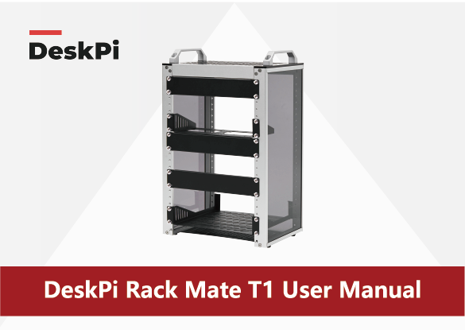
## Description
DeskPi Rack Mate T1 is Aluminum Alloy and Acrylic Frame Mini Chassis which you can setup your own cluster or home assistant server farm into the Mini Chassis. 
Thank you for choosing our aluminum alloy and acrylic frame mini chassis.
This user manual will provide you with a detailed description and usage guide for the chassis, 
ensuring that you can correctly install, use, and maintain this product.
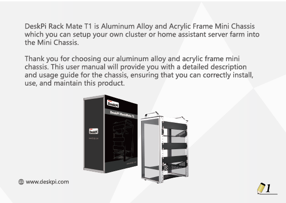

[Buy DeskPi RackMate T1](https://deskpi.com/products/deskpi-rackmate-t1-2)

[Visit DeskPi Official Website](https://deskpi.com/){ .md-button .md-button --primary }

## Features
* 10-inch width 
The cabinet has a width of 10 inches, which is a relatively small size that saves space while accommodating sufficient equipment. 
With dimensions of 11x7.8x16 inches, it is suitable for small offices, home environments, and large enterprises looking to save space.

* Open Design
The cabinet adopts an open design, allowing easy access to all devices inside. 
This design facilitates equipment installation and maintenance, aids in device cooling, and maintains optimal working conditions.
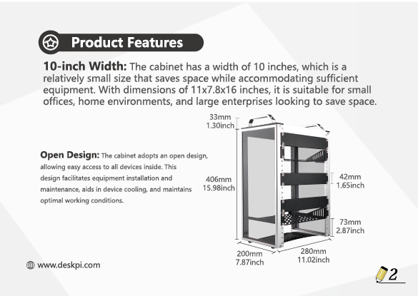

* Mounting Hole Description
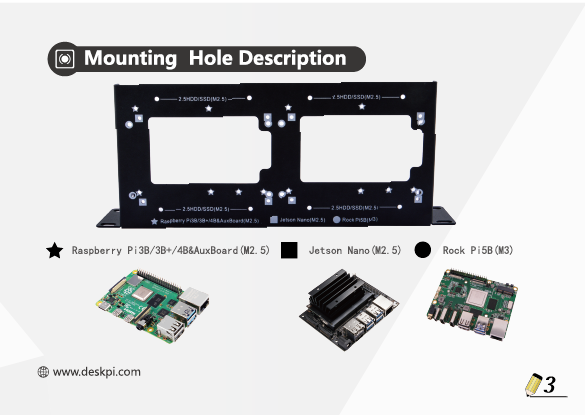
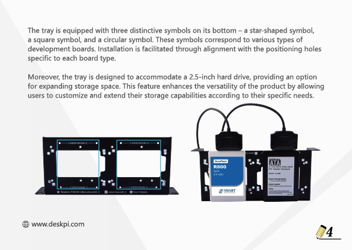

* 8U Standard Size
The cabinet has a height of 8U, which is a standard unit size. 
With 1U equaling 1.75 inches, 8U implies a height of 14 inches.
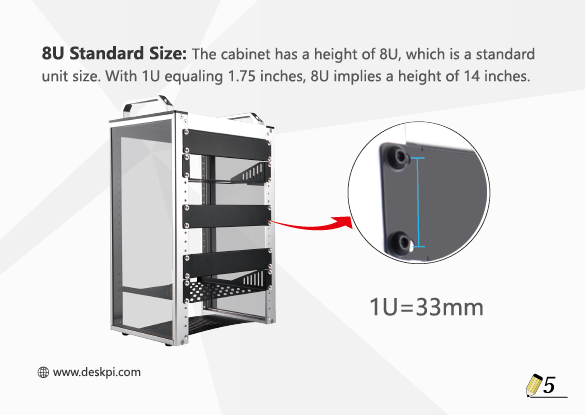

* 10mm Thick Aluminum Structure
The main structure of the cabinet is manufactured using die-cast aluminum with a thickness of up
to 10mm.
It can withstand heavy IT equipment such as UPS and NAS.
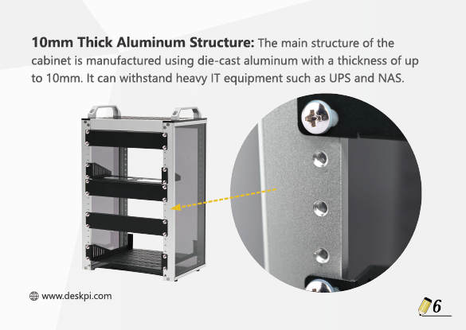

* Translucent Design
Both sides are made of translucent acrylic, providing dust resistance and reduced weight. 
This design allows direct observation of the cabinet's interior, and users can add ambient lights for
decoration.
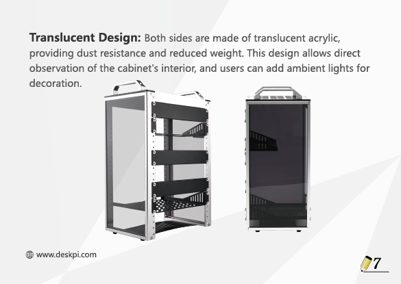

* Expandability
Both sides are made of translucent acrylic, providing dust resistance and reduced weight. 
This design allows direct observation of the cabinet's interior, and users can add ambient lights for decoration.

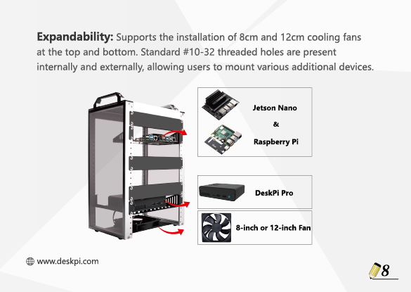

## Package Includes 

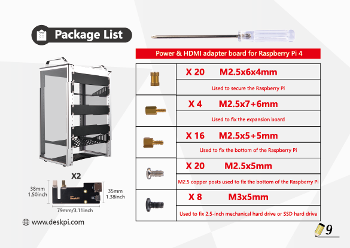

## Optional accessories
 Following accessories are not included in the package,
    additional purchase required.   

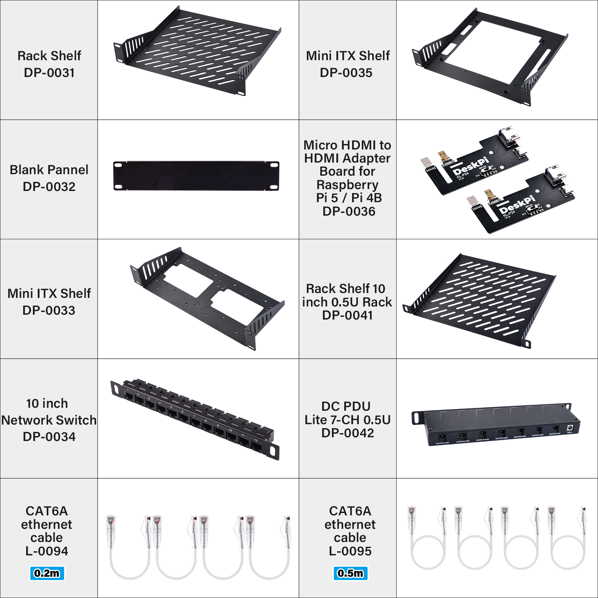 

* Please search the accessories in [https://deskpi.com/](https://deskpi.com)   or click the links below. 

## Accessories Details 

 NEW arrival!!! 

* DeskPi Rackmate 2U Rack Mount with PCIE NVME Board for Raspberry Pi 5: [DP-0046](./rackmate_accessories_3.md)

* DeskPi Rackmate 1U Rack Mount with PCIE NVME Board for Raspberry Pi 5: [DP-0039](./rackmate_accessories_4.md)

* DC PDU Lite 7-CH 0.5U for DeskPi Rackmate T1: [DP-0042](./rackmate_accessories.md)

* 10-inch Server Rack 0.5U Rack Cable Management Pannel-With 3 D-rings: [DP-0044](./rackmate_accessories_2.md)

* 10-inch 1U Rack Cable Entry Panel with Brush Strip: [DP-0055](./rackmate_accessories_5.md)

* T1 0.5U Heavy Duty Rack Shelf for 10-inch server: [DP-0056](./rackmate_accessories_6.md)

## Multiple Usages accroding to your requrement
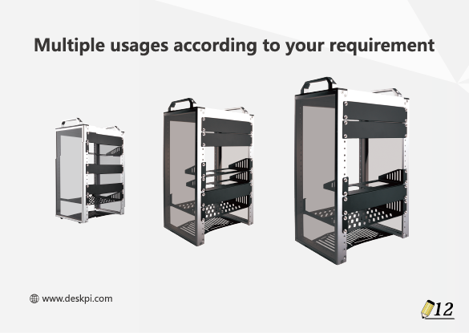

## Primary User Scenarios
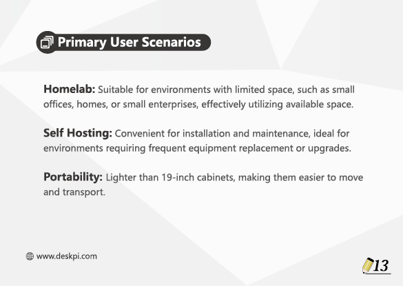

## Assembling Steps
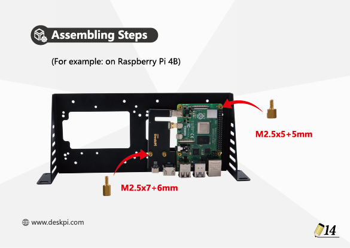

## YouTube Videos
<iframe width="560" height="315" src="https://www.youtube.com/embed/mwcAfQ94cXg?si=L08mH2LI2iv1c-lC" title="YouTube video player" frameborder="0" allow="accelerometer; autoplay; clipboard-write; encrypted-media; gyroscope; picture-in-picture; web-share" referrerpolicy="strict-origin-when-cross-origin" allowfullscreen></iframe>

## Accessories Purchase URL

{: style="height:50px;width:50px"}
{: style="height:50px;width:50px"}

* DeskPi Rackmate 2U Rack Mount with PCIE NVME Board for Raspberry Pi 5/4B: [DP-0046](https://deskpi.com/)
* Rack shelf [DP-0031](https://deskpi.com/collections/deskpi-rack-mate/products/deskpi)
* Blank Pannel [DP-0032](https://deskpi.com/collections/deskpi-rack-mate/products/deskpi-accessories-blank-pannel)
* SBC shelf [DP-0033](https://deskpi.com/collections/deskpi-rack-mate/products/deskpi-accessories-sbc-shell)
* 10-Inch Network Switch [DP-0034](https://deskpi.com/collections/deskpi-rack-mate/products/deskpi-rackmate-accessory-10-inch-network-switch)
* Mini ITX shelf [DP-0035](https://deskpi.com/collections/deskpi-rack-mate/products/deskpi-rackmate-accessory-mini-itx-shell)
* CAT6A Ethernet Cable(0.2M) [L-0094](https://deskpi.com/collections/new-arrival/products/4-pack-3-8mm-0-2m-snagless-short-shielded-cat6a-ethernet-cable) 
* CAT6A Ethernet Cable(0.5M) [L-0095](https://deskpi.com/collections/new-arrival/products/4-pack-3-8mm-0-5m-snagless-short-shielded-cat6a-ethernet-cable) 
* DC PDU Lite 7-CH 0.5U for DeskPi Rackmate T1:[DP-0042](https://deskpi.com/collections/new-arrival/products/deskpi-dc-pdu-lite-7-ch-0-5u-for-deskpi-rackmate-t1)
* 10-inch Server Rack 0.5U Rack Cable Management Panel-with 3 D-Rings: [DP-0044](https://deskpi.com/collections/new-arrival/products/10inch-server-rack-0-5u-rack-cable-management-panel-with-3-d-rings)

More accessories please visit: [DeskPi RackMate Accessories](./rackmate_accessories_allinone.md)

### Amazon Links:

* DeskPi RackMate T1: 

[US Store](https://www.amazon.com/dp/B0CSCWVTQ7/)
 
[UK Store](https://www.amazon.co.uk/dp/B0CS6MHCY8)

* Network Patch Panel 12 Port CAT6 10inch 0.5U

[US Store](https://www.amazon.com/dp/B0D5XPNHHF/)
 
[UK Store](https://www.amazon.co.uk/dp/B0D5Q6CJ1J)

* SBC shelf 10 inch 1U Rack

[US Store](https://www.amazon.com/dp/B0D5XMM7HL)
  
[UK Store](https://www.amazon.co.uk/dp/B0D5QL66MB)

* Mini ITX shelf 10 inch 1U Rack

[US Store](https://www.amazon.com/dp/B0D5XNDFDZ/)
  
[UK Store](https://www.amazon.co.uk/dp/B0D5QSB8GY)

* Blank Pannel 10 inch 1U Rack

[US Store]( https://www.amazon.com/dp/B0D5XKZ714/)
  
[UK Store]( https://www.amazon.co.uk/dp/B0D5QP91R9)

* SBC shelf 10 inch 1U Rack, with 2PCS Micro HDMI to HDMI Adapter Board for Raspberry Pi 5 / Pi 4B

[US Store]( https://www.amazon.com/dp/B0D9NGC4DH/)
  
[UK Store]( https://www.amazon.co.uk/dp/B0D9NGC4DH)

* Micro HDMI to HDMI Adapter Board for Raspberry Pi 5 / Pi 4B

[US Store]( https://www.amazon.com/dp/B0D9LDQ7DY/)
  
[UK Store]( https://www.amazon.co.uk/dp/B0D9LDQ7DY)

* GeeekPi 4PCS Cat6A Ethernet Cable, Snagless Short Shielded Network Cable, White (20 cm/0.65 ft)

[US Store (0.2m)](https://www.amazon.com/dp/B0DDXLCYF6/)
  
[UK Store (0.2m)](https://www.amazon.co.uk/dp/B0DDX78486)
  
[UK Store (0.5m)](https://www.amazon.co.uk/dp/B0DDXQH81J)

* Rack shelf 10 Inch 0.5U Rack Shelf

[US Store](https://www.amazon.com/dp/B0DFHCM3YG)
  
[UK Store](https://www.amazon.co.uk/dp/B0DFLQJ436)

* DeskPi 10inch Server Rack 0.5U Rack Cable Management Panel-with 3 D-Rings

[US Store](https://www.amazon.com/dp/B0DGP8TT6Q)
  
[UK Store](https://www.amazon.co.uk/dp/B0DFLQJ436)

* DeskPi DC PDU Lite 7-CH 0.5U for DeskPi Rackmate T1

[US Store](https://www.amazon.com/dp/B0DGFZVXF6)
  
[UK Store](https://www.amazon.co.uk/dp/B0DGGB14KN)

## DeskPi 

