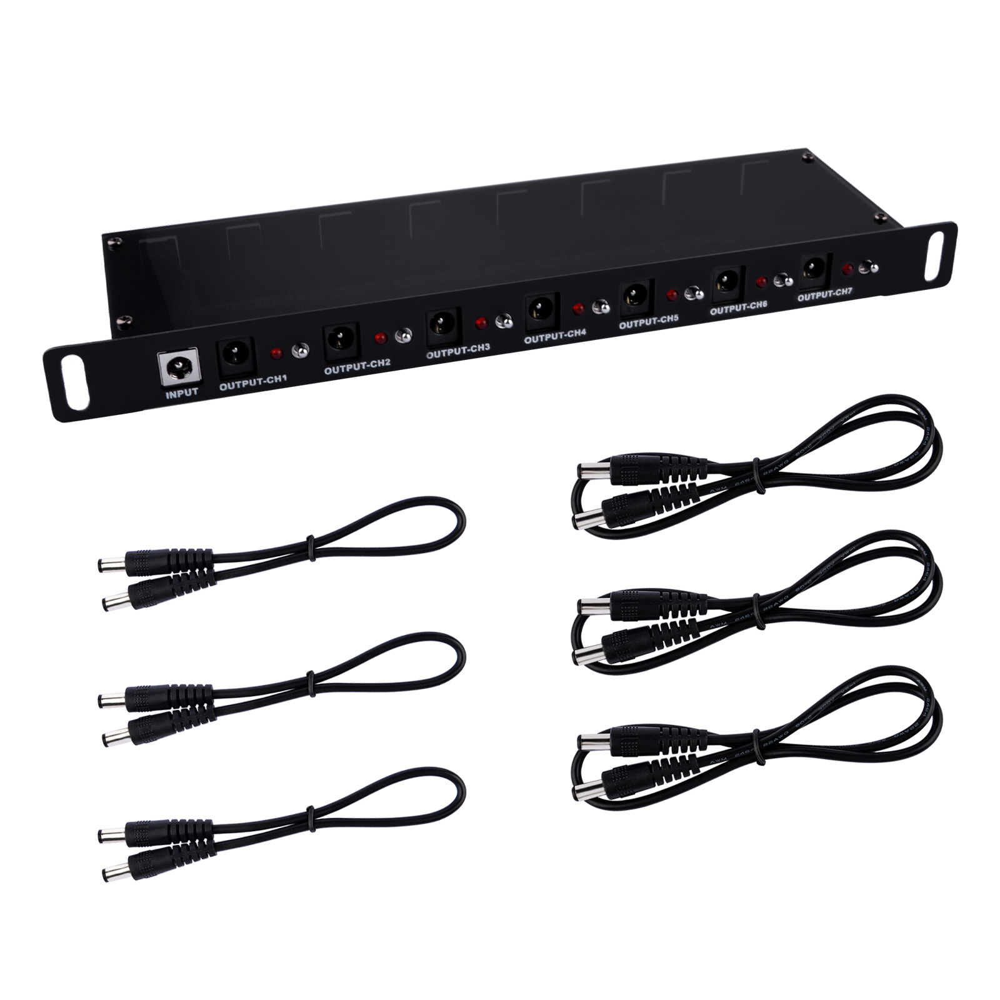
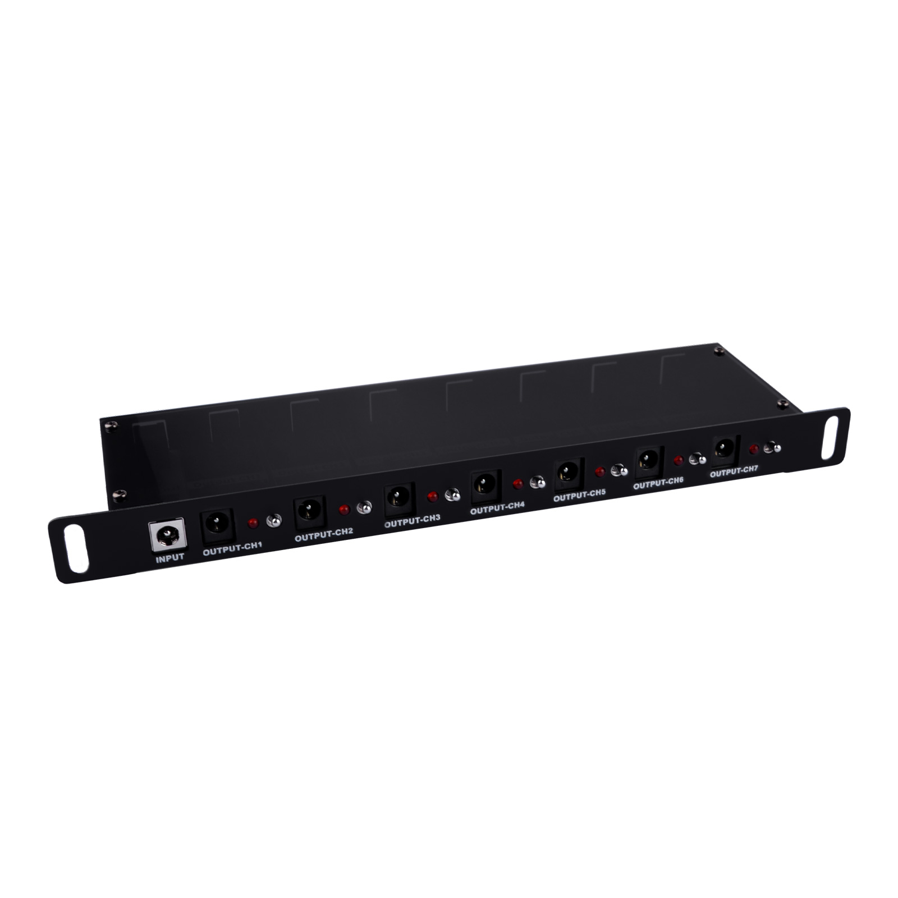
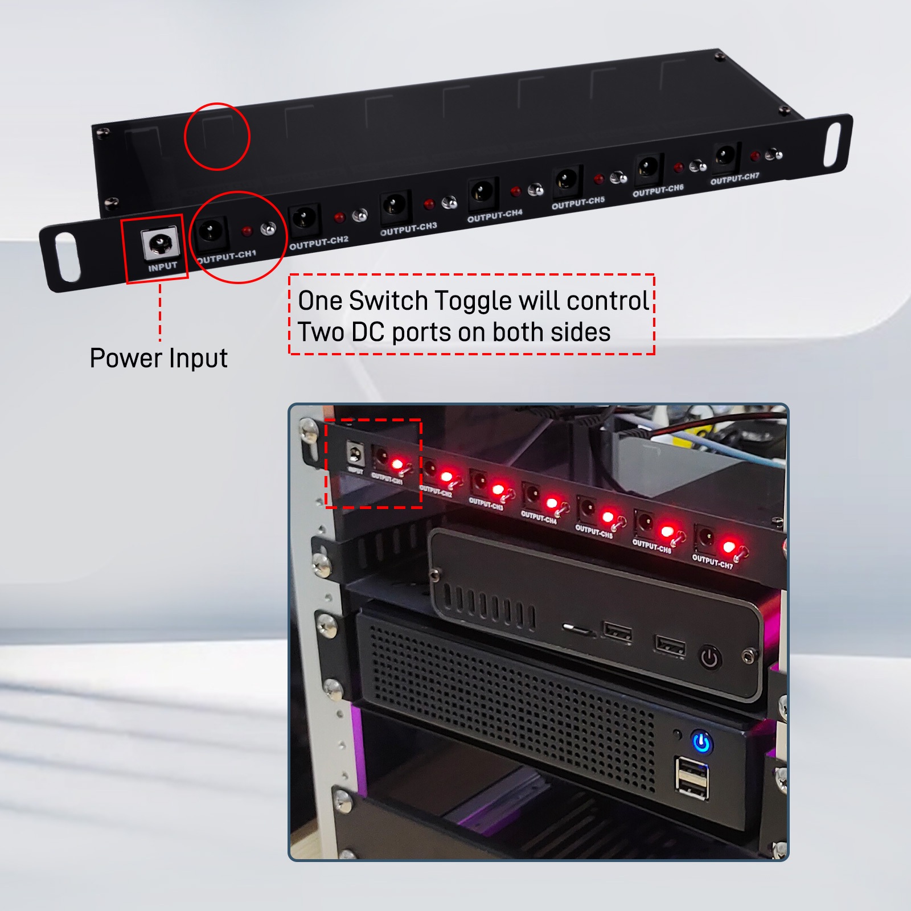
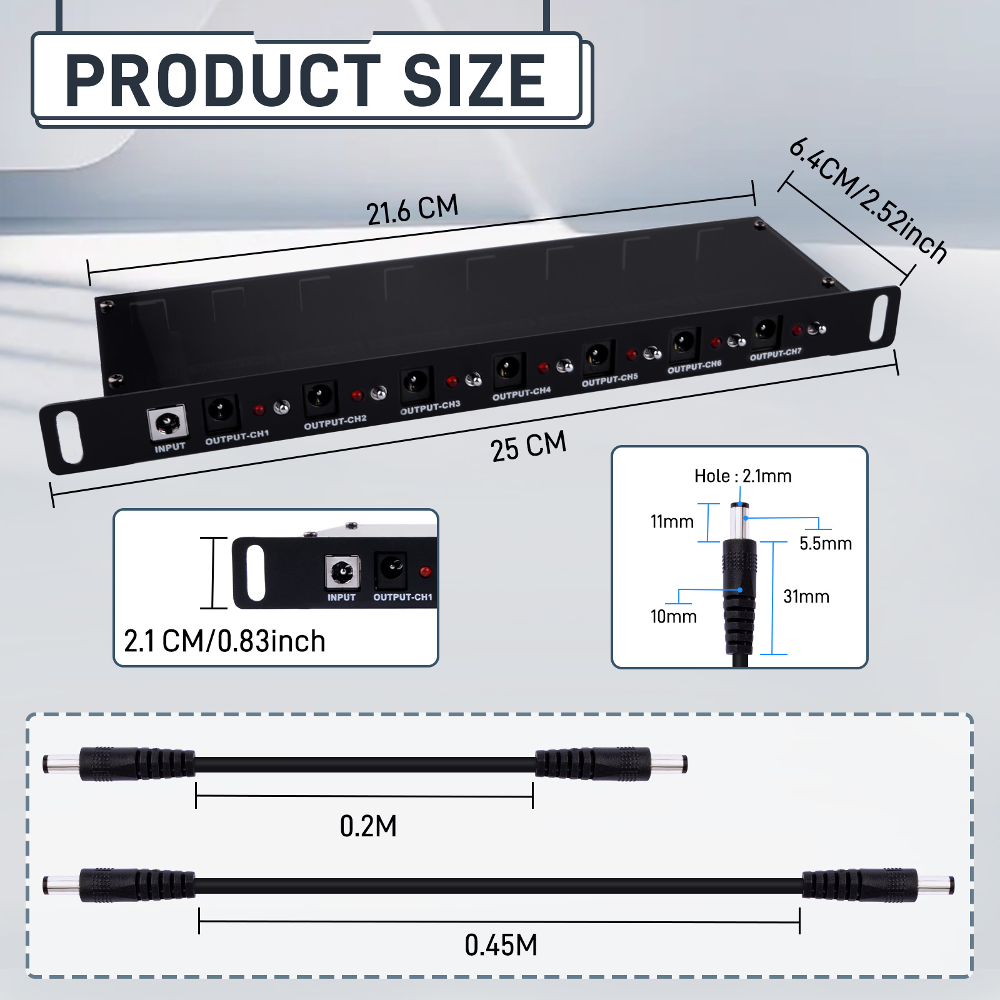
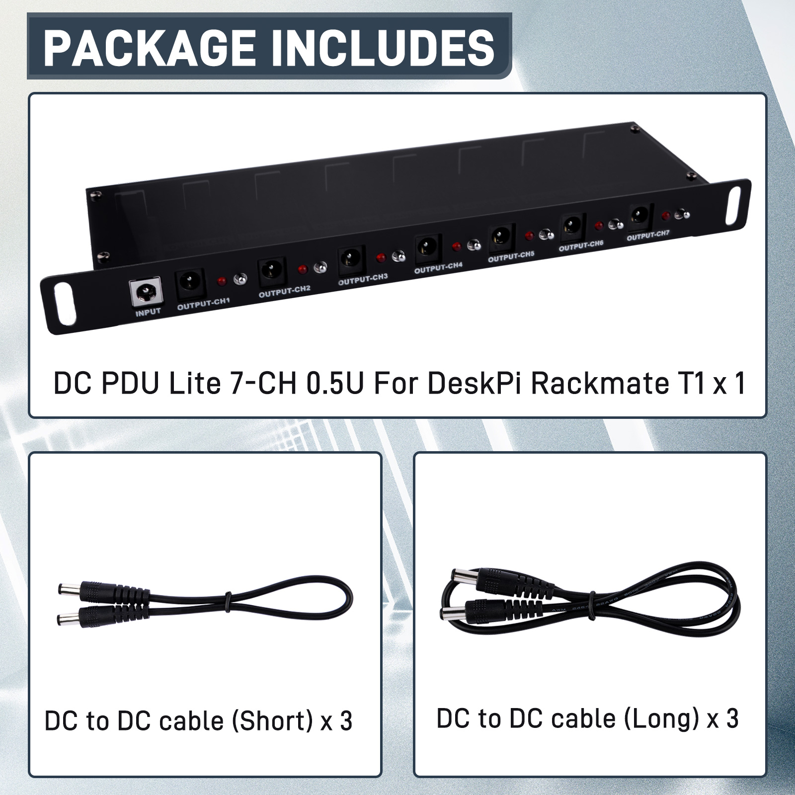

# DC PDU Lite 7-CH 0.5U for DeskPi Rackmate T1 

* SKU: DP-0042 
* Name: DC PDU Lite 7-CH 0.5U for DeskPi Rackmate T1 

## Description
The DP-0042 is a DC Power Distribution Unit (PDU) specifically designed for the DeskPi Rackmate T1, featuring 7 channels suitable for both desktop and rack-mount installations. It supports a broad range of input voltages with no minimum voltage requirement, up to a maximum of 24V, and a maximum current of 8A. This PDU is engineered to meet the power needs of various electronic devices and accessories, making it ideal for scenarios requiring flexible power management.

## Features

- **Flexible Voltage Support**: Capable of supporting input voltages from no minimum limit up to a maximum of 24V.
- **High Current Carrying Capacity**: With a maximum current of 8A, it is suitable for high-power devices.
- **Dual Input Interfaces**: Equipped with two input ports, front and rear, for user convenience based on connection needs.
- **Automatic Fuse Recovery**: Triggers a fuse break if the current in a single channel exceeds 5A, with automatic recovery after 4 seconds to ensure device safety.

## Specifications
- **Input Voltage Range**: No minimum limit to 24V
- **Maximum Input Current**: 8A
- **Output Voltage**: Equal to the input voltage
- **Maximum Current per Channel**: 3A
- **Fuse Trigger Current**: Over 5A
- **Automatic Recovery Time**: 4 seconds
- **Outlet Configuration**: Each channel has two outlets, front and rear, sharing a total current of 3A
- **Size**: 0.5U (specific dimensions to be provided based on the actual product)
- **Installation Method**: Compatible with DeskPi Rackmate T1, supports desktop or rack-mount installation

## Applications
The DP-0042 DC PDU is suitable for a variety of applications, including but not limited to:
- Laboratory and test equipment power management
- Industrial automation equipment power distribution
- Power supply for desktop computers and server accessories
- Any environment requiring flexible power solutions

## Safety Measures
- Ensure not to exceed the maximum current limit to avoid triggering the fuse.
- Installation and maintenance should be performed under the guidance of a professional.

## Package Includes 

### Accessories Purchase URL

* Rack Shell [DP-0031](https://deskpi.com/collections/deskpi-rack-mate/products/deskpi)
* Blank Pannel [DP-0032](https://deskpi.com/collections/deskpi-rack-mate/products/deskpi-accessories-blank-pannel)
* SBC Shell [DP-0033](https://deskpi.com/collections/deskpi-rack-mate/products/deskpi-accessories-sbc-shell)
* 10-Inch Network Switch [DP-0034](https://deskpi.com/collections/deskpi-rack-mate/products/deskpi-rackmate-accessory-10-inch-network-switch)
* Mini ITX Shell [DP-0035](https://deskpi.com/collections/deskpi-rack-mate/products/deskpi-rackmate-accessory-mini-itx-shell)
* CAT6A Ethernet Cable(0.2M) [L-0094](https://deskpi.com/collections/new-arrival/products/4-pack-3-8mm-0-2m-snagless-short-shielded-cat6a-ethernet-cable) 
* CAT6A Ethernet Cable(0.5M) [L-0095](https://deskpi.com/collections/new-arrival/products/4-pack-3-8mm-0-5m-snagless-short-shielded-cat6a-ethernet-cable) 
* DC PDU Lite 7-CH 0.5U for DeskPi Rackmate T1:[DP-0042](https://deskpi.com/collections/new-arrival/products/deskpi-dc-pdu-lite-7-ch-0-5u-for-deskpi-rackmate-t1)
* 10-inch Server Rack 0.5U Rack Cable Management Panel-with 3 D-Rings: [DP-0044](https://deskpi.com/collections/new-arrival/products/10inch-server-rack-0-5u-rack-cable-management-panel-with-3-d-rings)

### Optional Accessories Details
* [Accessories 1](./rackmate_accessories.md)
* [Accessories 2](./rackmate_accessories_2.md)
* [Accessories 3](./rackmate_accessories_3.md)
* [Accessories 4](./rackmate_accessories_4.md)

### Amazon Links:

* DeskPi RackMate T1: 

[US Store](https://www.amazon.com/dp/B0CSCWVTQ7/)
 
[UK Store](https://www.amazon.co.uk/dp/B0CS6MHCY8)

* Network Patch Panel 12 Port CAT6 10inch 0.5U

[US Store](https://www.amazon.com/dp/B0D5XPNHHF/)
 
[UK Store](https://www.amazon.co.uk/dp/B0D5Q6CJ1J)

* SBC Shell 10 inch 1U Rack

[US Store](https://www.amazon.com/dp/B0D5XMM7HL)
  
[UK Store](https://www.amazon.co.uk/dp/B0D5QL66MB)

* Mini ITX Shell 10 inch 1U Rack

[US Store](https://www.amazon.com/dp/B0D5XNDFDZ/)
  
[UK Store](https://www.amazon.co.uk/dp/B0D5QSB8GY)

* Blank Pannel 10 inch 1U Rack

[US Store](https://www.amazon.com/dp/B0D5XKZ714/)
  
[UK Store](https://www.amazon.co.uk/dp/B0D5QP91R9)

* SBC Shell 10 inch 1U Rack, with 2PCS Micro HDMI to HDMI Adapter Board for Raspberry Pi 5 / Pi 4B

[US Store]( https://www.amazon.com/dp/B0D9NGC4DH/)
  
[UK Store]( https://www.amazon.co.uk/dp/B0D9NGC4DH)

* Micro HDMI to HDMI Adapter Board for Raspberry Pi 5 / Pi 4B

[US Store]( https://www.amazon.com/dp/B0D9LDQ7DY/)
  
[UK Store]( https://www.amazon.co.uk/dp/B0D9LDQ7DY)

* GeeekPi 4PCS Cat6A Ethernet Cable, Snagless Short Shielded Network Cable, White (20 cm/0.65 ft)

[US Store (0.2m)](https://www.amazon.com/dp/B0DDXLCYF6/)
  
[UK Store (0.2m)](https://www.amazon.co.uk/dp/B0DDX78486)
  
[UK Store (0.5m)] (https://www.amazon.co.uk/dp/B0DDXQH81J)

* Rack Shell 10 Inch 0.5U Rack Shelf

[US Store](https://www.amazon.com/dp/B0DFHCM3YG)
  
[UK Store](https://www.amazon.co.uk/dp/B0DFLQJ436)

* DeskPi 10inch Server Rack 0.5U Rack Cable Management Panel-with 3 D-Rings

[US Store](https://www.amazon.com/dp/B0DGP8TT6Q)
  
[UK Store](https://www.amazon.co.uk/dp/B0DFLQJ436)

* DeskPi DC PDU Lite 7-CH 0.5U for DeskPi Rackmate T1

[US Store](https://www.amazon.com/dp/B0DGFZVXF6)
  
[UK Store](https://www.amazon.co.uk/dp/B0DGGB14KN)

## DeskPi 

