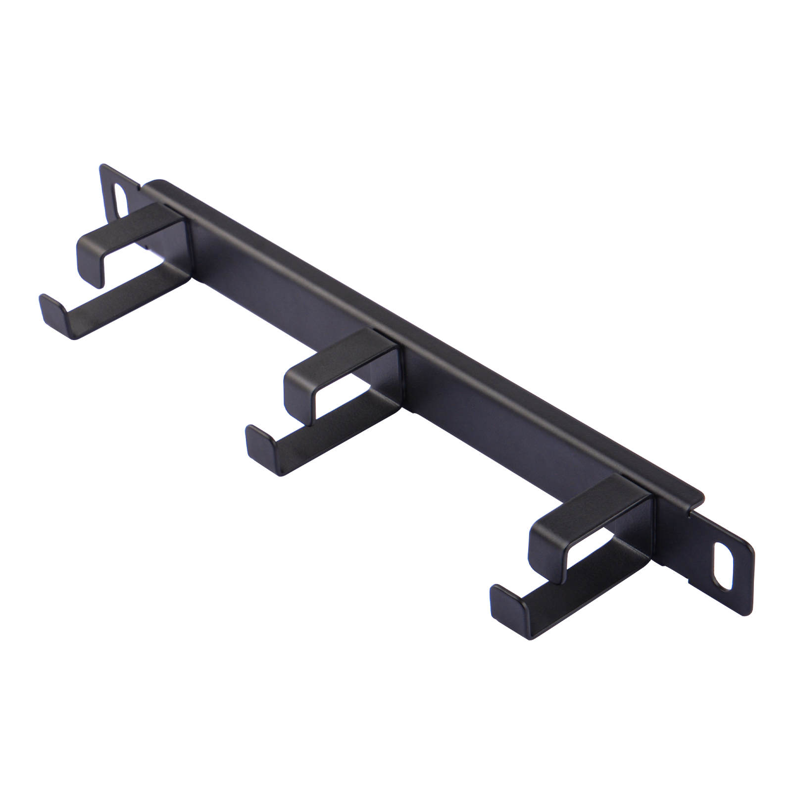
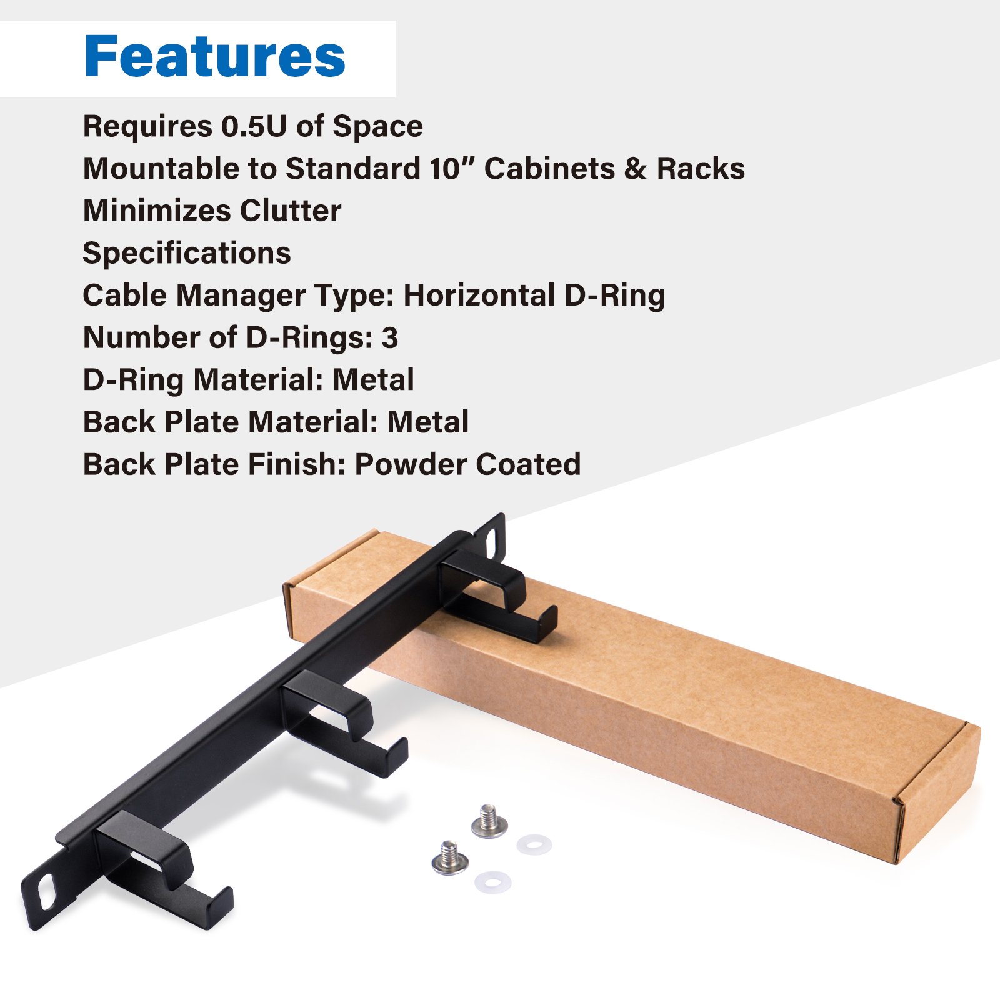
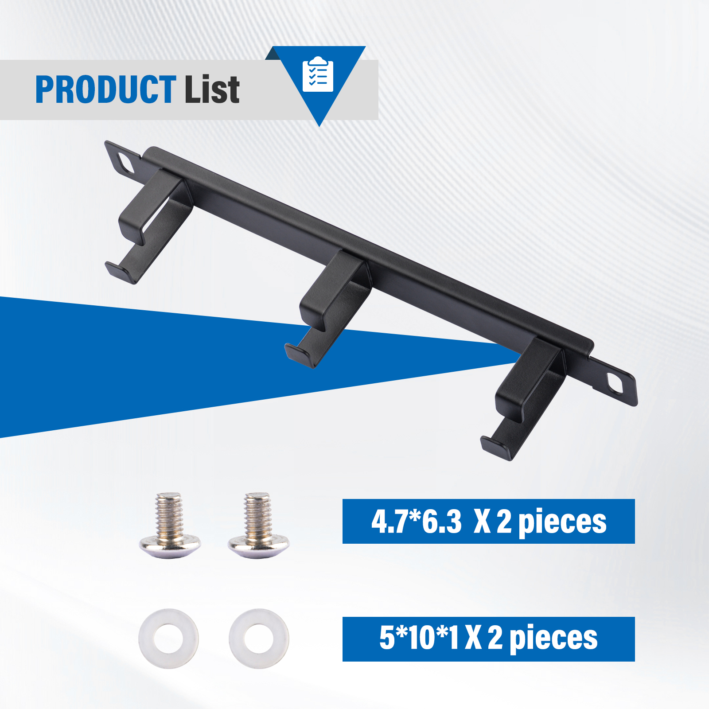
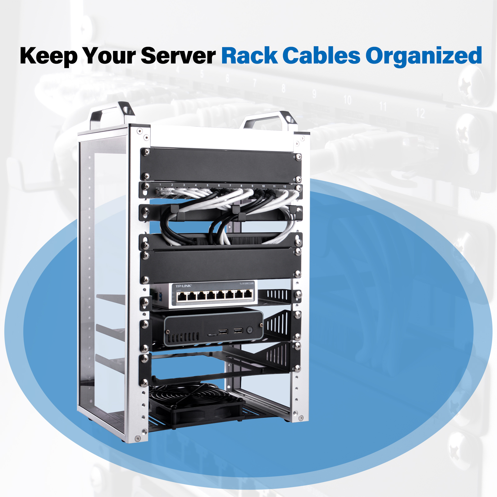
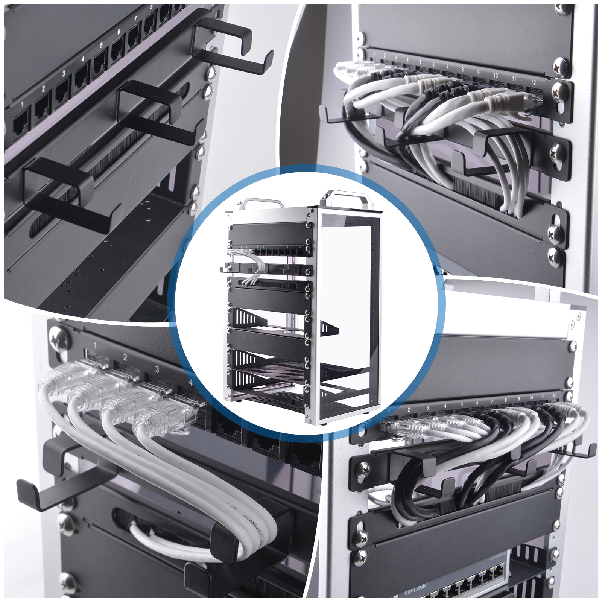
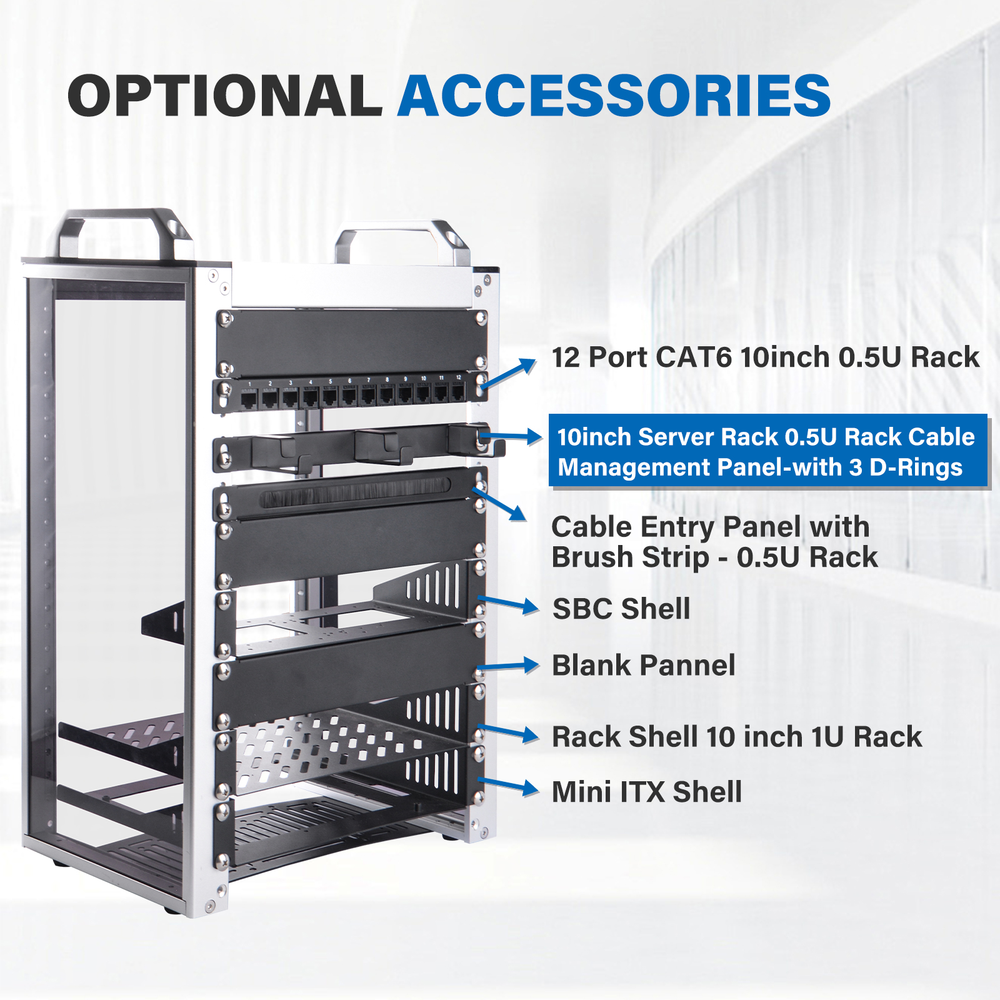

#  10-inch Server Rack 0.5U Rack Cable Management Panel-with 3 D-Rings 

* SKU: DP-0044 
* Name: 10-inch Server Rack 0.5U Rack Cable Management Panel-with 3 D-Rings for
DeskPi Rackmate T1 

## Description
The 10-inch Server Rack 0.5U Rack Cable Management Panel with 3 D-Rings is a cable management panel designed for server racks. This panel is typically mounted at the front or back of the rack to organize and secure cables, keeping the interior of the rack neat and orderly. It usually has the following features:

## Features

### Size and Design

- **Height**: 0.5U (1U equals 1.75 inches)
- **Width**: 10 inches
- Compact design to save rack space and fit standard 19-inch racks

### D-Ring Hooks

- Equipped with D-Ring hooks for securing and guiding cables

### Cable Capacity

- Accommodates a specific number of cables, depending on the panel's design and size

### Material and Construction
- Made of sturdy materials like steel or aluminum
- Powder-coated finish for durability and corrosion resistance

### Installation

- Mounts on standard EIA 19-inch rack rails for easy installation

### Additional Features
- May include brush strips or other features to enhance air flow and reduce dust accumulation

### Maintenance and Compatibility

- Reduces strain on equipment ports to protect rack-mounted devices
- Improves airflow within the rack for optimal equipment operation and reduced risk of overheating

## Package Includes 

### Accessories Purchase URL

{: style="height:50px;width:50px"}
{: style="height:50px;width:50px"}

* Rack Shell [DP-0031](https://deskpi.com/collections/deskpi-rack-mate/products/deskpi)
* Blank Pannel [DP-0032](https://deskpi.com/collections/deskpi-rack-mate/products/deskpi-accessories-blank-pannel)
* SBC Shell [DP-0033](https://deskpi.com/collections/deskpi-rack-mate/products/deskpi-accessories-sbc-shell)
* 10-Inch Network Switch [DP-0034](https://deskpi.com/collections/deskpi-rack-mate/products/deskpi-rackmate-accessory-10-inch-network-switch)
* Mini ITX Shell [DP-0035](https://deskpi.com/collections/deskpi-rack-mate/products/deskpi-rackmate-accessory-mini-itx-shell)
* CAT6A Ethernet Cable(0.2M) [L-0094](https://deskpi.com/collections/new-arrival/products/4-pack-3-8mm-0-2m-snagless-short-shielded-cat6a-ethernet-cable) 
* CAT6A Ethernet Cable(0.5M) [L-0095](https://deskpi.com/collections/new-arrival/products/4-pack-3-8mm-0-5m-snagless-short-shielded-cat6a-ethernet-cable) 
* DC PDU Lite 7-CH 0.5U for DeskPi Rackmate T1:[DP-0042](https://deskpi.com/collections/new-arrival/products/deskpi-dc-pdu-lite-7-ch-0-5u-for-deskpi-rackmate-t1)
* 10-inch Server Rack 0.5U Rack Cable Management Panel-with 3 D-Rings [DP-0044](https://deskpi.com/collections/new-arrival/products/10inch-server-rack-0-5u-rack-cable-management-panel-with-3-d-rings)

### Amazon Links:

* DeskPi RackMate T1: 

US:  https://www.amazon.com/dp/B0CSCWVTQ7/
UK: https://www.amazon.co.uk/dp/B0CS6MHCY8

* Network Patch Panel 12 Port CAT6 10inch 0.5U

US:  https://www.amazon.com/dp/B0D5XPNHHF/
UK:  https://www.amazon.co.uk/dp/B0D5Q6CJ1J

* SBC Shell 10 inch 1U Rack

US: https://www.amazon.com/dp/B0D5XMM7HL
UK:https://www.amazon.co.uk/dp/B0D5QL66MB

* Mini ITX Shell 10 inch 1U Rack

US: https://www.amazon.com/dp/B0D5XNDFDZ/
UK: https://www.amazon.co.uk/dp/B0D5QSB8GY

* Blank Pannel 10 inch 1U Rack

US: https://www.amazon.com/dp/B0D5XKZ714/
UK: https://www.amazon.co.uk/dp/B0D5QP91R9

* SBC Shell 10 inch 1U Rack, with 2PCS Micro HDMI to HDMI Adapter Board for Raspberry Pi 5 / Pi 4B

US: https://www.amazon.com/dp/B0D9NGC4DH/
UK: https://www.amazon.co.uk/dp/B0D9NGC4DH

* Micro HDMI to HDMI Adapter Board for Raspberry Pi 5 / Pi 4B

US: https://www.amazon.com/dp/B0D9LDQ7DY/
UK: https://www.amazon.co.uk/dp/B0D9LDQ7DY

* GeeekPi 4PCS Cat6A Ethernet Cable, Snagless Short Shielded Network Cable, White (20 cm/0.65 ft)

US: (0.2m) https://www.amazon.com/dp/B0DDXLCYF6/
UK (0.2m) : https://www.amazon.co.uk/dp/B0DDX78486  
UK (0.5m)：https://www.amazon.co.uk/dp/B0DDXQH81J

* Rack Shell 10 Inch 0.5U Rack Shelf

US: https://www.amazon.com/dp/B0DFHCM3YG
UK:  https://www.amazon.co.uk/dp/B0DFLQJ436

* DeskPi 10inch Server Rack 0.5U Rack Cable Management Panel-with 3 D-Rings

US：https://www.amazon.com/dp/B0DGP8TT6Q
UK：https://www.amazon.co.uk/dp/B0DFLQJ436

* DeskPi DC PDU Lite 7-CH 0.5U for DeskPi Rackmate T1

US： https://www.amazon.com/dp/B0DGFZVXF6
UK：https://www.amazon.co.uk/dp/B0DGGB14KN
