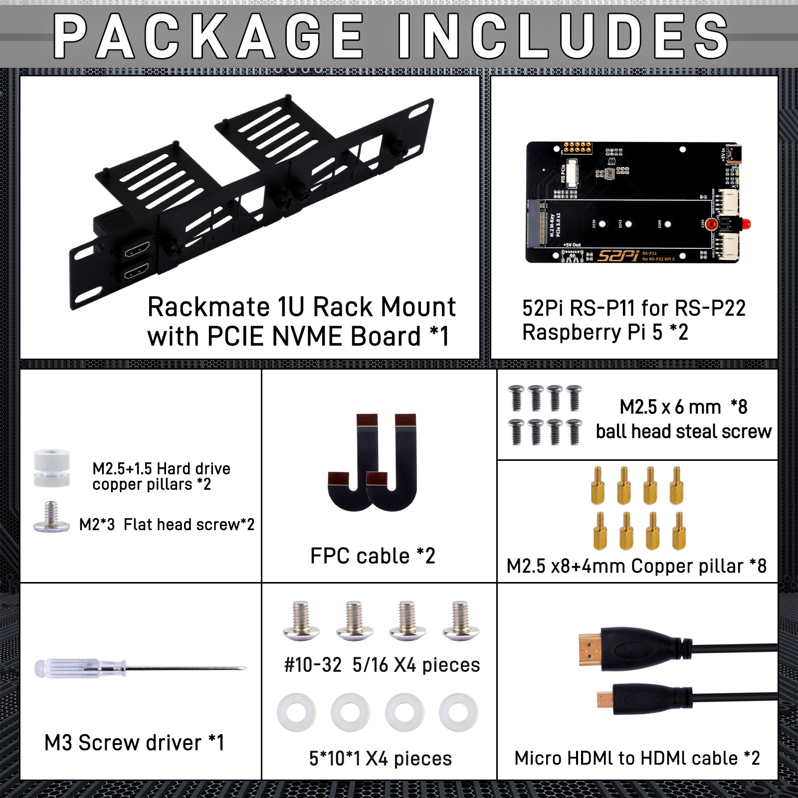

# DeskPi Rackmate 10-inch 1U Rack Mount with PCIE NVME Board for Raspberry Pi 5/4B

* SKU: DP-0039
* Name: DeskPi Rackmate 10-inch 1U Rack Mount with PCIE NVME Board for Raspberry Pi 5/4B


## Description
The 1U RackMount is specifically designed for the Raspberry Pi 4B and Raspberry Pi 5, serving as a robust and efficient rack solution to house these single-board computers within a standard 10-inch server rack. Ideal for data centers or network installations that require space-saving while looking to expand computing capabilities, this 1U rack is tailored to perfectly accommodate the Raspberry Pi 4B and Raspberry Pi 5, ensuring optimal compatibility and performance.


## Features

* **Standard 1U Size:** Perfectly fits into a 10-inch server rack, saving space while providing additional computing power.

* **Raspberry Pi Specific Design:** Tailored specifically for the Raspberry Pi 4B and Raspberry Pi 5, ensuring the best compatibility and performance.

* **Convenient Access:** Designed with user convenience in mind, making all critical ports and cards easily accessible.

* **Durable Construction:** Made from high-quality carbon steel with a matte black powder coat finish, ensuring durability and a professional appearance.

* **Efficient Cooling:** There is ample space between the Raspberry Pis for heat dissipation.

* **Scalability:** Capable of housing multiple Raspberry Pi 4B and Raspberry Pi 5 units, supporting the construction of high-performance computing clusters.

* **Versatile Applications:** Suitable for a variety of applications, including server rooms, home automation centers, and more, making it an ideal choice for tech enthusiasts and professionals alike.

* **Easy Assembly and Disassembly:** Components are secured with hand-tightened screws, allowing for convenient adjustments and removal.

* **Rackmount Form Factor:** Designed to fit into a 1U rack space, making it suitable for data centers or other environments where space is at a premium.

* **Versatility:** The Rackmount can be configured in various ways to suit different use cases, whether for development, testing, or deployment in a production environment.


### Specifications

* **Form Factor:** 1U Rackmount design suitable for standard 10-inch racks.

* **Raspberry Pi Compatibility:** Specifically designed for Raspberry Pi 5 and Raspberry Pi 4B models.

* **PCIe Expansion:** Supports M.2 NVMe SSDs in 2230, 2242, 2260, and 2280 form factors. Provides a PCIe interface for high-speed data transfer.
<font color=red> NOTE: This function supports Raspberry Pi 5 only! </font><br>

* **I/O Connectivity:** Rear I2C interface via PogoPin connectors for external peripherals. GPIO4 pin for programmable LED control.

* **LED Indicator:** Red LED for device identification or status indication. Programmable through software to show different statuses. 

* **Physical Security:** Hand-tightened screws for secure mounting of Raspberry Pi devices and OLED display. Ensures stability and ease of maintenance.

* **Power Requirements:** Compatibility with Raspberry Pi's standard power supply.

* **Material and Construction:** Durable metal construction for the rackmount chassis. High-quality components for reliable performance.

* **Mounting Options:** Standard rackmount holes for easy installation into a rack. Includes additional mounting accessories for different setups.

* **Software Compatibility:** Compatible with Raspberry Pi's operating system and software ecosystem. 

* **Support for GPIO programming:** for custom LED and device control.


### Size and Design

- **Height**: 1U 
- **Width**: 10 inches
- 2 * Slot for Raspberry Pi
- Compact design to save rack space and fit standard 19-inch racks


### Fit for DeskPi Rackmate series 

* For Rackmate T1 and Rackmate T0


### PCIe M.2 NVMe expansion board supported


### Supported NVMe SSD Types


### Optional Accessories List


## How to assemble it 

* Please assemble it according to following figures.


## Package Includes 



## How to enable PCIe function on Raspberry Pi 5?

To enable PCIe functionality on the Raspberry Pi 5, follow these steps:

* 1. Enable the PCIe External Connector:
By default, the PCIe connector on the Raspberry Pi 5 is not enabled. To enable it, you need to add a configuration parameter to the `config.txt` file located in the `/boot/firmware` directory. You can use either of these lines:

```bash
dtparam=pciex1
```

After adding the line, reboot your Raspberry Pi for the changes to take effect.

* 2.Enable PCIe Gen 3.0 (Optional):
The Raspberry Pi 5's PCIe connection is certified for Gen 2.0 speeds. However, if you want to attempt using Gen 3.0 speeds, add the following line to the `config.txt` file as well:

```bash
dtparam=pciex1_gen=3
```

Be aware that the Raspberry Pi 5 is not certified for Gen 3.0 speeds, and using this setting may result in instability .
3.Booting from PCIe:
If you intend to boot from a device connected via PCIe, such as an NVMe SSD, you will need to modify the boot order in the EEPROM. Use the following command to edit the EEPROM configuration:

```bash
sudo apt update 
sudo apt upgrade -y 
sudo rpi-eeprom-config --edit
```

Then, change the `BOOT_ORDER` line to include NVMe in the boot order:

```bash
BOOT_ORDER=0xf416
```

This setting will make the Raspberry Pi attempt to boot from an NVMe device connected to the PCIe port .

## How to light up identical LED?
To light up UID LED indicator on a Raspberry Pi 4B or 5, you'll make sure the GPIO Pin of the UID LED connected to.

GPIO (General Purpose Input/Output) pins on the Raspberry Pi.

### Steps

* Identify GPIO Pins: `GPIO4`
* Power On: Make sure your Raspberry Pi is powered off before connecting the LED.  Once everything is connected, you can power on your Raspberry Pi.
* Software Setup: You'll need to write a small program to turn the GPIO pin on and off to control the LED. You can use Python with the `gpiozero` library or `RPi.GPIO` library to control the GPIO pins.

#### Example Python Code with gpiozero:

```python
from gpiozero import LED
from time import sleep


led = LED('GPIO4')

while True:
    led.on()
    sleep(1)
    led.off()
    sleep(1)
```

#### Example Python Code with RPi.GPIO (For Raspberry Pi 4B):

```python
import RPi.GPIO as GPIO
import time


# Set the GPIO mode
GPIO.setmode(GPIO.BCM)

GPIO_PIN = 4

# Set up the GPIO pin as an output channel
GPIO.setup(GPIO_PIN, GPIO.OUT)

while True:
    GPIO.output(GPIO_PIN, GPIO.HIGH)  # Turn on the LED
    time.sleep(1)
    GPIO.output(GPIO_PIN, GPIO.LOW)   # Turn off the LED
    time.sleep(1)

# Clean up the GPIO pins before exiting the program
GPIO.cleanup()
```

### Safety Tips:
Be careful not to short any pins on the Raspberry Pi.

### Accessories Purchase URL

{: style="height:50px;width:50px"}
{: style="height:50px;width:50px"}

* Rackmate 10-inch 2U Rack Mount with PCIE NVME Board for Raspberry Pi 5/4B: [DP-0046](https://deskpi.com/)

* Rackmate 10-inch 1U Rack Mount with PCIE NVME Board for Raspberry Pi 5/4B: [DP-0039](https://deskpi.com/)

* Rack shelf [DP-0031](https://deskpi.com/collections/deskpi-rack-mate/products/deskpi)

* Blank Pannel [DP-0032](https://deskpi.com/collections/deskpi-rack-mate/products/deskpi-accessories-blank-pannel)

* SBC shelf [DP-0033](https://deskpi.com/collections/deskpi-rack-mate/products/deskpi-accessories-sbc-shell)

* 10-Inch Network Switch [DP-0034](https://deskpi.com/collections/deskpi-rack-mate/products/deskpi-rackmate-accessory-10-inch-network-switch)

* Mini ITX shelf [DP-0035](https://deskpi.com/collections/deskpi-rack-mate/products/deskpi-rackmate-accessory-mini-itx-shell)

* CAT6A Ethernet Cable(0.2M) [L-0094](https://deskpi.com/collections/new-arrival/products/4-pack-3-8mm-0-2m-snagless-short-shielded-cat6a-ethernet-cable) 

* CAT6A Ethernet Cable(0.5M) [L-0095](https://deskpi.com/collections/new-arrival/products/4-pack-3-8mm-0-5m-snagless-short-shielded-cat6a-ethernet-cable) 

* DC PDU Lite 7-CH 0.5U for DeskPi Rackmate T1:[DP-0042](https://deskpi.com/collections/new-arrival/products/deskpi-dc-pdu-lite-7-ch-0-5u-for-deskpi-rackmate-t1)

* 10-inch Server Rack 0.5U Rack Cable Management Panel-with 3 D-Rings: [DP-0039](https://deskpi.com/collections/new-arrival/products/10inch-server-rack-0-5u-rack-cable-management-panel-with-3-d-rings)

### Amazon Links:

* DeskPi RackMate T1: 

[US Store](https://www.amazon.com/dp/B0CSCWVTQ7/)
<br>
[UK Store](https://www.amazon.co.uk/dp/B0CS6MHCY8)

* Network Patch Panel 12 Port CAT6 10inch 0.5U

[US Store](https://www.amazon.com/dp/B0D5XPNHHF/)
<br>
[UK Store](https://www.amazon.co.uk/dp/B0D5Q6CJ1J)

* SBC shelf 10 inch 1U Rack

[US Store](https://www.amazon.com/dp/B0D5XMM7HL)
<br> 
[UK Store](https://www.amazon.co.uk/dp/B0D5QL66MB)

* Mini ITX shelf 10 inch 1U Rack

[US Store](https://www.amazon.com/dp/B0D5XNDFDZ/)
<br> 
[UK Store](https://www.amazon.co.uk/dp/B0D5QSB8GY)

* Blank Pannel 10 inch 1U Rack

[US Store]( https://www.amazon.com/dp/B0D5XKZ714/)
<br> 
[UK Store]( https://www.amazon.co.uk/dp/B0D5QP91R9)

* SBC shelf 10 inch 1U Rack, with 2PCS Micro HDMI to HDMI Adapter Board for Raspberry Pi 5 / Pi 4B

[US Store]( https://www.amazon.com/dp/B0D9NGC4DH/)
<br> 
[UK Store]( https://www.amazon.co.uk/dp/B0D9NGC4DH)

* Micro HDMI to HDMI Adapter Board for Raspberry Pi 5 / Pi 4B

[US Store]( https://www.amazon.com/dp/B0D9LDQ7DY/)
<br> 
[UK Store]( https://www.amazon.co.uk/dp/B0D9LDQ7DY)

* GeeekPi 4PCS Cat6A Ethernet Cable, Snagless Short Shielded Network Cable, White (20 cm/0.65 ft)

[US Store (0.2m)](https://www.amazon.com/dp/B0DDXLCYF6/)
<br> 
[UK Store (0.2m)](https://www.amazon.co.uk/dp/B0DDX78486)
<br> 
[UK Store (0.5m)](https://www.amazon.co.uk/dp/B0DDXQH81J)

* Rack shelf 10 Inch 0.5U Rack Shelf

[US Store](https://www.amazon.com/dp/B0DFHCM3YG)
<br> 
[UK Store](https://www.amazon.co.uk/dp/B0DFLQJ436)

* DeskPi 10inch Server Rack 0.5U Rack Cable Management Panel-with 3 D-Rings

[US Store](https://www.amazon.com/dp/B0DGP8TT6Q)
<br> 
[UK Store](https://www.amazon.co.uk/dp/B0DFLQJ436)

* DeskPi DC PDU Lite 7-CH 0.5U for DeskPi Rackmate T1

[US Store](https://www.amazon.com/dp/B0DGFZVXF6)
<br> 
[UK Store](https://www.amazon.co.uk/dp/B0DGGB14KN)

