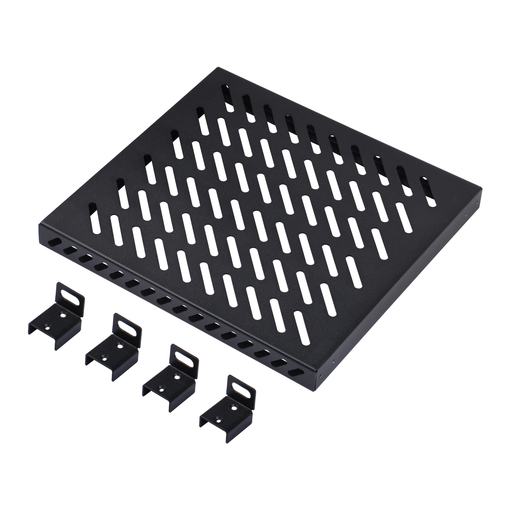
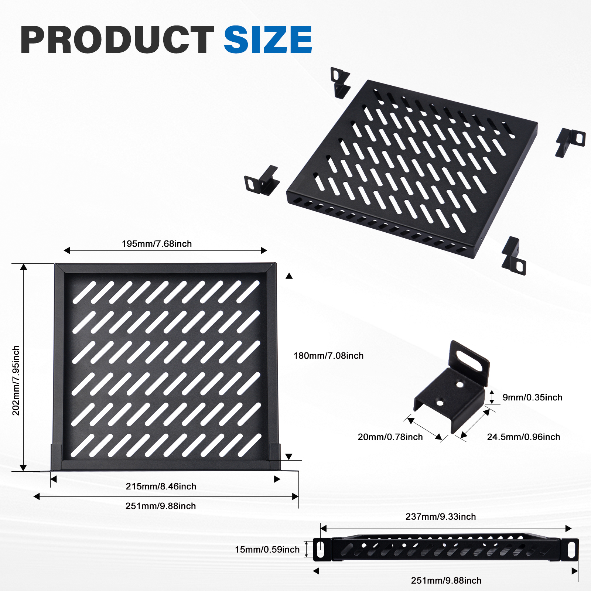
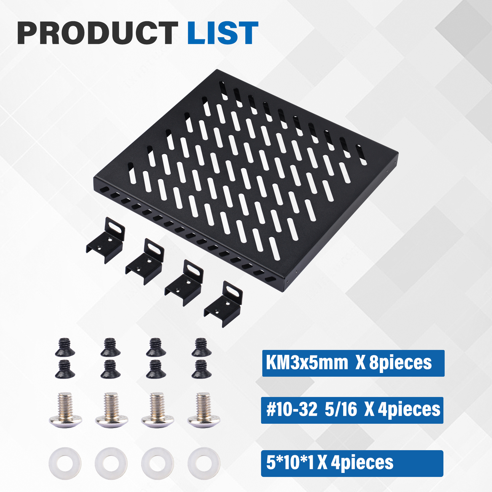
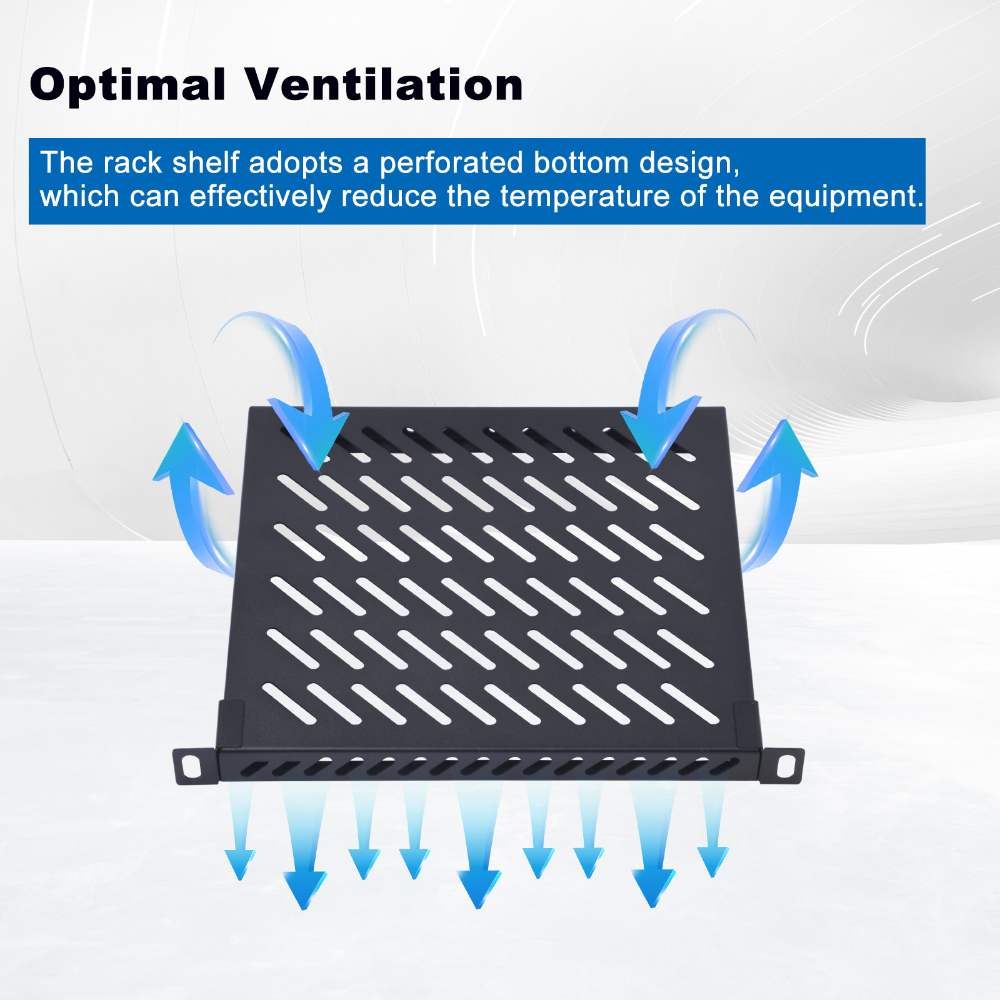
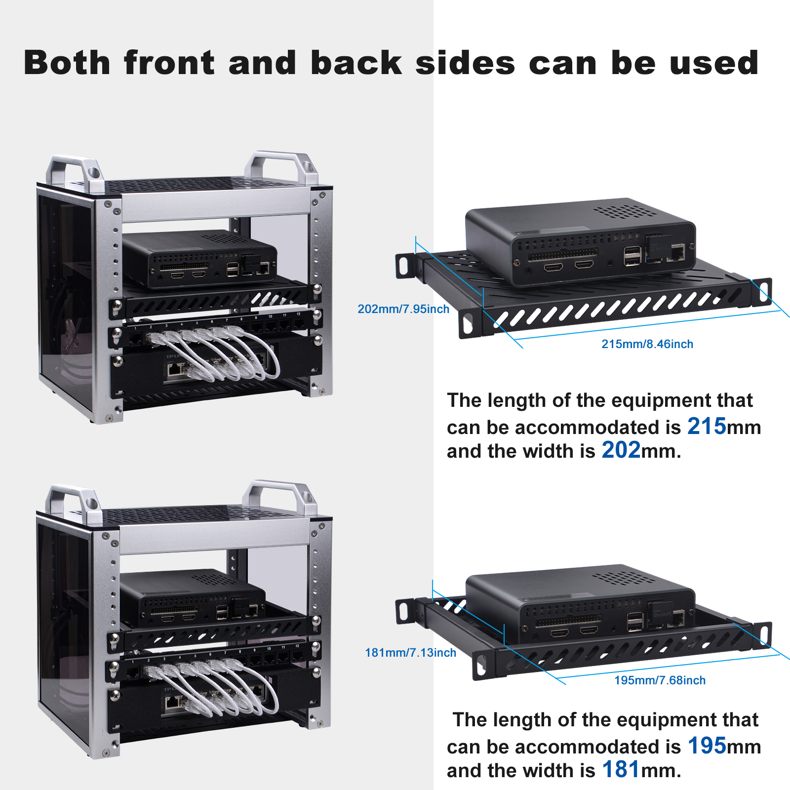
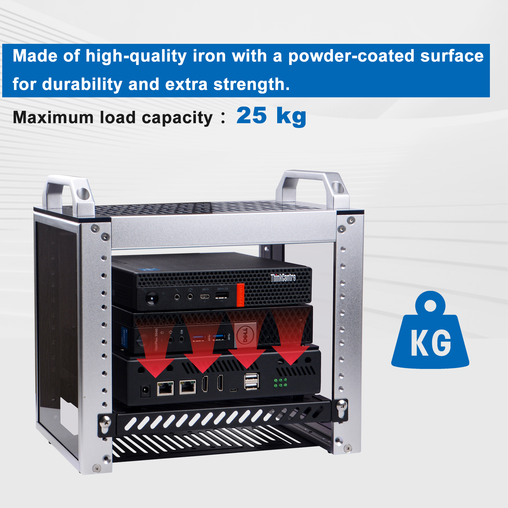
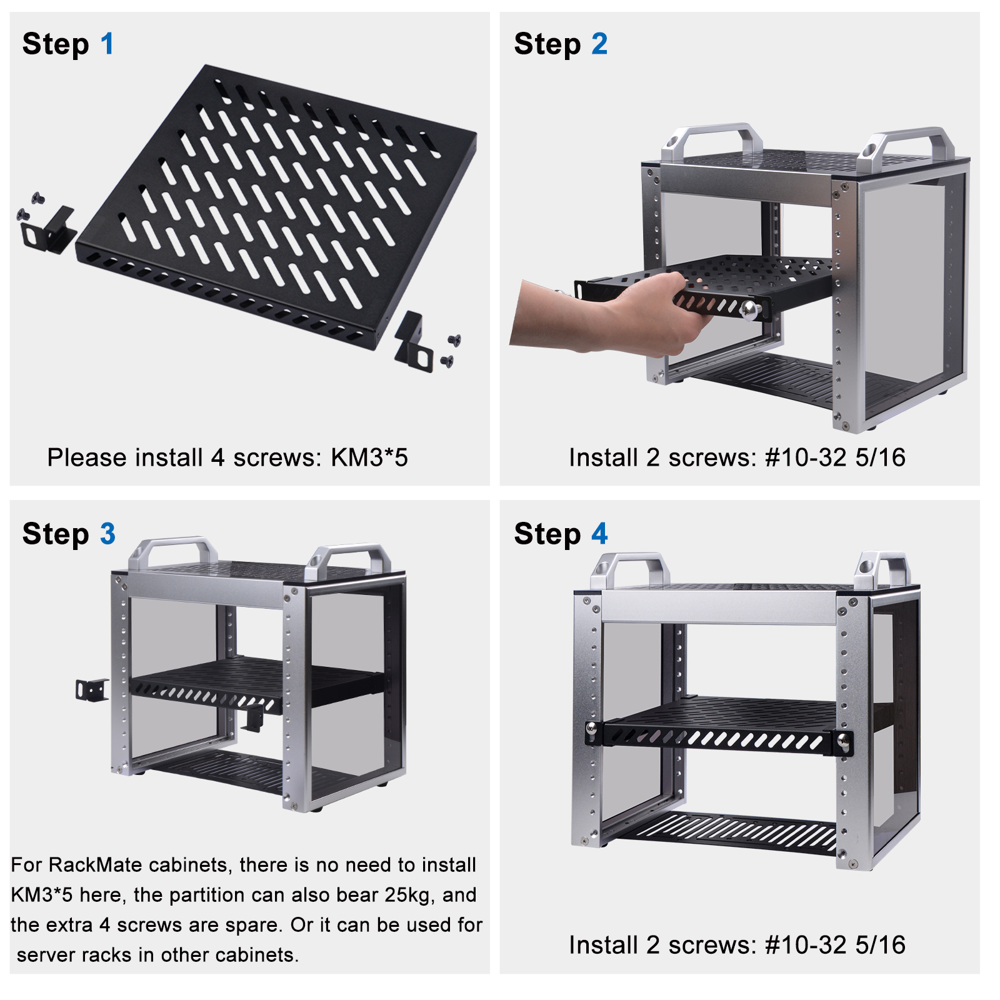

# DeskPi Rackmate 10-inch 0.5U Heavy Duty Rack Shelf for 10 inch server 

* SKU: DP-0056

* Name: DeskPi Rackmate 10-inch 0.5U Heavy Duty Rack Shelf for 10 inch server 

## Description
The DeskPi Rackmate 10-inch 0.5U Heavy Duty Rack Shelf is designed specifically for 10-inch servers. It features an enhanced design tailored for heavy-duty use scenarios.

## Product Size 

## Package List 

## Features 

* Optimal Ventilation

* Both front and back sied can be used 

* Heavy Duty scenario

## How to assemble it 

## Documentations 

* Datasheet: [DP-0056-datasheet](./imgs/DP-0056/DP-0056-datasheet.pdf)
* Mechanical Drawing: [DP-0056-Mechanical-Drawing](./imgs/DP-0056/T1 0.5u HeavyDuty Rack Shelf for 10inch server-Drawing.DWG)

### Accessories Purchase URL

{: style="height:50px;width:50px"}
{: style="height:50px;width:50px"}

* Rackmate 10-inch 2U Rack Mount with PCIE NVME Board for Raspberry Pi 5: [DP-0046](https://deskpi.com/)

* Rackmate 10-inch 1U Rack Mount with PCIE NVME Board for Raspberry Pi 5: [DP-0039](https://deskpi.com/)

* Rack shelf [DP-0031](https://deskpi.com/collections/deskpi-rack-mate/products/deskpi)

* Blank Pannel [DP-0032](https://deskpi.com/collections/deskpi-rack-mate/products/deskpi-accessories-blank-pannel)

* SBC shelf [DP-0033](https://deskpi.com/collections/deskpi-rack-mate/products/deskpi-accessories-sbc-shell)

* 10-Inch Network Switch [DP-0034](https://deskpi.com/collections/deskpi-rack-mate/products/deskpi-rackmate-accessory-10-inch-network-switch)

* Mini ITX shelf [DP-0035](https://deskpi.com/collections/deskpi-rack-mate/products/deskpi-rackmate-accessory-mini-itx-shell)

* CAT6A Ethernet Cable(0.2M) [L-0094](https://deskpi.com/collections/new-arrival/products/4-pack-3-8mm-0-2m-snagless-short-shielded-cat6a-ethernet-cable) 

* CAT6A Ethernet Cable(0.5M) [L-0095](https://deskpi.com/collections/new-arrival/products/4-pack-3-8mm-0-5m-snagless-short-shielded-cat6a-ethernet-cable) 

* DC PDU Lite 7-CH 0.5U for DeskPi Rackmate T1:[DP-0042](https://deskpi.com/collections/new-arrival/products/deskpi-dc-pdu-lite-7-ch-0-5u-for-deskpi-rackmate-t1)

* 10-inch Server Rack 0.5U Rack Cable Management Panel-with 3 D-Rings: [DP-0039](https://deskpi.com/collections/new-arrival/products/10inch-server-rack-0-5u-rack-cable-management-panel-with-3-d-rings)

### Amazon Links:

* DeskPi RackMate T1: 

[US Store](https://www.amazon.com/dp/B0CSCWVTQ7/)
 
[UK Store](https://www.amazon.co.uk/dp/B0CS6MHCY8)

* Network Patch Panel 12 Port CAT6 10inch 0.5U

[US Store](https://www.amazon.com/dp/B0D5XPNHHF/)
 
[UK Store](https://www.amazon.co.uk/dp/B0D5Q6CJ1J)

* SBC shelf 10 inch 1U Rack

[US Store](https://www.amazon.com/dp/B0D5XMM7HL)
  
[UK Store](https://www.amazon.co.uk/dp/B0D5QL66MB)

* Mini ITX shelf 10 inch 1U Rack

[US Store](https://www.amazon.com/dp/B0D5XNDFDZ/)
  
[UK Store](https://www.amazon.co.uk/dp/B0D5QSB8GY)

* Blank Pannel 10 inch 1U Rack

[US Store]( https://www.amazon.com/dp/B0D5XKZ714/)
  
[UK Store]( https://www.amazon.co.uk/dp/B0D5QP91R9)

* SBC shelf 10 inch 1U Rack, with 2PCS Micro HDMI to HDMI Adapter Board for Raspberry Pi 5 / Pi 4B

[US Store]( https://www.amazon.com/dp/B0D9NGC4DH/)
  
[UK Store]( https://www.amazon.co.uk/dp/B0D9NGC4DH)

* Micro HDMI to HDMI Adapter Board for Raspberry Pi 5 / Pi 4B

[US Store]( https://www.amazon.com/dp/B0D9LDQ7DY/)
  
[UK Store]( https://www.amazon.co.uk/dp/B0D9LDQ7DY)

* GeeekPi 4PCS Cat6A Ethernet Cable, Snagless Short Shielded Network Cable, White (20 cm/0.65 ft)

[US Store (0.2m)](https://www.amazon.com/dp/B0DDXLCYF6/)
  
[UK Store (0.2m)](https://www.amazon.co.uk/dp/B0DDX78486)
  
[UK Store (0.5m)](https://www.amazon.co.uk/dp/B0DDXQH81J)

* Rack shelf 10 Inch 0.5U Rack Shelf

[US Store](https://www.amazon.com/dp/B0DFHCM3YG)
  
[UK Store](https://www.amazon.co.uk/dp/B0DFLQJ436)

* DeskPi 10inch Server Rack 0.5U Rack Cable Management Panel-with 3 D-Rings

[US Store](https://www.amazon.com/dp/B0DGP8TT6Q)
  
[UK Store](https://www.amazon.co.uk/dp/B0DFLQJ436)

* DeskPi DC PDU Lite 7-CH 0.5U for DeskPi Rackmate T1

[US Store](https://www.amazon.com/dp/B0DGFZVXF6)
  
[UK Store](https://www.amazon.co.uk/dp/B0DGGB14KN)

