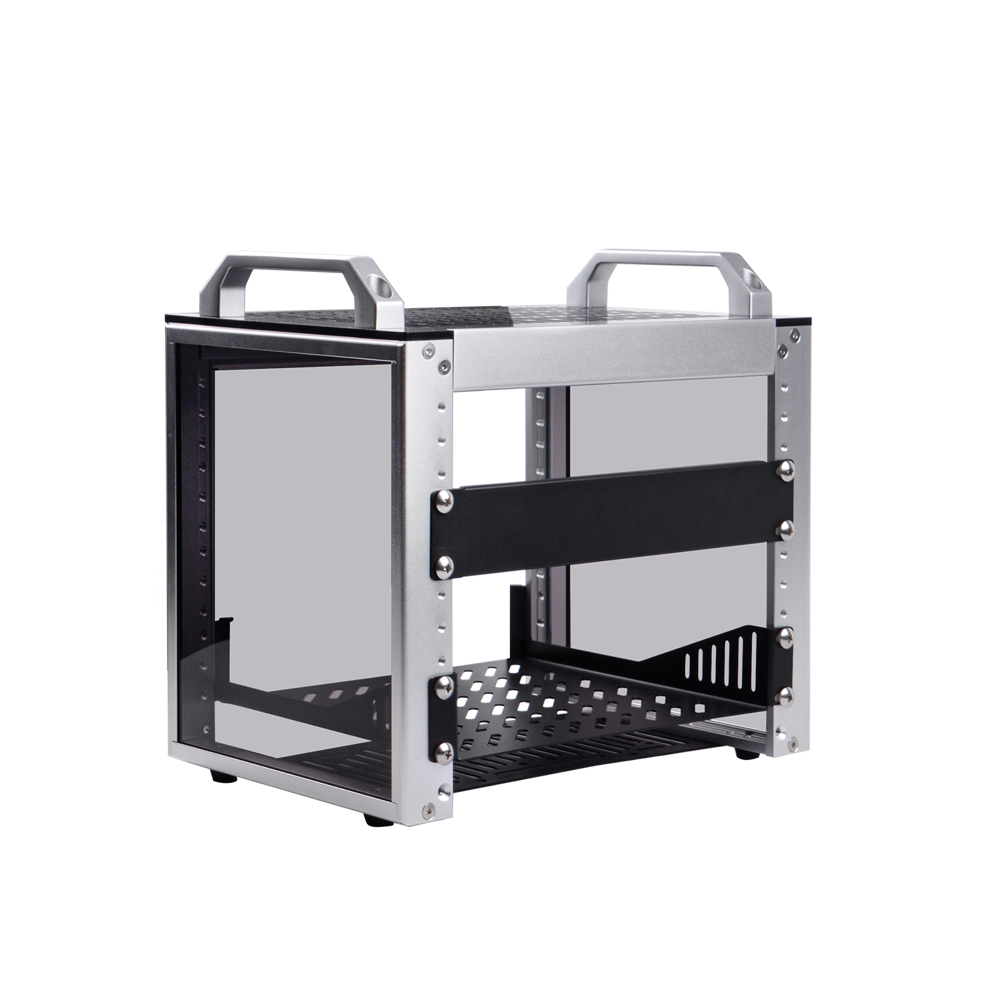
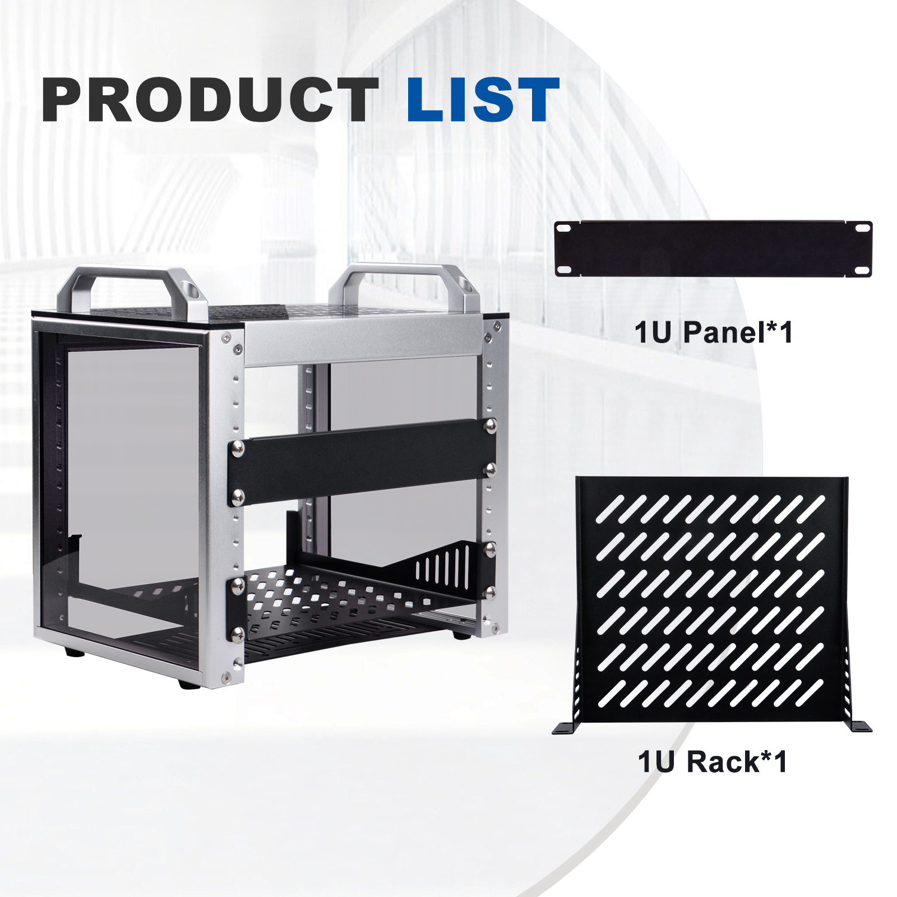
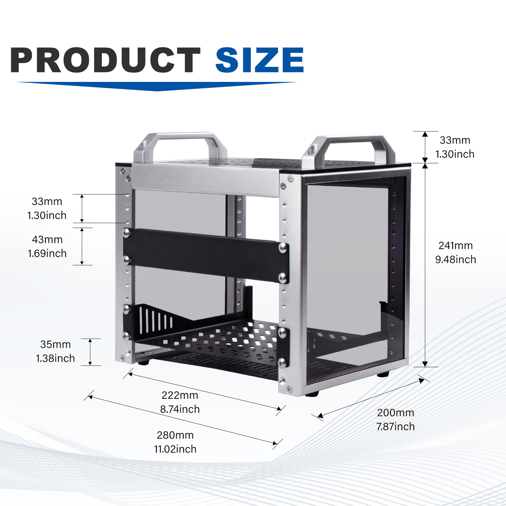
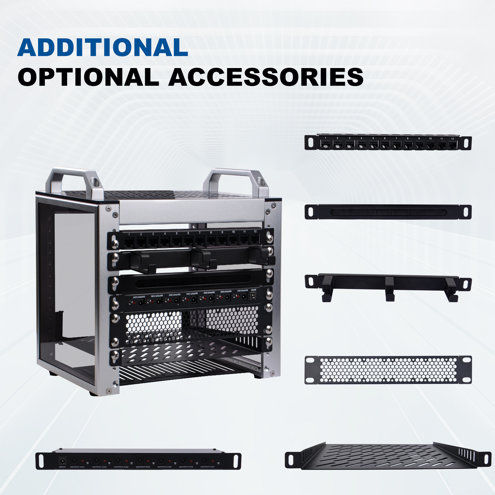
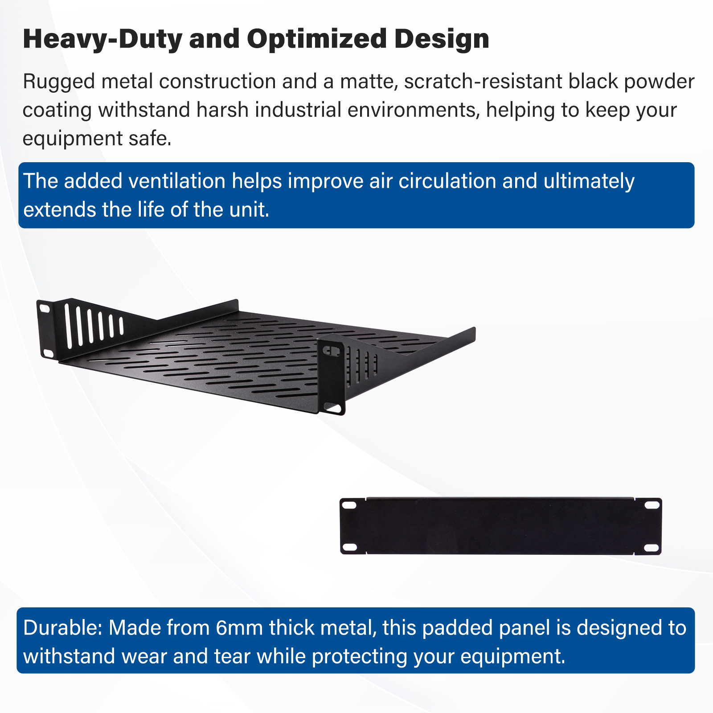
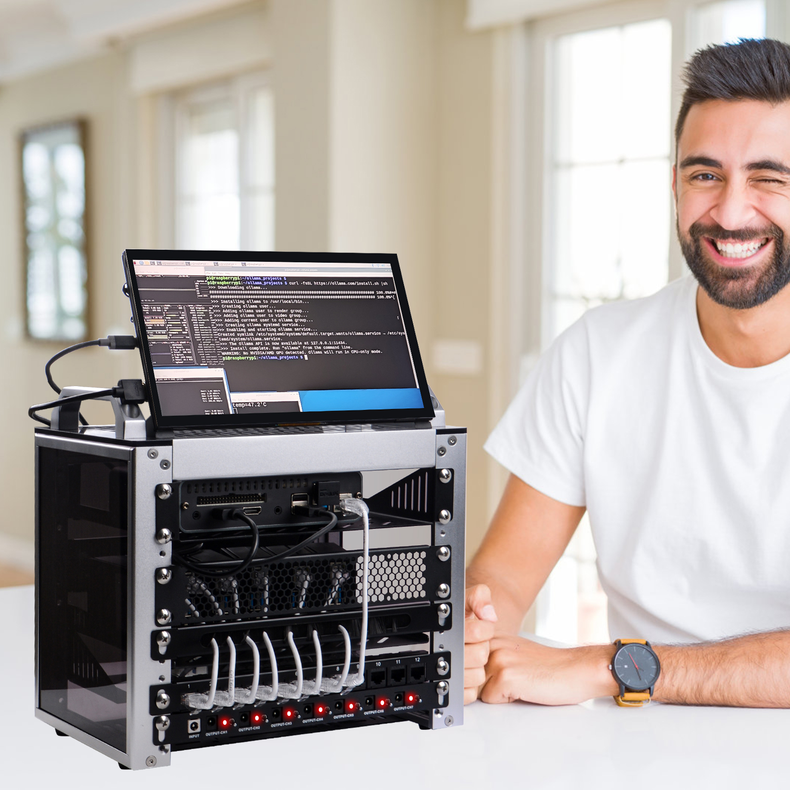
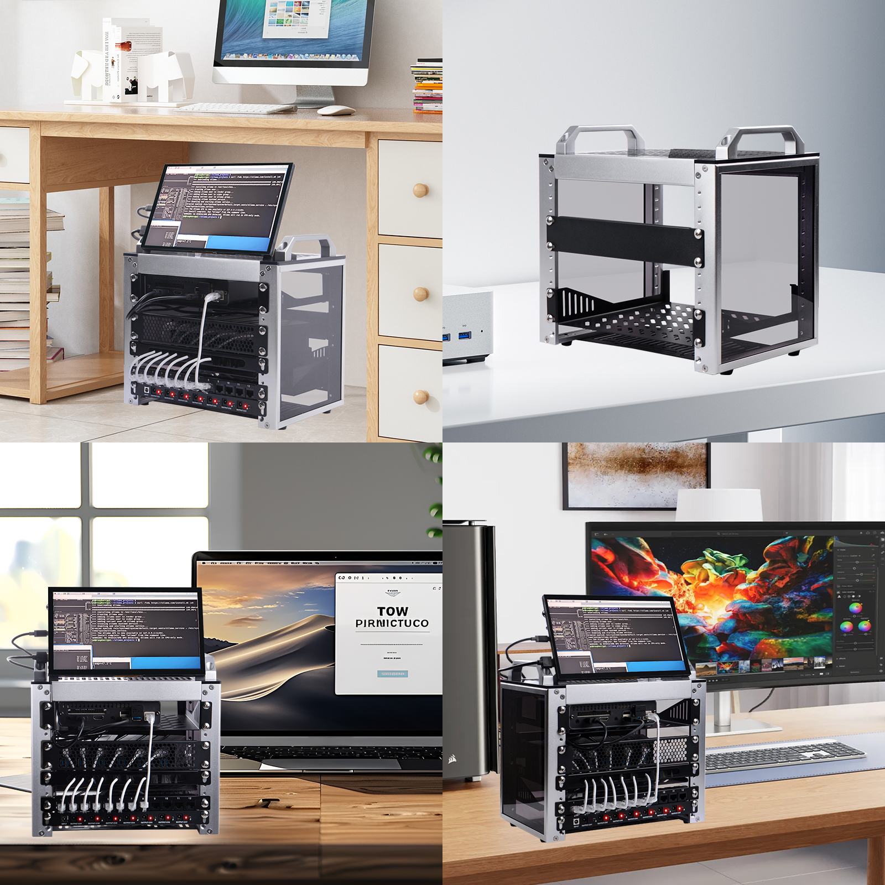

# RackMate T0 4U Server Rack

The RackMate T0 is a robust and versatile 4U server rack designed to meet the demands of modern data center environments. With a depth of 10 inches, it offers ample space for a variety of server configurations.

## Purchase URL

* Purchase: [RackMate T0](https://deskpi.com/collections/deskpi-rack-mate/products/deskpi-rackmate-t1-rackmount-10-inch-4u-server-cabinet-for-network-servers-audio-and-video-equipment)

## Key Features

- **Sturdy Construction**: Crafted from high-quality materials, the RackMate T0 ensures durability and reliability, providing a secure housing for your critical IT equipment.

- **Optimal Space Utilization**: The 4U design allows for efficient use of vertical space, making it ideal for environments where rack space is at a premium.

- **Easy Access and Maintenance**: The rack features tool-less mounting options and removable side panels, facilitating quick and easy access to servers for maintenance and upgrades.

- **Enhanced Cooling**: Equipped with perforated side panels, the RackMate T0 promotes superior airflow, helping to keep your servers cool and operating at peak performance.

- **Secure and Stable**: With a solid frame and reinforced corners, this server rack is designed to withstand the rigors of daily use, ensuring the stability of your IT infrastructure.

- **Versatile Compatibility**: The RackMate T0 is compatible with a wide range of server and networking equipment, making it a flexible solution for diverse data center needs.

## Specifications

- **Width**: 10 inches
- **Depth**: 200mm 
- **Height**: 4U
- **External Dimensions**: 280x200x274mm
- **Internal Dimensions**: 222x200x241mm
- **Easy to install**: 4U Rack is shipped assembled, saving you the trouble of
installation. 
- **Material**: High-strength aluminum, steel and acrylic.
- **Cooling**: Perforated side panels for improved airflow
- **Mounting**: Tool-less mounting for quick server installation
- **Package Contents**: 4U Rack*1 set, 1U tray*1, 1U panel*1 
- **Weight**: 3.12Kg
- **Pacakge Dimensions**: 32.5cm*25cm*31cm

The RackMate T0 is an excellent choice for organizations looking to optimize their server room space, improve cooling efficiency, and ensure the security and stability of their IT assets.

## Gallery 

* Product outlook

* Package Includes

* Dimensions

* Additional optional accessories 

> NOTE: Additional Optional accessories does not included in the package,
> additional purchase required. 
> More information please visit: [DeskPi Official WebStore](https://deskpi.com/)

* Heavy-Duty and Optimized Design 

* Application scenarios

Perfectly suited for creating a home lab or managing devices for a Home Assistant.

### Optional Accessories

* [Accessories 1](./rackmate_accessories.md)
* [Accessories 2](./rackmate_accessories_2.md)
* [Accessories 3](./rackmate_accessories_3.md)
* [Accessories 4](./rackmate_accessories_4.md)

[GO BACK TO HOME PAGE](https://wiki.deskpi.com/)
