# Super4C 

## Introduction 
The Super4C is a cluster - type hardware built on the Raspberry Pi CM5.
It supports four channels of CM5 and extends almost all the interfaces of CM5, providing users with powerful device - connection capabilities. Meanwhile, the hardware also integrates an ESP32 processing module, which offers remote management capabilities for the entire cluster of devices. For the sake of convenience in explanation, this document will refer to this cluster board hardware as the "motherboard" in the following sections.

<font color=red> Compatible with Raspberry Pi CM5 Only</font><br> 

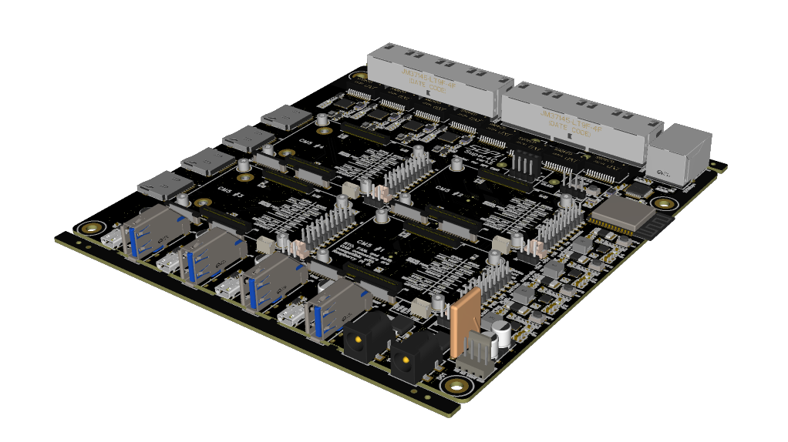 

## Features
* Standard mini ITX form factor
* Supports all Raspberry Pi CM5 modules
* External DC 19V/4.73A power input with redundant interface support and reverse polarity protection
* Four-channel independent DC/DC conversion to provide power for:
  - Independent power reset button (simultaneously resets CM5, NVMe, 2.5Gbps, 1Gbps, SD card, CAM0/1, etc.)
  - Hardware power - on delay (approximately 0.5 seconds each) to avoid inrush current from simultaneous power on
* 4 - pin fan connector (directly connected to the DC 19V power port)
* Supports up to four CM5 modules per channel, each with:
  - 1x micro HDMI interface
  - 1x USB 3.0 interface
  - 1x USB 2.0 interface (Type - C connector, no VBUS output)
  - 1x 1Gbps Ethernet interface
  - 1x 2.5Gbps Ethernet interface (via USB 3.0 expansion)
  - 1x microSD card interface
  - 1x M.2 M - key PCIe interface
  - 1x 4 - pin JST - SH PWM fan interface
  - 1x RTC battery interface
  - 2x MIPI DSI/CSI - 2 interfaces
  - Jumper interface (to disable eMMC, EEPROM, etc.)
* Integrated ESP32 - WROOM - 32E - N4 module
  - Supports 2.4GHz Wi - Fi + Bluetooth with integrated antenna
  - Expanded W5500 100Mbps wired network
  - 4 - pin UART download interface
  - 4 - pin I2C expansion interface (for expanding OLED screens, etc.)
  - Two integrated INA3221 chips for measuring voltage and current of six channels on the board
  - ESP32 pins can individually control the power switch for each channel and the PMIC_EN signal switch for CM5
  - BOOT/EN button

### Main Power Input 
The main power input uses a barrel power connector (inner diameter 2mm, outer diameter 6.6mm) with a voltage range of DC 19V. 
Two connectors (DC1, DC2) support redundant power input. When two power supplies with different voltages are inserted simultaneously, the hardware will automatically select the power supply with the higher voltage.

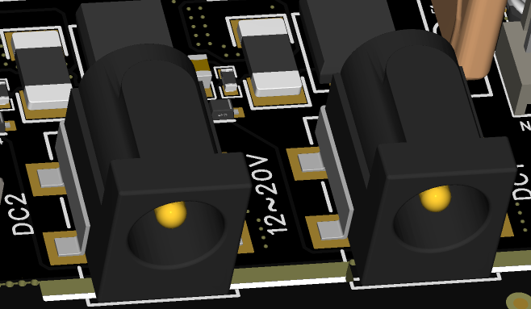 

### Main Power Protection

The main power supply passes through the protection circuit, voltage and current sampling circuit, reverse polarity protection circuit, and fuse circuit before providing power to the internal components and simultaneously outputting to the J15 connector for powering the external main fan. **Note**: When connecting a fan, ensure that the fan's rated voltage matches the main power supply voltage.

### Internal 5V DC/DC and Buttons 

The main power supply passes through the internal four - channel DC/DC circuit, converting it into a 5V power supply for each CM5 module and its peripherals. Each DC/DC channel has an independent power reset button (PWR_OFF1/2/3/4). Pressing the button (SW3/4/5/6) will reset the power supply for each CM5 module and its peripheral channel individually.

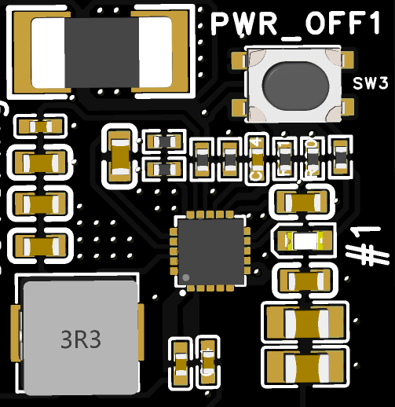 

### Voltage and Current Monitoring 

Both the main power sockets and the four internal 5V power rails are equipped with voltage and current sensing capabilities. Through the I2C interface of the ESP32, two INA3221 chips (covering a total of six channels) are controlled to monitor voltage and current.

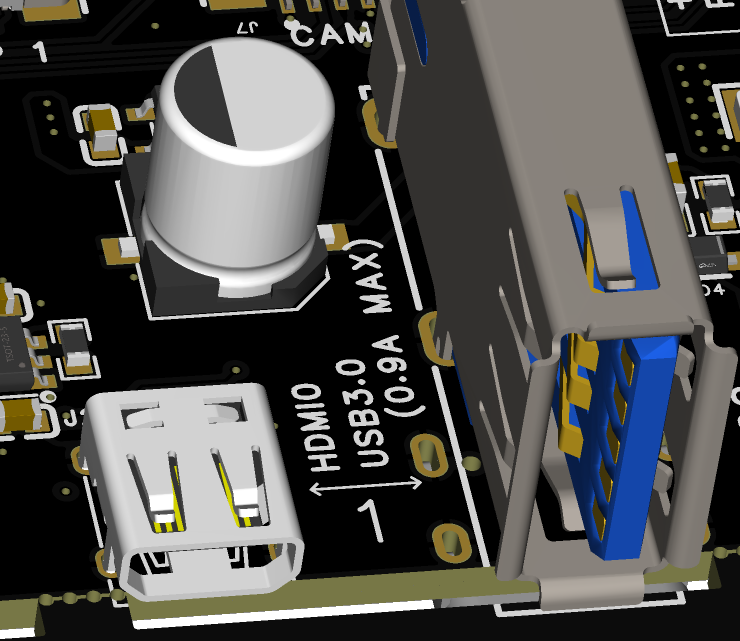 

### CM5 Modules 

A total of four CM5 channels are supported, with each channel featuring identical extended interfaces, which are labeled with the numbers 1, 2, 3, and 4 on the hardware silk screen.

### CM5 Connector
The standard CM5 connector is used, with a total height of 3mm below the board after installation.

###  micro HDMI 2.0 Interface
The standard micro HDMI interface is directly connected to the HDMI0 interface of the CM5 module. The 5V power on the interface is provided by the motherboard through a current - limiting switch.

### USB3.0 Interface
The CM5 module features two USB 3.0 interfaces. On this motherboard, the USB 3.0 interface is connected to Port 0. The interface is equipped with a current - limiting switch, which provides a maximum power supply capability of 0.9A to external devices.

 

### USB2.0 Interface 

The CM5 module has one USB 2.0 interface, which is connected to the Type-C connector on this motherboard. This interface only connects the D+/D- signals and does not provide power to external devices. It can be used in conjunction with the nRPIBOOT signal to program the CM5.

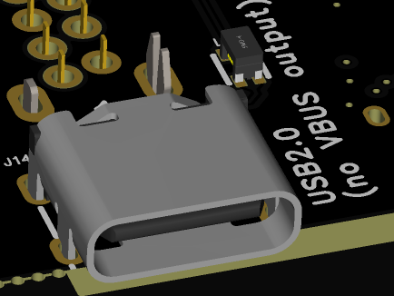 

### 1Gbps Ethernet Interface

Connected to the native Gigabit Ethernet interface of the CM5, it uses a standard RJ45 connector and does not support Power over Ethernet (PoE).

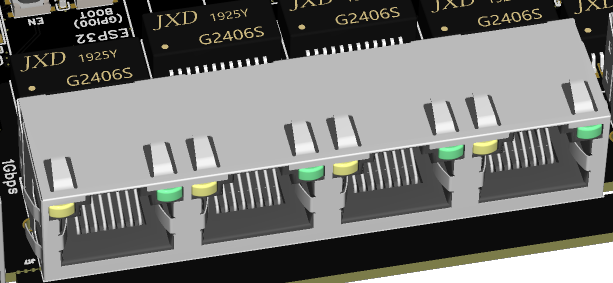 

### 2.5Gbps Ethernet Interface

The CM5 module features two USB 3.0 interfaces. On this motherboard, the 2.5Gbps Ethernet interface is expanded through the USB 3.0 Port 1 of the CM5. This interface also supports Gigabit and Fast Ethernet (100Mbps) connections.

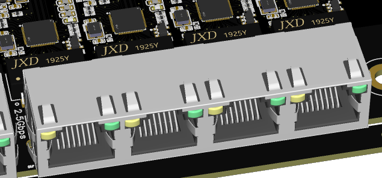 

### microSD Card Interface

A push - type interface that only supports the CM5Lite version.

### M.2 M-Key Interface

Supports various M.2 M-key cards. The interface only provides PCIe signals and supports the 2280 form factor.

### Fan Interface

The interface size and signal definitions are the same as those on the official CM5 IO board.

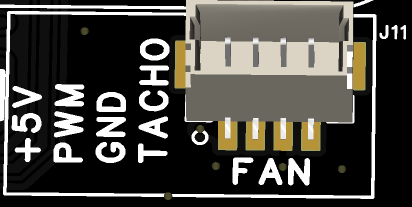 

### RTC Battery Interface

The interface size and signal definitions are the same as those on the official CM5 IO board

 

### MIPI Interface
The interface size and signal definitions are the same as those on the official CM5 IO board, featuring a 22 - pin, 0.5 - pitch FPC (Flexible Printed Circuit) connector.

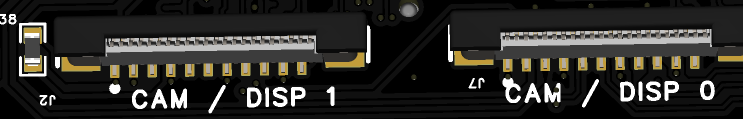 

### Jumper Headers
The IO voltage is by default configured to +3.3V. The pin definitions correspond one - to - one with the silk - screen markings on the board. These headers also bring out GPIO8/9/10/11 for expansion use. Additionally, the PMIC_ENABLE signal can be controlled either through jumpers or via the ESP32 (with different ESP32 IO pins allocated for controlling different CM5 channels). The figure below shows the jumper pins and silk - screen markings corresponding to the first - channel CM5.

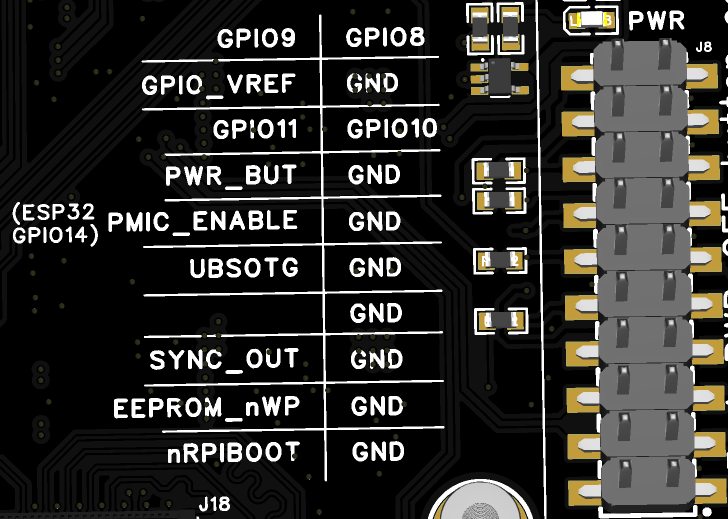 

### ESP32

The model of the ESP32 integrated on the motherboard is ESP32-WROOM-32E-N4. The motherboard comes with a pre-installed basic firmware that can perform simple power control, monitor voltage and current, and display the information in real - time on an OLED screen (SSD1306).

#### ESP32 Pin Allocation

| **Pin** | **ESP32-WROOM-32E** | **Super4C Net Name** | **Function / Notes** |
|---------|---------------------|----------------------|----------------------|
| 1       | GND                 | GND                  | **Ground** |
| 2       | 3V3                 | 3V3                  | **3.3 V Power Supply** |
| 3       | EN                  | EN                   | **HIGH=ON** (ESP32 enabled)<br>**LOW=OFF** (ESP32 shut-down)<br>Also wired to **SW2** (pressed = LOW) |
| 4       | SENSOR_VP           | NC                   | *Unconnected* |
| 5       | SENSOR_VN           | NC                   | *Unconnected* |
| 6       | IO34                | NC                   | *Unconnected* |
| 7       | IO35                | NC                   | *Unconnected* |
| 8       | IO32                | XTAL_32K_P           | 32.768 kHz crystal **input** |
| 9       | IO33                | XTAL_32K_N           | 32.768 kHz crystal **output** |
| 10      | IO25                | CM5_4_PMIC_ENABLE    | **Channel-4 Enable**<br>HIGH=ON (default) ‑ LOW=OFF |
| 11      | IO26                | CM5_3_PMIC_ENABLE    | **Channel-3 Enable**<br>HIGH=ON (default) ‑ LOW=OFF |
| 12      | IO27                | CM5_2_PMIC_ENABLE    | **Channel-2 Enable**<br>HIGH=ON (default) ‑ LOW=OFF |
| 13      | IO14                | CM5_1_PMIC_ENABLE    | **Channel-1 Enable**<br>HIGH=ON (default) ‑ LOW=OFF |
| 14      | IO12                | NC                   | *Unconnected* |
| 15      | GND                 | GND                  | **Ground** |
| 16      | IO13                | BMC_I2C_SDA          | I²C **SDA**<br>→ two on-board **INA3221** + **J12** & **J6** |
| 17-22   | —                   | NC                   | *Unconnected* |
| 23      | IO15                | BMC_I2C_SCL          | I²C **SCL**<br>→ two on-board **INA3221** + **J12** & **J6** |
| 24      | IO2                 | BMC_PSU1             | **PSU-1 ENABLE**<br>`HIGH=OFF` ‑ `LOW=ON` (default) |
| 25      | IO0                 | BOOT                 | Boot-strap (strapping) pin |
| 26      | IO4                 | BMC_PSU2             | **PSU-2 ENABLE**<br>`HIGH=OFF` ‑ `LOW=ON` (default) |
| 27      | IO16                | BMC_PSU3             | **PSU-3 ENABLE**<br>`HIGH=OFF` ‑ `LOW=ON` (default) |
| 28      | IO17                | BMC_PSU4             | **PSU-4 ENABLE**<br>`HIGH=OFF` ‑ `LOW=ON` (default) |
| 29      | IO5                 | `#SCS_W5500`         | W5500 **SPI-CS** (pin 32) |
| 30      | IO18                | SCLK_W5500           | W5500 **SPI-CLK** (pin 33) |
| 31      | IO19                | MISO_W5500           | W5500 **MISO** (pin 34) |
| 32      | —                   | NC                   | *Unconnected* |
| 33      | IO21                | `#INT_W5500`         | W5500 **INT** (pin 36) |
| 34      | RXD0                | BMC_RXD0             | UART0 RX → **J47** |
| 35      | TXD0                | BMC_TXD0             | UART0 TX → **J47** |
| 36      | IO22                | `#RST_W5500`         | W5500 **RST** (pin 37) |
| 37      | IO23                | MOSI_W5500           | W5500 **MOSI** (pin 35) |
| 38      | GND                 | GND                  | **Ground** |

#### ESP32 Buttons

* **BOOT (SW1):**
  - When the BOOT button is held down while powering on the motherboard (or while powered on, hold both BOOT and EN buttons, release the EN button first, and then release the BOOT button), the ESP32 will enter programming mode. The ESP32 can then be programmed via the UART interface (J47).
  - In the default firmware, after the ESP32 starts up, the BOOT pin is used as an input IO (GPIO0). When the BOOT button is pressed for more than 1 second and then released, the ESP32 will sequentially disable the PMIC_ENABLE signals for the four CM5 modules and the ENABLE signals for the four DC/DC (5V) channels, with an interval of approximately 0.5 seconds.

* **EN (SW2):**
  - In the default firmware, pressing the EN button will reset all CM5_PMIC_ENABLE and DC/DC (5V) ENABLE signals.

#### ESP32 I2C Address

The I2C signals of the ESP32 are connected to both the J12 and J6 headers, as well as the two onboard INA3211 chips. The headers can be used to expand external I2C devices.

| **Item**        | **Channels / Pins / Address**                        | **Description** |
|-----------------|------------------------------------------------------|-----------------|
| **J12 Connector** | 4-pin 2.54 mm header (GND, 3V3, SDA, SCL)            | Header for plugging in an **OLED module** (I²C interface) |
| **J16 Connector** | 4-pin 2.54 mm header (GND, 3V3, SDA, SCL)            | Header for **additional I²C devices** |
| **INA3221 #1**    | 3-channel • 20 mΩ shunt • I²C address `0x40`         | IN1 → **DC1**<br>IN2 → **DC2**<br>IN3 → **DC/DC 5 V #1** |
| **INA3221 #2**    | 3-channel • 20 mΩ shunt • I²C address `0x41`         | IN1 → **DC/DC 5 V #2**<br>IN2 → **DC/DC 5 V #3**<br>IN3 → **DC/DC 5 V #4** |

The pinout diagram for J12/J6 connectors is as follows:

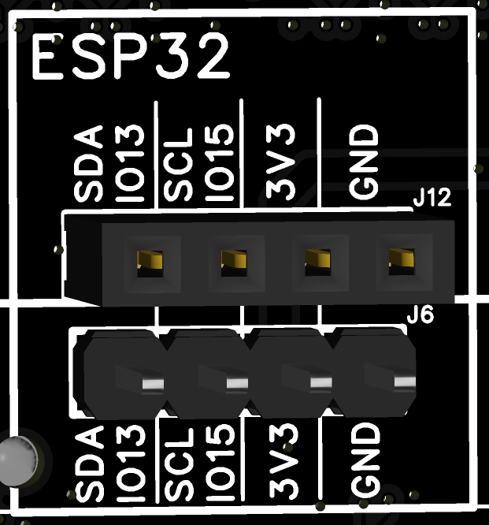 

#### ESP32 Firmware

The ESP32 comes with default firmware:

* It can control the DC/DC power supply for four channels and the PMIC_ENABLE signal for CM5.
* It can drive the OLED display module (SSD1306).
* It can monitor the current information of a total of six channels (two DC input ports and four internal 5V power supplies).
* It can display the collected current information on the OLED screen all at once.
* It can detect the network connectivity of W5500:
  - When connected, the OLED screen displays: 192.168.1.222
  - When not connected, the OLED screen displays: LINK: OFF

### Open Source
Some pages of the schematics and the ESP32 default firmware source code can be open - sourced to facilitate secondary development of the board by community enthusiasts.
It will be open source once the firmware has been test out. 


### Flash an image to a Compute Module
To flash the same image to multiple Compute Modules, use the Raspberry Pi Secure Boot Provisioner. To customise an OS image to flash onto those devices, use pi-gen.

The Compute Module has an on-board eMMC device connected to the primary SD card interface. This guide explains how to flash (write) an operating system image to the eMMC storage of a single Compute Module.
Lite variants of Compute Modules do not have on-board eMMC. Instead, follow the procedure to flash a storage device for other Raspberry Pi devices at Install an operating system.

#### Prerequisites
To flash the Compute Module eMMC, you need the following:
* Another computer, referred to in this guide as the host device. You can use Linux (we recommend Raspberry Pi OS or Ubuntu), Windows 11, or macOS.
*	Super4C mother board.
*	A USB-C cable for Compute Module models flashing image. 

#### Set up the IO Board

* 1.Connect the Compute Module to the Super4C board. When connected, the Compute Module should lie flat.
* 2.Fit `nRPI_BOOT` to `GND` Pin (disable eMMC Boot) on the board with jumper.

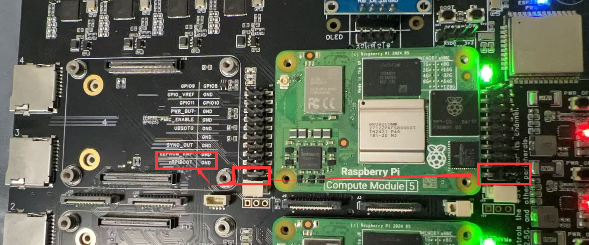 

* Connect a cable from USB-C slave port J11 on the board to the host device.

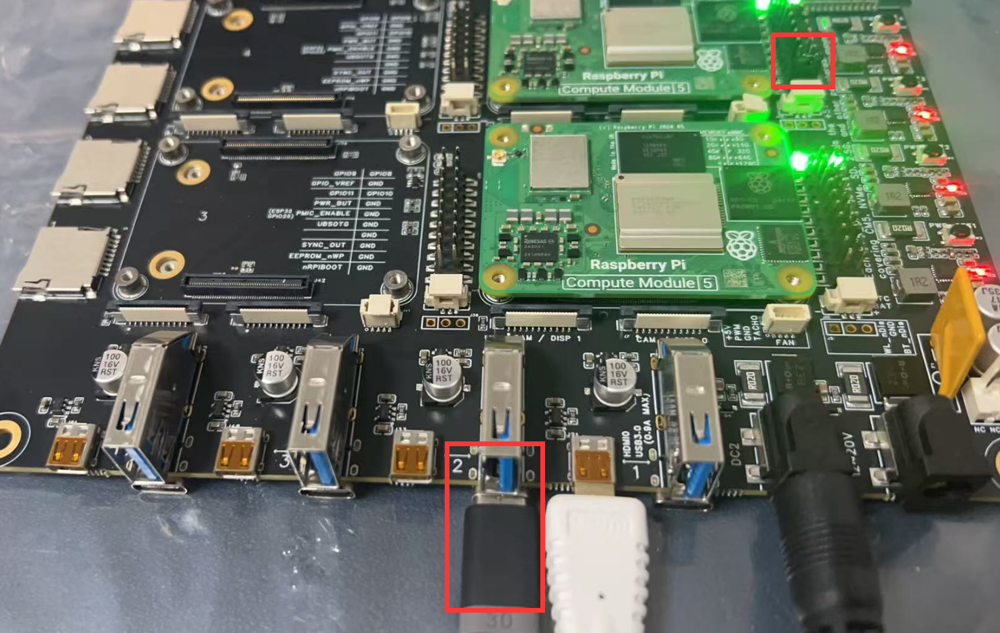 

#### Set up the host device
Next, let’s set up software on the host device.
For a host device, we recommend a Raspberry Pi 4 or newer running 64-bit Raspberry Pi OS.

##### For Linux: 

To set up software on a Linux host device:

* 1.Run the following command to install rpiboot (or, alternatively, build rpiboot from source):

```bash 
sudo apt install rpiboot
```

* 2.Connect the IO Board to power.
* 3.Then, run rpiboot:
```bash
sudo rpiboot
```
* 4.After a few seconds, the Compute Module should appear as a mass storage device. Check the /dev/ directory, likely /dev/sda or /dev/sdb, for the device. Alternatively, run lsblk and search for a device with a storage capacity that matches the capacity of your Compute Module.

##### For macOS:

To set up software on a macOS host device:

* 1.First, build rpiboot from source.
* 2.Connect the IO Board to power.
* 3.Then, run the rpiboot executable with the following command:

```bash
rpiboot -d mass-storage-gadget64
```
* 4.When the command finishes running, you should see a message stating "The disk you inserted was not readable by this computer." Click Ignore. Your Compute Module should now appear as a mass storage device

##### For Windows:

To set up software on a Windows 11 host device:

* 1.Download the Windows installer or build rpiboot from source. 
Windows installer Download URL: https://github.com/raspberrypi/usbboot/raw/master/win32/rpiboot_setup.exe
Build source : https://github.com/raspberrypi/usbboot
* 2.Double-click on the installer to run it. This installs the drivers and boot tool. Do not close any driver installation windows which appear during the installation process.
* 3.Reboot
* 4.Connect the IO Board to power. Windows should discover the hardware and configure the required drivers.
* 5.On CM4 and later devices, select Raspberry Pi - Mass Storage Gadget - 64-bit from the start menu. After a few seconds, the Compute Module eMMC or NVMe will appear as USB mass storage devices. This also provides a debug console as a serial port gadget.
* 6.On CM3 and older devices, select rpiboot. Double-click on RPiBoot.exe to run it. After a few seconds, the Compute Module eMMC should appear as a USB mass storage device.

### Flash the eMMC 

You can use Raspberry Pi Imager to flash an operating system image to a Compute Module.  Raspberry Pi Imager Download URL: https://www.raspberrypi.com/documentation/computers/getting-started.html#raspberry-pi-imager
Alternatively, use dd to write a raw OS image (such as Raspberry Pi OS) to your Compute Module. Run the following command, replacing /dev/sdX with the path to the mass storage device representation of your Compute Module and raw_os_image.img with the path to your raw OS image:

```bash
sudo dd if=raw_os_image.img of=/dev/sdX bs=4MiB
```

Once the image has been written, disconnect and reconnect the Compute Module. You should now see two partitions (for Raspberry Pi OS):
<pre>
/dev/sdX    <- Device
/dev/sdX1   <- First partition (FAT)
/dev/sdX2   <- Second partition (Linux filesystem)
</pre>

You can mount the /dev/sdX1 and /dev/sdX2 partitions normally.
For example: 
Following figure shows that how to dump the OS from Raspberry Pi’s MicroSD card to the CM5’s eMMC storage: 

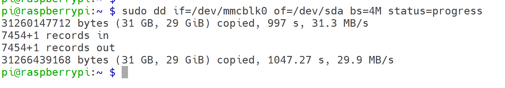 

## Boot from eMMC 
Disconnect `nRPI_BOOT` from `GND` (disable eMMC Boot) on the super4c board jumper.

Disconnect the USB slave port. Power-cycle the super4c board to boot the Compute Module from the new image you just wrote to eMMC.

## More information please visit:
[Raspberry Pi Official Documentations](https://www.raspberrypi.com/documentation/computers/compute-module.html)

## Application Demo

End-to-End Guide: Build & Manage a 4-Node Raspberry Pi CM5 Cluster with Ansible on Raspberry Pi 5

> All previous Chinese instructions condensed, corrected, and translated into a single English document.

---

## 0. Hardware & Network Topology

| Node        | Role          | IP Address       |
|-------------|---------------|------------------|
| Raspberry Pi 5 | **Ansible Control Node** | 192.168.10.1/24 |
| CM5-01      | Compute Module 5 | 192.168.10.11 |
| CM5-02      | Compute Module 5 | 192.168.10.12 |
| CM5-03      | Compute Module 5 | 192.168.10.13 |
| CM5-04      | Compute Module 5 | 192.168.10.14 |

---

## 1. Prepare the Control Node (ONLY this machine)

```bash
sudo apt update && sudo apt full-upgrade -y
sudo apt install -y python3-pip sshpass jq
pip3 install --user ansible-core==2.16
echo 'export PATH=$PATH:~/.local/bin' >> ~/.bashrc && source ~/.bashrc

mkdir -p ~/cm5-cluster/{inventory,group_vars,playbooks,roles,report}
cd ~/cm5-cluster

```

## Inventory & First-Time SSH Setup
* Create `inventory/hosts.yml`
```yaml
all:
  children:
    cm5_cluster:
      hosts:
        CM501: {ansible_host: 192.168.10.11}
        CM502: {ansible_host: 192.168.10.12}
        CM503: {ansible_host: 192.168.10.13}
        CM504: {ansible_host: 192.168.10.14}
      vars:
        ansible_user: pi
        ansible_ssh_pass: raspberry
        ansible_ssh_common_args: '-o StrictHostKeyChecking=no'
```
Generate & push SSH key (password login is kept):

### Create playbooks/init-ssh.yml file 
```yaml
---
- hosts: cm5_cluster
  gather_facts: no
  tasks:
    - name: Push public key
      authorized_key:
        user: pi
        key: "{{ lookup('file', '~/.ssh/id_ed25519.pub') }}"
```

### Run once:
```bash 
ssh-keygen -t ed25519 -f ~/.ssh/id_ed25519 -N ''
ansible-galaxy collection install ansible.posix   # only if using FQCN
ansible-playbook -i inventory/hosts.yaml playbooks/init-ssh.yml
```

### Basic System Initialization 

* playbooks/site.yml

```yaml
---
- name: Initialize all CM5 nodes
  hosts: cm5_cluster
  become: yes
  roles:
    - common
```

### Create `roles/common/tasks/main.yml`
```yaml
---
- name: Expand root filesystem
  shell: raspi-config --expand-rootfs
  notify: reboot

- name: Set unique hostname
  hostname:
    name: "{{ inventory_hostname }}"

- name: Update system
  apt:
    update_cache: yes
    upgrade: dist

- name: Install common packages
  apt:
    name:
      - python3-venv
      - python3-dev
      - build-essential
      - git
      - htop
      - vim
    state: present

handlers:
  - name: reboot
    reboot:
```
* Execute:
```bash 
ansible-playbook -i inventory/hosts.yaml playbooks/site.yml
```
## Create Python Virtualenv & Install Data-Science Packages
* create `playbooks/venv.yml`
```yaml
---
- name: Deploy Python venv with AI/ML packages
  hosts: cm5_cluster
  become: yes
  vars:
    venv_path: "/home/{{ ansible_user }}/venv"
    python_packages:
      - pandas
      - numpy
      - opencv-python
      - matplotlib
      - seaborn
      - xgboost
      - pillow
      - onnxruntime
  tasks:
    - name: Ensure venv directory exists
      file:
        path: "{{ venv_path }}"
        state: directory
        owner: "{{ ansible_user }}"
        group: "{{ ansible_user }}"

    - name: Create virtualenv
      command: python3 -m venv {{ venv_path }}
      args:
        creates: "{{ venv_path }}/bin/activate"

    - name: Upgrade pip
      pip:
        executable: "{{ venv_path }}/bin/pip"
        name: pip
        state: latest

    - name: Install packages
      pip:
        executable: "{{ venv_path }}/bin/pip"
        name: "{{ python_packages }}"

    - name: Auto-activate venv on login
      copy:
        dest: /etc/profile.d/venv.sh
        mode: '0644'
        content: |
          [ -d "{{ venv_path }}" ] && source {{ venv_path }}/bin/activate
```
* Execute:
```bash 
ansible-playbook -i inventory/hosts.yaml playbooks/venv.yml
```

## Gather Hostname, IP, Disk Information 
* Create `playbooks/gather-host-info.yml`
```yaml
---
- name: Collect hostname, IPs, disk usage
  hosts: cm5_cluster
  gather_facts: yes
  vars:
    report_dir: "{{ playbook_dir }}/../report"
  tasks:
    - name: Ensure report directory exists (locally)
      file:
        path: "{{ report_dir }}"
        state: directory
      delegate_to: localhost
      run_once: yes

    - name: Render per-host JSON file
      template:
        src: host-info.json.j2
        dest: "{{ report_dir }}/{{ inventory_hostname }}.json"
      delegate_to: localhost
```
* Create playbooks/templates/host-info.json.j2
```jinja2

{"hostname":"{{ ansible_hostname }}","ipv4":{{ ansible_all_ipv4_addresses | to_json }},"disk_GB":"{{ (root.block_total * root.block_size / 1024**3) | round(2) }}","used_GB":"{{ (root.block_used * root.block_size / 1024**3) | round(2) }}","usage":"{{ (root.block_used / root.block_total * 100) | round(1) }}%"}
```
* Run & view:
```bash 
sudo apt -y install jq
ansible-playbook -i inventory/hosts.yaml playbooks/gather-host-info.yml
cat report/*.json | jq -s .
```

## Batch Shutdown / Reboot
* Create `playbooks/shutdown.yml`
```yaml
---
- name: Shutdown all CM5 nodes
  hosts: cm5_cluster
  become: yes
  tasks:
    - name: Power off
      command: shutdown -h now
```
* Create `playbooks/reboot.yml`
```yaml
---
- name: Reboot all CM5 nodes
  hosts: cm5_cluster
  become: yes
  tasks:
    - name: Reboot
      command: reboot 
```
* Execute: 
```bash 
ansible-playbook -i inventory/hosts.yaml playbooks/shutdown.yml   # shutdown
ansible-playbook -i inventory/hosts.yaml playbooks/reboot.yml    # reboot  
```
### Get the CPU temperature 
* Create a file structure like this:
<pre>
cpu_temp/
├── hosts.ini          # Inventory file – list of managed hosts
├── cpu_temp.yml       # Main Ansible playbook
└── templates/
    └── temp_report.j2 # Optional Jinja2 template for formatted output
</pre>

* Explanations:

| Directory / File           | Purpose & Explanation (English)                                                        |
| -------------------------- | -------------------------------------------------------------------------------------- |
| `cpu_temp/`                | Root directory that contains all playbook-related files.                               |
| `hosts.ini`                | Inventory file listing the managed hosts (the Raspberry Pi nodes).                     |
| `cpu_temp.yml`             | Main Ansible playbook that defines the tasks to retrieve and process CPU temperatures. |
| `templates/`               | Directory for Jinja2 templates used to create formatted reports or files.              |
| `templates/temp_report.j2` | Optional Jinja2 template for generating a nicely-formatted output report.              |


* Create `playbooks/cpu_temp.yml`
```yaml
# This playbook retrieves the CPU temperature of managed Raspberry Pi hosts.
# The `vcgencmd measure_temp` command is executed on each host to get the real-time temperature.

- name: Retrieve CPU temperature from managed Raspberry Pi hosts
  hosts: rpi
  gather_facts: no        # Skip full fact gathering to speed up execution
  become: no              # vcgencmd can be run by the pi user without sudo

  tasks:
    - name: Execute vcgencmd measure_temp to obtain real-time temperature
      ansible.builtin.command: vcgencmd measure_temp
      register: temp_raw  # Save command output in the variable temp_raw

    - name: Parse temperature value (remove prefix and unit)
      ansible.builtin.set_fact:
        cpu_temp: "{{ (temp_raw.stdout | regex_replace('temp=', '') | regex_replace(\"'C\\n\", '')) }}"

    - name: Display temperature for each host in the console
      ansible.builtin.debug:
        msg: "Host {{ inventory_hostname }} CPU temperature: {{ cpu_temp }}°C"

    - name: Append results to a local summary file (optional)
      ansible.builtin.lineinfile:
        path: "./cpu_temp_summary.txt"
        line: "{{ '%Y-%m-%d %H:%M:%S' | strftime }} - {{ inventory_hostname }} - {{ cpu_temp }}°C"
        create: yes
      delegate_to: localhost  # Run this task on the Ansible control node 
```

* Explanations:

| Playbook Segment                                 | Purpose & Explanation (English)                                                                                 |
| ------------------------------------------------ | --------------------------------------------------------------------------------------------------------------- |
| `---`                                            | YAML file start marker.                                                                                         |
| `- name: 获取树莓派管理主机的 CPU 温度`                      | Name of the play; it appears in the playbook output.                                                            |
| `hosts: rpi`                                     | Targets only hosts in the `[rpi]` group from the inventory.                                                     |
| `gather_facts: no`                               | Skips the `setup` module to reduce SSH round-trips and speed up execution.                                      |
| `become: no`                                     | Does not escalate privileges; `vcgencmd` does not require root.                                                 |
| `ansible.builtin.command: vcgencmd measure_temp` | Executes the temperature-retrieval command on the remote host.                                                  |
| `register: temp_raw`                             | Captures stdout, stderr, and return code of the command into the variable `temp_raw`.                           |
| `set_fact: cpu_temp: ...`                        | Uses regex to strip prefixes like `temp=` and the trailing `'C`, leaving only the numeric value (e.g., `47.2`). |
| `debug: msg: "主机 ..."`                           | Prints the formatted temperature for each host in real time on the console.                                     |
| `lineinfile: ...`                                | Appends results to `cpu_temp_summary.txt` on the control node for later review or graphing.                     |
| `delegate_to: localhost`                         | Ensures the file-append task runs on the Ansible control node, not on the managed hosts.                        |

* Execute:
```bash 
cd cpu_temp
ansible-playbook -i hosts.ini cpu_temp.yml
```

## Quick Reference
| Action             | Command                                               |
| ------------------ | ----------------------------------------------------- |
| Check connectivity | `ansible cm5_cluster -i inventory/hosts.yaml -m ping` |
| Ad-hoc shell       | `ansible cm5_cluster -a "uname -a"`                   |
| View JSON report   | `cat ~/cm5-cluster/report/*.json \| jq -s .`          |

Enjoy your fully-automated CM5 cluster!

