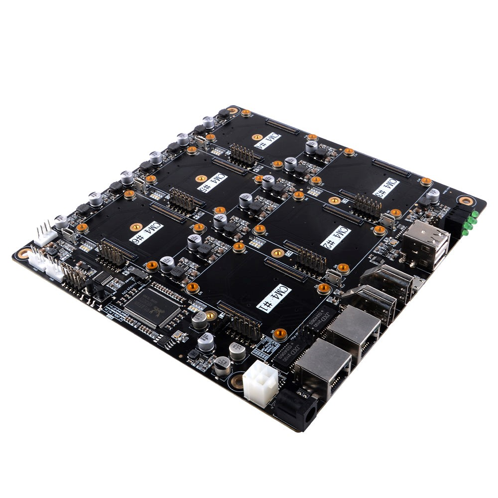
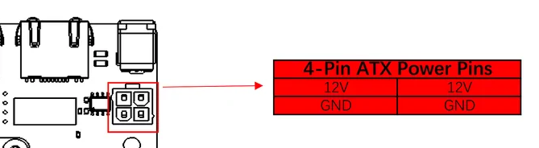
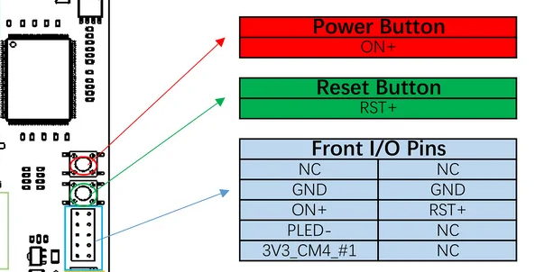
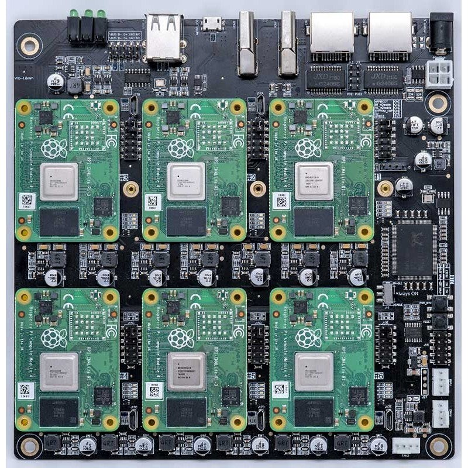
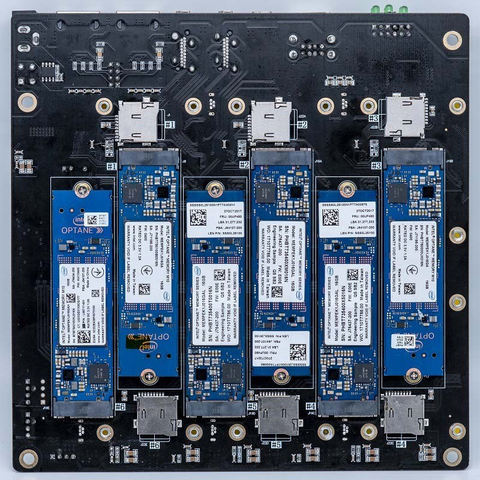
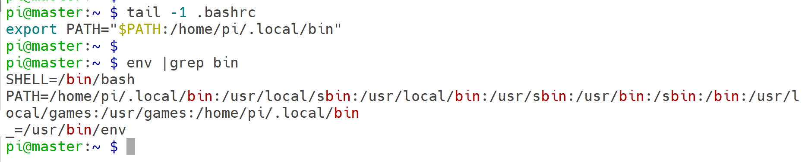
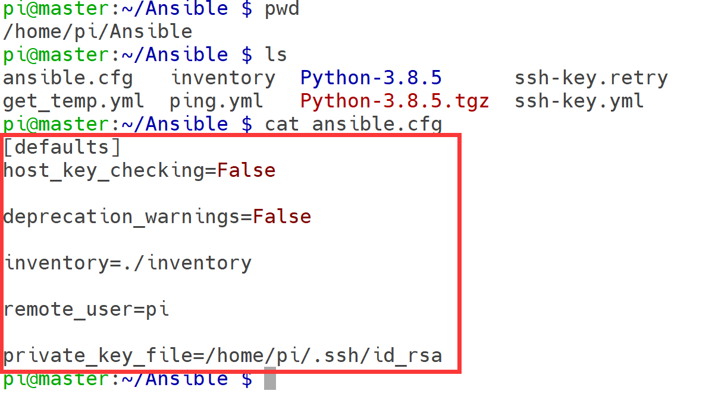
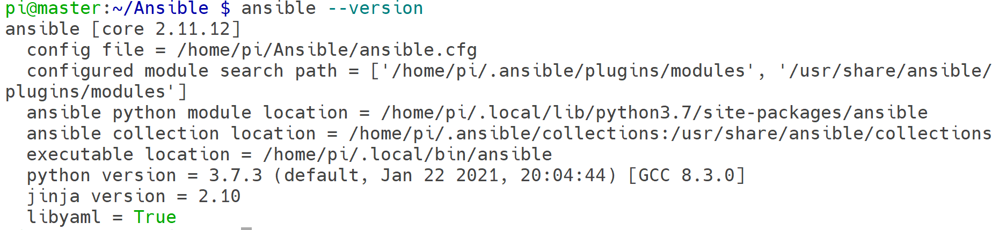
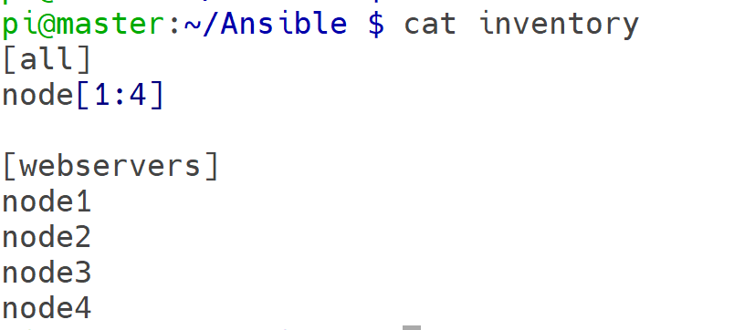
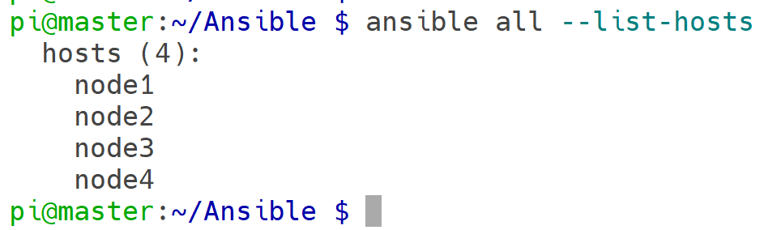

# DeskPi Super6C 


## Purchase 
 
[DeskPi Super6C](https://deskpi.com/collections/deskpi-super6c)

## Description 
DeskPi Super6C is the Raspberry Pi cluster board a standard size mini-ITX board to be put in a case with up to 6 RPI CM4 Compute Modules.
- For every CM4:
  * M.2 2280 slot (PCIe Gen 2 x1)
  * TF Card slot
  * 5V FAN Header
  * Micro USB 2.0
 
- Only for 1st CM4:
  * USB Host A 2.0 x2
  * USB Host 2.54 4-pins x2
  * HDMI 2.0 x1
  * HDMI 1.4a x1

## Featrues

## Package Includes:
* 1pcs Raspberry Pi CM4 Cluster Mini-ITX board.
* 1pcs 100W Power supply.

> Note:  Raspberry Pi CM4 board are not included

## Dimension
170mm x 170mm x 21mm (Mini-ITX)

## Applications
* Self-hosted: Host cloud applications locally or at the edge Learning
* Learning: Kubernetes, Docker, Serverless 
* Development: Build cloud-native and CI/CD for ARM edge infrastructure 
* Network-Attached Storage or Distributed Storage System :6 x ARM NAS node or CEPH node

## Software


## Port definitions


* 1 x DC IN +12~24V
* 2 x RJ45 Gigabit Ethernet Port 1Gbps
* 2 x Full-Sized HDMI Ports
* 1 x Micro USB Port from CM4 1# (Flashing EEPROM)
* 2 x CM4 1# USB Host 2.0 
* 6 x CM4 Activity LED 
* 3 x Fan Pin Header
* 1 x Always ON switch 

## Power Supply Specifications
* Recommended:
SWITCHING ADAPTER
Model: FJ-SW2025G1904730
INPUT: 100-240V~50/60Hz 2.0A Max
OUTPUT：19.0V ≈ 4.73A， 89.87W


## Mechanical Drawing


## Block Scheme


## Pin Headers definitions

* CM4 Jumpers Functions


* LED definitions


* 4-Pin ATX Power Pins definitions

12V Pin and GND:


Power button and Reset Button


Distribution of Pins 


***Note：***

* J6: If you are using 9pin USB pins, it is more common for motherboards that support Pentium4 or athlon XP chipsets (such as i845D, i845E, SiS 650, etc.) to need to drop the pins.


If a 10-pin type USB pin is used, such as i815, i815E, i815EP, KT133 and other chipset motherboards, this pin can be reserved, please refer to the motherboard manual for wiring.

* `J27`: J27 Pin is the control programming interface for power management, which is directly used for internal production, `DO NOT CONNECT!!!`

* `J11/J13`: PoE1/PoE2 Not available,`DO NOT CONNECT!!!`

## How to install CM4 module
Please press the CM4 module onto Super6c mainboard as following picture.  
Attach the CM4 to the board by simply aligning it with the two connectors on the IO board, then give it a good squeeze. It’ll crunch into place and you should be set.



and if you have SSD drive, install it as following picture.



## How to Flash image to eMMC on CM4 module.
* Flashing the Compute Module eMMC
The Compute Module has an on-board eMMC device connected to the primary SD card interface. This guide explains how to write data to the eMMC storage using a Compute Module IO board.

Please also read the section in the [Compute Module Datasheets](https://www.raspberrypi.com/documentation/computers/compute-module.html#datasheets-and-schematics)

* Compute Module 4
Ensure the Compute Module is fitted correctly installed on the IO board. It should lie flat on the IO board.

Make sure that `nRPBOOT` which is on `J2` (disable eMMC Boot) on the board jumper is fitted

Use a micro USB cable to connect the micro USB slave port MCRO_USB on board to the host device.

***Do not power up yet.***

* For Windows Users
Under Windows, an installer is available to install the required drivers and boot tool automatically. Alternatively, a user can compile and run it using Cygwin and/or install the drivers manually.

* Windows Installer
For those who just want to enable the Compute Module eMMC as a mass storage device under Windows, the stand-alone installer is the recommended option. This installer has been tested on Windows 10 32-bit and 64-bit, and Windows XP 32-bit.

Please ensure you are not writing to any USB devices whilst the installer is running.

Download and run the Windows installer to install the drivers and boot tool.

[windows installer download URL](https://github.com/raspberrypi/usbboot/raw/master/win32/rpiboot_setup.exe)

Plug your host PC USB into the USB SLAVE port, making sure you have setup the board as described above.

Apply power to the board; Windows should now find the hardware and install the driver.

Once the driver installation is complete, run the `RPiBoot.exe` tool that was previously installed.

After a few seconds, the Compute Module eMMC will pop up under Windows as a disk (USB mass storage device).

Building rpiboot on your host system (Cygwin/Linux)
We will be using Git to get the rpiboot source code, so ensure Git is installed. In Cygwin, use the Cygwin installer. On a Raspberry Pi or other Debian-based Linux machine, use the following command:

```bash
sudo apt install git 
```
 
Git may produce an error if the date is not set correctly. On a Raspberry Pi, enter the following to correct this:
 
```bash
sudo data MMDDhhmm
```

where MM is the month, DD is the date, and hh and mm are hours and minutes respectively.

* Clone the usbboot tool repository:
```bash
git clone --depth=1 https://github.com/raspberrypi/usbboot
cd usbboot
```
 
libusb must be installed. If you are using Cygwin, please make sure libusb is installed as previously described. On Raspberry Pi OS or other Debian-based Linux, enter the following command:

```bash
sudo apt install libusb-1.0-0-dev 
```
 
Now build and install the usbboot tool:

```bash
make 
```
 
Run the usbboot tool and it will wait for a connection:
```bash
sudo ./rpiboot
```
 
Now plug the host machine into the Super6C USB slave port and power on. The rpiboot tool will discover the Compute Module and send boot code to allow access to the eMMC.

##For more information run
 
* Writing to the eMMC (Windows)
After rpiboot completes, a new USB mass storage drive will appear in Windows. We recommend using Raspberry Pi Imager to write images to the drive.

Make sure `J2 (nRPBOOT)` is set to the disabled position and/or nothing is plugged into the USB slave port. Power cycling the IO board should now result in the Compute Module booting from eMMC.

* Writing to the eMMC (Linux)
After rpiboot completes, you will see a new device appear; this is commonly /dev/sda on a Raspberry Pi but it could be another location such as /dev/sdb, so check in /dev/ or run lsblk before running rpiboot so you can see what changes.

You now need to write a raw OS image (such as Raspberry Pi OS) to the device. Note the following command may take some time to complete, depending on the size of the image: (Change /dev/sdX to the appropriate device.)

```bash
sudo dd if=raw_os_image_of_your_choice.img of=/dev/sdX bs=4MiB
```

 Once the image has been written, unplug and re-plug the USB; you should see two partitions appear (for Raspberry Pi OS) in /dev. In total, you should see something similar to this:

```bash
/dev/sdX  <- device
/dev/sdX1 <- First partition (FAT)
/dev/sdX2 <- Second partition (Linux Filesystem)
```
 
The /dev/sdX1 and /dev/sdX2 partitions can now be mounted normally.

Make sure `J2 (nRPBOOT)` is set to the disabled position and/or nothing is plugged into the USB slave port. Power cycling the board should now result in the Compute Module booting from eMMC.


## Compute Module 4 Bootloader
The default bootloader configuration on CM4 is designed to support bring up and development on a Compute Module 4 IO board and the software version flashed at manufacture may be older than the latest release. For final products please consider:

* Selecting and verifying a specific bootloader release. The version in the usbboot repo is always a recent stable release.

* Configuring the boot device (e.g. network boot). See BOOT_ORDER section in the bootloader configuration guide.

* Enabling hardware write protection on the bootloader EEPROM to ensure that the bootloader can’t be modified on remote/inaccessible products.

N.B. The Compute Module 4 ROM never runs recovery.bin from SD/EMMC and the rpi-eeprom-update service is not enabled by default. This is necessary because the EMMC is not removable and an invalid recovery.bin file would prevent the system from booting. This can be overridden and used with self-update mode where the bootloader can be updated from USB MSD or Network boot. However, self-update mode is not an atomic update and therefore not safe in the event of a power failure whilst the EEPROM was being updated.

## Modifying the bootloader configuration
To modify the CM4 bootloader configuration:
```bash
cd usbboot/recovery
```

Replace pieeprom.original.bin if a specific bootloader release is required.

Edit the default boot.conf bootloader configuration file. Typically, at least the BOOT_ORDER must be updated: 

* For network boot `BOOT_ORDER=0xf2`

* For SD/EMMC boot `BOOT_ORDER=0xf1`

* For USB boot failing over to EMMC `BOOT_ORDER=0xf15`

Run `./update-pieeprom.sh` to update the EEPROM image `pieeprom.bin` image file.

If EEPROM write protection is required then edit config.txt and add `eeprom_write_protect=1`. Hardware write-protection must be enabled via software and then locked by pulling the EEPROM_nWP pin low.

Run `../rpiboot -d`. to update the bootloader using the updated EEPROM image pieeprom.bin

The pieeprom.bin file is now ready to be flashed to the Compute Module 4.

## Flashing the bootloader EEPROM - Compute Module 4
To flash the bootloader EEPROM follow the same hardware setup as for flashing the EMMC but also ensure `EEPROM_nWP` is NOT pulled low. Once complete EEPROM_nWP may be pulled low again.
 
```bash
# Writes recovery/pieeprom bin to the bootloader EEPROM.
./rpiboot -d recovery
```

## Troubleshooting
For a small percentage of Raspberry Pi Compute Module 3s, booting problems have been reported. We have traced these back to the method used to create the FAT32 partition; we believe the problem is due to a difference in timing between the BCM2835/6/7 and the newer eMMC devices. The following method of creating the partition is a reliable solution in our hands.

```bash
sudo parted /dev/<device>
(parted) mkpart primary fat32 4MiB 64MiB
(parted) q
sudo mkfs.vfat -F32 /dev/<device>
sudo cp -r <files>/* <mountpoint>
```

After Flash Raspberry Pi OS to eMMC on CM4 module, just power off the system, and one complete, 5 to go, just repeat those step five times. 

If your CM4 Module does not have eMMC on board, that will be easy, just flash Raspberry Pi OS to TF card or SSD drive, and insert them to card slot, fix it with screws. and connect the power supply, and press `PWR_BTN` button to power them on.

If your CM4 module has eMMC on board, the SSD drive and TF card can be external mass storage.


## How to build your own cluster and manage the cluster via Ansible
### Fit for CM4 Lite version
***Note:***
The latest Raspberry Pi OS does not contain pi user and it may not need to add `dtoverlay=dwc2,dr_mode=host` to config.txt file on location `/boot`.

> Assume you are using the old version (Raspberry Pi OS 2021-11-08)

CM4 Lite means Raspberry Pi Computer module come without a EMMC storage onboard.　That means additional MicroSD card(TF card) is required.

### Steps:
* Download the latest Raspberry Pi OS 64bit image from: 
[Download Image](https://downloads.raspberrypi.org/raspios_arm64/images/raspios_arm64-2021-11-08/)

* Unzip it and flash the .img file to TF card by using Etcher tool, which can be downloaded via[Download flash tool](https://www.balena.io/etcher/)

* Modify config.txt file in TF card and adding `dtoverlay=dwc2,dr_mode=host` to it and save it. (Do not need to execute this step if your using the latest version image)

* Before we unplug, now that your CM4 is fully flashed and ready to go, you’ll be surprised to learn that the USB Ports are disabled by default. Yes, really. Remember, this is a board designed to be embedded elsewhere and not for consumer-level off-the-shelf use.

* In the “boot” folder, find the config.txt and add the following:

```bash
dtoverlay=dwc2,dr_mode=host
```

This will turn on the USB ports when you boot up, but if you accidentally keep the micro USB in, you will run into issues. Before you begin your first boot, make sure everything is unplugged. Boot and then plug in your mouse or keyboard.

If you’re like me and couldn’t get a wi-fi version, this is where you’ll plug in your dongle or ethernet cable.

* Create a new file named ssh on TF card /boot folder

* Insert TF card into card slot on Super6C board.

* Connect the power supply to DC Socket or Using ATX Power supply. (Max. 24V/6.15A)

* Connect Full-sized HDMI cable to super6C, Other head connect to your TV or Monitor.

* Connect Keyboard and mouse to USB2.0 port on board.

* Connect Ethernet cable to ETH1 to your Router.

* Press `PWR_BTN` button to booting up all of CM4 modules.

* Press `Reset` button will reset all of CM4 modules, unsaved file will be lost!!!

* Login to Raspberry pi

```bash
username: pi  
default password: raspberry
```
* Make sure your OS can access internet.

* Deploy ansible environments as following steps

If you want to use Ansible to manage Raspberry Pi cluster, you need to upgrade python version from 3.7 to 3.8 as following steps:

1. Remove old version python 

```bash
sudo apt remove ansible 
sudo apt purge –y python2.7-minimal
```

2. Update and upgrade system.

```bash
sudo apt update 
sudo apt upgrade –y
```

3. Install dependencies. 

```bash
sudo apt-get install -y build-essential tk-dev libncurses5-dev \
libncursesw5-dev libreadline6-dev libdb5.3-dev libgdbm-dev libsqlite3-dev \
libssl-dev libbz2-dev libexpat1-dev liblzma-dev zlib1g-dev libffi-dev
```

4. Download source code and compile it.

```bash
version=3.8.5
wget https://www.python.org/ftp/python/$version/Python-$version.tgz

tar zxf Python-$version.tgz
cd Python-$version
./configure --enable-optimizations
make -j4
sudo make altinstall
```

> Do remember:　Installs Python into /usr/local/bin

5. Install ansible 

We can use apt or your particular distro package manager, but doing that, we risk no getting the latest version available.
In some cases, I have to agree that is good idea, we make sure system is kept stable and the packages has been tested enough, but in technologies like Ansible, which is still changing so rapidly, I recommend you to go ahead in your tests and get the latest version, that way you will also learn to use those latest versions, which have some modules usage differences.
Lets see the version installed using apt in Raspbian.

```bash
sudo apt list ansible
pip3 install ansible --user
```

Installing Ansible using the --user option, will make that the binary will be available directly under your user home, and not in your root bin directory (/bin,/usr/bin..)


 
For that, I recommend you to add your `$user_home/.local/bin` to your PATH environment:


 
### Ansible Project Configuration
Now that we have Ansible installed, let’s set some basic configuration.

Create a directory for our first project where we are going to set the different configuration files and Ansible playbooks
```bash
mkdir Ansible
```

First file we are going to create, is an Ansible configuration file. This will make sure we are using correct inventory file and some specific options for this project.

In this case, we will use the inventory file in the local directory and will be connecting to the remote server as root. Additionally, will disable ssh-key check so we can connect to the servers without doing first ssh-key handshake (is a security risk, but will help us to destroy and deploy containers and VMs more rapidly in the future)



 
Using --version attribute, will allow us to make sure we are suing correct configuration file:


 
Create the inventory file with the list of hosts 


 
We can list all the hosts from our inventory：



 
If we try the command ansible ping we will have errors, since we can not actually connect to our servers using SSH public keys.
```bash
ansible all –m ping
```


and before that, we need to create a file called ping.yml. 


##FAQ
* Q: What can I do with Super6C ?
  A: Home server (homelab) and cloud apps hosting. Learn Kubernetes, Docker Swarm, Serverless, Microservices on bare metal Cloud-native apps testing environment Learn concepts of distributed Machine Learning apps Prototype and learn cluster applications, parallel computing, and distributed computing concepts Host K8S, K3S, Minecraft, Plex, Owncloud, Nextcloud, Seafile, Minio, Tensorflow

* Q: Which Raspberry Pi models are compatible ?
  A: Super6C supports all Raspberry Pi CM4 with and without eMMC.

* Q: Does Raspberry Pi include compute modules ?
  A: No, the product only have cluster motherboard and power adapter.

* Q: From where Super6C boots OS ?
  A: You can boot the OS either from eMMC, SD Card or netboot.

* Q: Does each node get its own IP address?
  A: Yes

* Q: How the compute modelues communicate with each other ?
  A: The nodes interconnected with the onboard 1 Gbps switch. And, each node has 1Gbps speed.

* Q: Do all the slots need to be filled in ?
  A: The cluster works with any amount of nodes. You can start with a couple of nodes and scale when needed.

* Q: Can I flash compute modules through the board ?
  A:Yes, you can flash a compute module using a Micro USB cable.

* Q: How do the NIC, Ethernet, USB, HDMI, and audio ports work ?
  A: There are 2 USB-A an 2 USB 2.54 Pins on the board.They only connect to CM4 1$. The two HDMI ports are also the same. NIC – There is an 8-port gigabit switch on the board. Each port goes to each node plus one uplink. Two RJ45 out are from the switch. You can use them connect to other network device without extern switch.

* Q: Can Super6C function from either an ATX power supply 12V ?
  A: Yes.

* Q: Can I use this cluster io expansion board to just running my MySQL server?
  A: Yes, you can running not only MySQL server but also PostgreSQL, SQLite, Mongo DB and so on.

